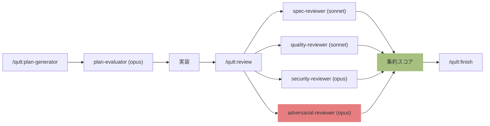

# qult

**qu**ality + c**ult** — コード品質への狂信的なこだわり。

**Quality by Convention, Not by Coercion.** Workflow rules + 独立レビュアー + on-demand check で Claude を導く harness。編集中の中断はありません。

> v0.29: hooks を完全廃止。workflow は `~/.claude/rules/qult-*.md`（`/qult:init` で配布）と `/qult:review` 4 段独立レビュー、状態管理用 MCP server で運用します。
> Claude Code Plugin として配布。

[English / README.md](README.md)

## 問題: AI コード品質の危機

AI コーディングエージェントは高速にコードを出力する。しかし研究が示すのは、一貫した品質劣化のパターンだ:

| 事実 | 出典 |
|------|------|
| AI コードの問題は人間の **1.7 倍** | [CodeRabbit Report](https://www.coderabbit.ai/blog/state-of-ai-vs-human-code-generation-report) |
| AI コードの脆弱性は **2.74 倍** | [SoftwareSeni 分析](https://www.softwareseni.com/ai-generated-code-security-risks-why-vulnerabilities-increase-2-74x-and-how-to-prevent-them/) |
| 反復編集で重大脆弱性が **37.6% 増加** | [セキュリティ劣化研究](https://arxiv.org/abs/2506.11022) |
| エージェントはプロンプトルールの **83% を選択的に無視** | [AgentPex, Microsoft Research](https://arxiv.org/abs/2603.23806) |
| AI レビューコメントの採用率はわずか **0.9–19.2%** | [コードレビューエージェント研究](https://arxiv.org/abs/2604.03196) |
| AI 支援コミットのシークレットリーク率は **ベースラインの 2 倍** | [GitGuardian 2026](https://blog.gitguardian.com/state-of-secrets-sprawl-2026/) |

## qult v0.29 の解法

qult は **workflow rules** を `~/.claude/rules/qult-*.md` に配置し、Claude Code の全セッションで読み込ませて、以下のフローを誘導します:

1. **Plan**: `/qult:plan-generator`（独立した plan-evaluator がスコアリング）
2. **Implement**: `TaskCreate` でタスク追跡
3. **Review**: `/qult:review`（4 段独立レビュー、レビュアーモデル多様性 sonnet × 3 + opus × 1）
4. **Finish**: `/qult:finish`（構造化されたブランチ完了）

ルールはプロンプトレベルでは助言ですが、**独立レビュー** が構造的な裏止めです。レビュアーは別 subagent コンテキストで動くため、実装側モデルが見落とした問題を捕捉できます。「AI Code Review Fails to Catch AI-Generated Vulnerabilities」研究によれば、自己レビューは自分が入れたバグの 64.5% を見逃します — モデルファミリーの多様性で相関エラーを軽減します。

### v0.29 で hooks を撤廃した理由

- **編集中の中断**で生産性が落ちた（Edit/Write DENY が編集パターンごとに発火）
- **プロジェクト境界を越える発火**（`Bash(git commit*)` matcher が `/tmp/` や無関係 repo で発火）
- 議論ターン中の **Stop hook ノイズ**
- **Plugin hook の安定性問題**（#16538 stdout バグ、#21988 DENY 無視）
- **Opus 4.7 の reasoning** で rule 遵守の信頼性が以前より十分高い
- **クリーンアンインストール** — `rm ~/.claude/rules/qult-*.md` でユーザー環境に残痕なし

構造的強制レイヤーは、ランタイム exit-2 の壁ではなく `/qult:review` 独立レビュアー + 人間 architect の "On the Loop" モデルに移行しました。

<details>
<summary>研究的基盤</summary>

- [Anthropic: Harness Design](https://www.anthropic.com/engineering/harness-design-long-running-apps) — Generator-Evaluator パターン、自己評価バイアス
- [Martin Fowler: Harness Engineering](https://martinfowler.com/articles/exploring-gen-ai/harness-engineering.html) — ガイド (フィードフォワード) + センサー (フィードバック)
- [Nonstandard Errors](https://arxiv.org/abs/2603.16744) — 異なるモデルファミリーは安定して異なる分析スタイル。レビュアー多様性で相関エラー軽減
- [AI Code Review Self-Review Failure](https://www.augmentedswe.com/p/ai-code-review-security) — 自己レビューは自分のエラーの 64.5% を見逃す。独立レビュアー必須
- [CodeRabbit Report](https://www.coderabbit.ai/blog/state-of-ai-vs-human-code-generation-report) — AI コードは 1.7 倍の問題を生成
- [Triple Debt Model](https://arxiv.org/abs/2603.22106) — 技術負債 + 認知負債 + 意図負債
- [Semgrep + LLM Hybrid](https://semgrep.dev/products/semgrep-code/) — SAST 単体の精度 35.7% → LLM トリアージ併用で 89.5%
- [TDAD](https://arxiv.org/abs/2603.17973) — プロンプトのみ TDD はリグレッション悪化。v0.29 では TDD 強制を撤廃しプロンプトのみ TDD の失敗モードを回避

</details>

## 哲学

```
1. ルールは導く、レビュアーが検証する
   実装モデルだけは信頼できない。独立レビュアーは信頼できる。

2. architect が設計し、agent が実装する
   人間は何を作るかを決める。AI はどう作るかを実行する。

3. レビュアー多様性は単一モデル判断に勝る
   sonnet × 2 + opus × 2 (security + adversarial を opus 化)。異なるファミリーは異なるエラーを捕捉する。

4. fail-open
   qult の障害で Claude を止めない。壊れたら道を開ける。
```

## 仕組み



## 機能

| 機能 | 仕組み |
|---|---|
| Workflow ガイダンス | `~/.claude/rules/qult-*.md` の 5 ルール (`/qult:init` で配布) |
| 4 段階独立コードレビュー | Spec + Quality + Security + Adversarial |
| レビュアーモデル多様性 (B+ プラン) | sonnet × 2 + opus × 2 (security + adversarial を opus で高リスク領域カバー) |
| ステージ別レビュアーモデル設定 | config / 環境変数で上書き可 |
| プラン生成 + 評価 | `plan-generator` / `plan-evaluator` (sonnet) |
| ハルシネーション import 検出 | インストール済みパッケージと照合 |
| export 破壊的変更検出 | git HEAD と比較 |
| AST データフロー汚染追跡 (7 言語) — opt-in | Tree-sitter WASM: ユーザー入力 → 危険シンクを 3 ホップ追跡 |
| 循環的/認知的複雑度メトリクス — opt-in | AST ベースの関数単位複雑度 |
| セキュリティパターン検出 (25+ ルール) | シークレット、インジェクション、XSS、SSRF、弱い暗号 |
| 依存パッケージ脆弱性スキャン | osv-scanner（npm, pip, cargo, go, gem, composer 等） |
| 幻覚パッケージ検出 | レジストリ存在確認 |
| SBOM 生成 (MCP ツール) | osv-scanner/syft による CycloneDX JSON |
| コード重複検出 — opt-in | ファイル内 blocking、ファイル間 advisory |
| PBT 対応テスト品質チェック | 空テスト、always-true、trivial assertion |
| ミューテーションテスト統合 — opt-in | Stryker/mutmut スコア解析 |
| セッション横断学習 (Flywheel) | パターン分析に基づく閾値調整推奨 |
| フライホイール自動適用 | 安定指標の閾値を自動引き上げ + プロジェクト間知識転移 |
| Detector findings を MCP 経由で取得 | `get_detector_summary`, `get_file_health_score` |
| コンテキスト圧縮への耐性 | DB ベース; `~/.qult/qult.db` (SQLite WAL) |

## インストール

**[Bun](https://bun.sh) が必要**（MCP server は Bun ランタイムで実行）。

**推奨: [Semgrep](https://semgrep.dev)** — security reviewer が使用する SAST 解析。

**推奨: [osv-scanner](https://google.github.io/osv-scanner/)** — 依存パッケージ脆弱性スキャン。SBOM 生成にも使用。

```bash
brew install semgrep      # macOS
brew install osv-scanner  # 推奨: 依存スキャン
# or
pip install semgrep   # pip
```

### インストール

```
/plugin marketplace add hir4ta/qult
/plugin install qult@hir4ta-qult
```

インストール後に Claude Code を再起動してください。

### プロジェクトセットアップ

```
/qult:init
```

`/qult:init` は以下を実行します:

- ツールチェーン (biome/eslint, tsc/pyright, vitest/jest 等) を自動検出して `~/.qult/qult.db` にゲートを登録
- workflow rules を `~/.claude/rules/qult-*.md` に配布（毎回上書き、常に最新）
- 旧バージョン由来の `.qult/` ディレクトリや hook 残骸を整理

プロジェクトディレクトリにはファイルを作成しません。状態は `~/.qult/qult.db`、ルールは `~/.claude/rules/` に置かれます。

### 動作確認

```
/qult:doctor
```

### オプション: LSP 連携

言語サーバーをインストールすると、qult の検出精度が向上します:

- **クロスファイル影響分析**: Python、Go、Rust でも変更ファイルの消費者を検出（TypeScript/JavaScript に加えて）
- **未使用インポート検出**: LSP が利用可能な場合、正規表現ベースのヒューリスティックに代わってセマンティック分析を使用

```bash
# TypeScript/JavaScript
npm install -g typescript-language-server typescript

# Python
pip install pyright

# Go
go install golang.org/x/tools/gopls@latest

# Rust
rustup component add rust-analyzer
```

`/qult:init` がインストール済みの言語サーバーを自動検出します。LSP は**オプション** — サーバーが未インストールの場合は正規表現ベースの検出にフォールバックします（fail-open）。

### アンインストール

```
/plugin  →  qult を削除
rm -f ~/.claude/rules/qult-*.md
rm -rf ~/.qult                        # 任意: SQLite DB を削除
```

## コマンド

| コマンド | 説明 |
|---------|------|
| `/qult:init` | プロジェクトのセットアップ + rules 配布 |
| `/qult:status` | ゲート状態と pending fixes の表示 |
| `/qult:review` | 4 段階独立コードレビュー |
| `/qult:explore` | architect との設計探索 |
| `/qult:plan-generator` | 構造化された実装計画の生成 |
| `/qult:finish` | ブランチ完了ワークフロー |
| `/qult:debug` | 構造化された原因調査 |
| `/qult:skip` | ゲートの一時無効化/有効化 |
| `/qult:config` | 設定値の表示・変更 |
| `/qult:doctor` | セットアップの健全性チェック |

## 4 段階レビュー

`/qult:review` は 4 つの独立したレビュアーを起動し、各 2 次元 (1-5) でスコアリング:

| ステージ | モデル | 次元 | 焦点 |
|---------|-------|------|------|
| Spec | sonnet | Completeness + Accuracy | コードは計画通りか？ |
| Quality | sonnet | Design + Maintainability | 設計は適切か？ |
| **Security** | **opus** | Vulnerability + Hardening | 高リスクの脆弱性検出 |
| **Adversarial** | **opus** | EdgeCases + LogicCorrectness | 最終番人: エッジケース、サイレント障害 |

**合計: 8 次元 / 40 点。** デフォルト閾値: 30/40、次元フロア: 4/5。

<details>
<summary>スコア閾値の詳細</summary>

**集約閾値** (デフォルト 30/40): 複数の弱い領域があると不合格。一貫した「良い」(4+4+4+4+4+4+4+4 = 32) は合格。

**次元フロア** (デフォルト 4/5): いずれかの次元がフロアを下回るとブロック。

最大 3 回のレビューイテレーション。レビュアーは read-only（ファイル変更不可）。

</details>

## Detector triage (v0.29)

| Tier | Detector | デフォルト |
|------|----------|---------|
| **Tier 1** (常時、レビュアーが参照) | security-check, dep-vuln-check, hallucinated-package-check, test-quality-check, export-check | 常に利用可能 |
| **Opt-in** (`set_config` / `enable_gate` で有効化) | dataflow-check, complexity-check, duplication-check, semantic-check, mutation-test | 休眠 |
| **v0.29 で削除** | convention-check, import-check | (削除) |
| **ユーティリティのみ** (auto-fire しない、MCP/LSP 内部から参照) | dead-import-check, spec-trace-check | n/a |

<details>
<summary>対応言語・ツール</summary>

| 言語 | Lint/型チェック | テスト | E2E |
|---|---|---|---|
| TypeScript/JS | biome / eslint / tsc | vitest / jest | playwright / cypress |
| Python | ruff / pyright / mypy | pytest | |
| Go | go vet | go test | |
| Rust | cargo clippy/check | cargo test | |
| Ruby | rubocop | rspec | |
| Deno | deno lint | deno test | |

</details>

## 設定

全ての設定は DB に保存され、`/qult:config` または MCP ツールで管理できます。環境変数によるオーバーライドも対応。

<details>
<summary>設定リファレンス</summary>

| キー | デフォルト | 説明 |
|-----|---------|------|
| `review.score_threshold` | 30 | レビュー合格の集約スコア (/40) |
| `review.max_iterations` | 3 | レビューリトライ回数上限 |
| `review.required_changed_files` | 5 | レビュー必須になるファイル数 |
| `review.dimension_floor` | 4 | 次元ごとの最低スコア (1-5) |
| `review.require_human_approval` | false | コミット前に architect 承認を必須にする |
| `review.models.spec` | sonnet | spec-reviewer モデル |
| `review.models.quality` | sonnet | quality-reviewer モデル |
| `review.models.security` | opus | security-reviewer モデル（高リスク） |
| `review.models.adversarial` | opus | adversarial-reviewer モデル（最終番人） |
| `plan_eval.score_threshold` | 12 | プラン評価スコア (/15) |
| `plan_eval.models.generator` | sonnet | plan-generator モデル |
| `plan_eval.models.evaluator` | opus | plan-evaluator モデル（仕様品質ゲート） |
| `gates.output_max_chars` | 3500 | ゲート出力の最大文字数 |
| `gates.default_timeout` | 10000 | ゲートコマンドのタイムアウト (ms) |
| `security.require_semgrep` | true | Semgrep インストール必須化 |
| `escalation.*_threshold` | 8-10 | ブロックまでの警告回数 |
| `escalation.security_iterative_threshold` | 5 | 同一ファイル編集回数で advisory→blocking |
| `escalation.dead_import_blocking_threshold` | 5 | dead import 警告数で blocking 化 |
| `gates.coverage_threshold` | 0 | テストカバレッジ最低 % (0 = 無効、opt-in) |
| `gates.complexity_threshold` | 15 | 循環的複雑度の警告閾値 |
| `gates.function_size_limit` | 50 | 関数行数の警告閾値 |
| `gates.mutation_score_threshold` | 0 | ミューテーションスコア最低 % (0 = 無効、opt-in) |
| `flywheel.enabled` | true | セッション横断の閾値推奨 |
| `flywheel.min_sessions` | 10 | Flywheel 分析に必要な最低セッション数 |
| `flywheel.auto_apply` | false | raise 方向の推奨を自動適用 |

環境変数: `QULT_REVIEW_SCORE_THRESHOLD`, `QULT_REVIEW_MODEL_SPEC`, `QULT_FLYWHEEL_ENABLED` 等。

</details>

## トラブルシューティング

<details>
<summary>Rules が Claude に反映されない</summary>

`~/.claude/rules/qult-*.md` はセッション開始時に読み込まれます。`/qult:init` 後は Claude Code を再起動してください。`ls ~/.claude/rules/` で配置確認できます。

</details>

<details>
<summary>新バージョンへの更新</summary>

`/plugin update qult` の後に `/qult:init` を再実行してください。rules は常に上書きされるため、最新の workflow ガイダンスが反映されます。

</details>

## スタック

TypeScript / Bun 1.3+ / bun:sqlite / vitest / Biome / web-tree-sitter (WASM) / mutation-testing-metrics
