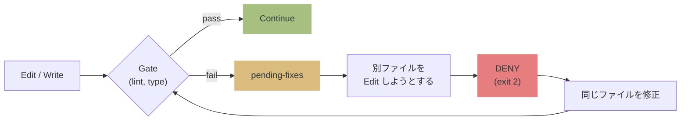
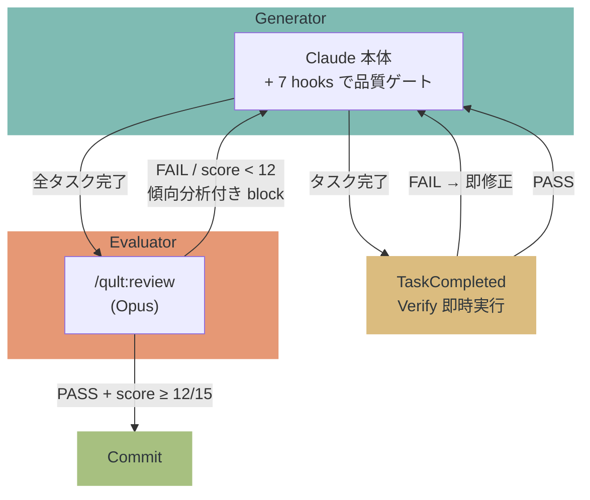

# qult


**Claude の悪い癖を物理的に止める。** コードの品質を構造で守る evaluator harness。

> Claude は優秀だが、lint エラーを放置して次のファイルに行く。テストなしでコミットする。自分のコードを褒めてレビューを終える。
> qult は 7 hooks + MCP server + 独立 Opus evaluator で、それを **お願い (advisory) ではなく exit 2 (DENY) で止める**。
> Claude Code Plugin として配布。`/plugin install` で導入完了。

> [!NOTE]
> セッション開始時に `SessionStart:startup hook error` や `Stop hook error` と表示されることがありますが、**これは qult のバグではありません**。
> Claude Code の UI が hook の成功/失敗を正しく判別できない既知のバグです ([#12671](https://github.com/anthropics/claude-code/issues/12671), [#21643](https://github.com/anthropics/claude-code/issues/21643), [#10463](https://github.com/anthropics/claude-code/issues/10463))。
> hook 自体は正常に動作しています。

> [!WARNING]
> **PreToolUse hook の DENY が無視される場合があります。** qult は正しく `exit 2` を返しますが、
> Claude Code がブロックせずにツールを実行してしまうケースが報告されています
> ([#21988](https://github.com/anthropics/claude-code/issues/21988), [#4669](https://github.com/anthropics/claude-code/issues/4669), [#24327](https://github.com/anthropics/claude-code/issues/24327))。
> Claude Code 側の修正待ちです。

[English README / README.md](README.md)

## How it works



Anthropic の [Harness Design](https://www.anthropic.com/engineering/harness-design-long-running-apps) 記事が示した Generator-Evaluator パターンで動作:



## 何を防ぐか

| 状況 | 行動 |
| --- | --- |
| lint/type エラーを放置して別ファイルへ | **DENY** — 修正するまでブロック |
| テスト未実行で git commit | **DENY** — テスト pass を要求 |
| レビュー未実行/FAIL で完了宣言 | **block** — /qult:review を要求 |
| レビュー PASS だがスコア低い | **block** — 傾向分析付きで再レビュー (最大3回) |
| Plan 確定時に漏れがある | **DENY** — セッション全体の漏れチェックを強制 (1回) |
| Plan の途中で完了宣言 | **block** — 全タスク完了を要求 |
| Plan タスク完了時 | **verify** — Verify フィールドのテストを即時実行 |

## 7 Hooks + MCP Server

| 分類 | Hook | 役割 |
| ------ | ------ | ------ |
| **初期化** (advisory) | SessionStart | state ディレクトリ初期化、stale ファイル掃除、startup 時に pending-fixes クリア |
| **壁** (enforcement) | PostToolUse | Edit/Write 後に lint/type gate 実行、state に書き込み |
| **壁** (enforcement) | PreToolUse | pending-fixes 未修正なら DENY、commit 前にテスト/レビュー要求、ExitPlanMode 時に漏れチェック強制 |
| **完了ゲート** (enforcement) | Stop | 未修正エラー・未完了タスク・レビュー未実施なら block |
| **サブエージェント** (enforcement) | SubagentStop | レビュー出力検証 + 傾向分析付きスコア閾値強制 (12/15) |
| **タスク検証** (advisory) | TaskCompleted | Plan タスク完了時に Verify テストを即時実行 |
| **コンテキスト** (advisory) | PostCompact | compaction 後に pending-fixes と session 状態を再注入 |

| MCP Tool | 役割 |
| ---------- | ------ |
| get_pending_fixes | lint/typecheck エラーの詳細を返す |
| get_session_status | テスト/レビュー状態を返す |
| get_gate_config | ゲート設定を返す |
| disable_gate | ゲートを一時的に無効化 |
| enable_gate | 無効化したゲートを再有効化 |
| set_config | .qult/config.json の設定値を変更 |
| clear_pending_fixes | pending-fixes を全クリア |

## インストール

### 1. プラグインの導入 (1回だけ)

```
/plugin marketplace add hir4ta/qult
/plugin install qult@hir4ta-qult
```

インストール後、Claude Code を再起動する（セッションを終了して新しいセッションを開始）。

### 2. プロジェクトのセットアップ (プロジェクトごとに1回)

```
/qult:init
```

init が行うこと:

- `.qult/` ディレクトリ作成
- `.qult/gates.json` 生成 — プロジェクトの lint/typecheck/test ツールを自動検出
- `.claude/rules/qult-gates.md` 配置 — MCP tool の呼び出しルール (DENY 時に `get_pending_fixes` を呼ぶ等)
- `.claude/rules/qult-quality.md` 配置 — テスト駆動、スコープ管理ルール
- `.claude/rules/qult-plan.md` 配置 — Plan 構造ルール
- `.gitignore` に `.qult/` 追加

### 3. 動作確認

```
/qult:doctor
```

### init 後に使えるコマンド

| コマンド | 説明 |
| --------- | ------ |
| `/qult:status` | 現在の品質ゲート状態を表示 |
| `/qult:review` | 独立コードレビュー (Opus evaluator) |
| `/qult:skip` | ゲートの一時無効化/有効化、pending-fixes クリア |
| `/qult:config` | 設定値の確認・変更（閾値、イテレーション上限等） |
| `/qult:detect-gates` | ゲート設定を再検出 |
| `/qult:plan-generator` | 機能説明から構造化 Plan を生成 |
| `/qult:doctor` | セットアップの健全性チェック |
| `/qult:update` | プラグイン更新後に rules ファイルを最新化 |
| `/qult:register-hooks` | hooks を settings.local.json に登録 (フォールバック) |

hooks (SessionStart, PostToolUse, PreToolUse, Stop, SubagentStop, TaskCompleted, PostCompact) と MCP server は自動で動作する。

### hooks が発火しない場合

plugin hooks は一部の環境で正常に発火しない既知の問題がある ([#18547](https://github.com/anthropics/claude-code/issues/18547), [#10225](https://github.com/anthropics/claude-code/issues/10225))。インストール後に hooks が動かない場合:

```
/qult:register-hooks
```

同じ hooks を `.claude/settings.local.json` にフォールバックとして登録する。plugin hooks と settings hooks の両方が存在する場合、Claude Code が重複排除する (同一コマンドは1回だけ実行)。`.claude/settings.local.json` は gitignore されるため、チームメンバーに影響しない。

## 更新

1. `/plugin` > qult 詳細 > 更新 (hooks, skills, agents, MCP server が更新される)
2. `/qult:update` (プロジェクトの rules ファイルを最新化)

## アンインストール

`/plugin` > qult を削除。プロジェクトの `.qult/` と `.claude/rules/qult*.md` は手動で削除。

## 設定

`.qult/config.json` で閾値をカスタマイズできる (全てオプション):

```json
{
  "review": {
    "score_threshold": 12,
    "max_iterations": 3,
    "required_changed_files": 5
  },
  "gates": {
    "output_max_chars": 2000,
    "default_timeout": 10000
  }
}
```

環境変数でも上書き可能:

| キー | 型 | デフォルト | 説明 |
| ------ | ---- | ----------- | ------ |
| `review.score_threshold` | number | 12 | レビュー合格に必要な合計スコア (最大15) |
| `review.max_iterations` | number | 3 | レビュー再試行の最大回数 |
| `review.required_changed_files` | number | 5 | レビュー必須になる変更ファイル数 |
| `gates.output_max_chars` | number | 2000 | ゲート出力の最大文字数 (超過分は truncate) |
| `gates.default_timeout` | number | 10000 | ゲートコマンドのタイムアウト (ms) |

環境変数: `QULT_REVIEW_SCORE_THRESHOLD`, `QULT_REVIEW_MAX_ITERATIONS`, `QULT_REVIEW_REQUIRED_FILES`, `QULT_GATE_OUTPUT_MAX`, `QULT_GATE_DEFAULT_TIMEOUT`

<details>
<summary><strong>レビュースコア閾値の根拠</strong></summary>

reviewer エージェントは3つの観点 (Correctness, Design, Security) を 1-5 で採点する。デフォルト閾値 12/15 の意味:

- 5+5+2 = 12: セキュリティが弱い変更でも通る (内部ツール向け)
- 4+4+4 = 12: 全観点で「十分」なバランス
- 3+3+3 = 9: 不合格。全体的な品質不足は検出される

閾値はプロジェクトに合わせて変更可能。プロトタイプなら下げる (`"score_threshold": 9`)、本番APIなら上げる (`"score_threshold": 14`)。

スコアはLLM生成のため完全な再現性はない。トレンド検知付きイテレーション (`max_iterations` 回まで再試行) で補正: スコアが改善傾向ならフィードバックが機能している証拠。停滞なら別のアプローチを提案する。

</details>

<details>
<summary><strong>対応言語・ツール</strong></summary>

| 言語 | on_write (lint/type) | on_commit (test) | on_review (e2e) |
| --- | --- | --- | --- |
| **TypeScript/JS** | biome / eslint / tsc | vitest / jest / mocha | — |
| **Python** | ruff / pyright / mypy | pytest | — |
| **Go** | go vet | go test | — |
| **Rust** | cargo clippy / check | cargo test | — |
| **Ruby** | rubocop | rspec | — |
| **Java/Kotlin** | ktlint / detekt | gradle test / mvn test | — |
| **Elixir** | credo | mix test | — |
| **Deno** | deno lint | deno test | — |
| **Frontend** | stylelint | — | playwright / cypress / wdio |

</details>

### カスタムゲート

`.qult/gates.json` を直接編集してゲートの追加・変更・削除ができる:

```json
{
  "on_write": {
    "lint": { "command": "biome check {file}", "timeout": 3000 },
    "typecheck": { "command": "bun tsc --noEmit", "timeout": 10000, "run_once_per_batch": true },
    "custom-check": { "command": "my-tool check {file}", "timeout": 5000 }
  },
  "on_commit": {
    "test": { "command": "bun vitest run", "timeout": 30000 }
  },
  "on_review": {
    "e2e": { "command": "playwright test", "timeout": 120000 }
  }
}
```

**ゲートフィールド:**

| フィールド | 必須 | 説明 |
| ----------- | ------ | ------ |
| `command` | Yes | シェルコマンド。`{file}` は編集されたファイルパスに置換される |
| `timeout` | No | タイムアウト (ms)。省略時は `gates.default_timeout` |
| `run_once_per_batch` | No | true の場合、同一セッション内での再実行をスキップ (`tsc --noEmit` のようなプロジェクト全体チェック向け) |
| `extensions` | No | チェック対象の拡張子配列 (例: `[".ts", ".tsx"]`)。省略時はコマンドから推定 |

**ゲートカテゴリ:**

| カテゴリ | 実行タイミング | 典型的なゲート |
| --------- | --------------- | --------------- |
| `on_write` | Edit/Write の度に実行 | lint, typecheck |
| `on_commit` | `git commit` 検出時 | test |
| `on_review` | `/qult:review` 実行時 | e2e |

### ゲートの無効化

`.qult/gates.json` からゲートのエントリを削除するか、カテゴリごと削除する:

```json
{
  "on_write": {
    "lint": { "command": "biome check {file}", "timeout": 3000 }
  }
}
```

一時的に全ゲートを無効化するには `.qult/gates.json` をリネームまたは削除する。qult は fail-open 設計のため、ゲートなし = 制約なし。`/qult:detect-gates` で再生成可能。

### モノレポ・ワークスペース

qult はプロジェクトルートからゲートを検出する。ワークスペースごとに異なるツールを使う場合は `.qult/gates.json` を手動編集:

```json
{
  "on_write": {
    "lint-frontend": {
      "command": "cd packages/frontend && eslint {file}",
      "timeout": 5000,
      "extensions": [".tsx", ".jsx"]
    },
    "lint-backend": {
      "command": "cd packages/backend && biome check {file}",
      "timeout": 3000,
      "extensions": [".ts"]
    },
    "typecheck": {
      "command": "tsc --noEmit",
      "timeout": 15000,
      "run_once_per_batch": true
    }
  }
}
```

`extensions` でファイルを適切なリンターにルーティングする。`{file}` プレースホルダには編集されたファイルの絶対パスが入る。

## 設計原則

| 原則 | 意味 |
| ------ | ------ |
| **壁 > 情報提示** | DENY (exit 2) で止める。advisory は無視される前提 |
| **fail-open** | 全 hook は try-catch。qult の障害で Claude を止めない |
| **structural guarantee** | 品質を構造で保証する。仮定を stress-test し、崩れたら削除 |
| **dependencies ゼロ** | 全て devDependencies + bun build バンドル |

## Plan 自動生成

```
/qult:plan-generator "JWT認証をAPIに追加"
  → Opus が codebase を分析
  → WHAT/WHERE/VERIFY/BOUNDARY/SIZE 形式の Plan を生成
  → .claude/plans/ に書き出し
```

## データストレージ

```
.qult/
└── .state/
    ├── session-state-{id}.json
    └── pending-fixes-{id}.json
```

- セッション ID でスコープ (並行セッション安全)
- 24h 経過した古いファイルは自動クリーンアップ

## トラブルシューティング

<details>
<summary><strong>"Hook Error" がセッション開始時に表示される</strong></summary>

qult のバグではない。Claude Code の UI が hook の成功/失敗を正しく判別できない既知のバグ ([#12671](https://github.com/anthropics/claude-code/issues/12671), [#34713](https://github.com/anthropics/claude-code/issues/34713))。hook は正常に動作している。

</details>

<details>
<summary><strong>DENY したのにツールが実行される</strong></summary>

Claude Code 側の既知バグ ([#21988](https://github.com/anthropics/claude-code/issues/21988), [#24327](https://github.com/anthropics/claude-code/issues/24327))。qult は正しく exit 2 を返しているが、Claude Code がブロックしないケースがある。修正待ち。

</details>

<details>
<summary><strong>ゲートが検出されない</strong></summary>

`/qult:detect-gates` を実行。ツールのバイナリが PATH にあることを確認 (`which biome`, `which tsc` 等)。`node_modules/.bin` も自動的に検索される。

</details>

<details>
<summary><strong>state ファイルが壊れた</strong></summary>

`.qult/.state/` 内のファイルを削除して新しいセッションを開始する。qult は fail-open 設計のため、state ファイルが破損しても Claude は止まらない。

</details>

<details>
<summary><strong>特定のファイルでゲートをスキップしたい</strong></summary>

`.qult/gates.json` の各ゲートに `extensions` フィールドを追加して、対象拡張子を制限できる:

```json
{
  "on_write": {
    "lint": { "command": "biome check {file}", "extensions": [".ts", ".tsx"] }
  }
}
```

</details>

<details>
<summary><strong>ゲートが誤検出する (実際にはエラーでないのにブロックされる)</strong></summary>

1. ゲートコマンドをターミナルで手動実行して結果を確認
2. ツール設定の問題なら `.eslintrc.json` や `biome.json` 等を修正
3. qult が間違ったツールを実行しているなら `.qult/gates.json` のコマンドを修正
4. 最終手段として `.qult/gates.json` からゲートを削除

qult は `gates.json` のコマンドをそのまま実行する。誤検出はツール設定の問題であり、qult 側の修正は不要。

</details>

<details>
<summary><strong>レビューが低スコアで繰り返しブロックされる</strong></summary>

レビューイテレーション上限はデフォルト3回。3回目以降は通過する。スコアイテレーションをスキップしたい場合:

- `.qult/config.json` の `review.score_threshold` を下げる
- または環境変数 `QULT_REVIEW_SCORE_THRESHOLD=9` を設定

スコアが停滞する場合 (同じスコアが繰り返される)、SubagentStop hook が根本的に異なるアプローチを提案する。これは設計通り: 同じ修正戦略を繰り返してもスコアは改善しない。

</details>

<details>
<summary><strong>qult がコミットをブロックするが今すぐコミットしたい</strong></summary>

qult は PreToolUse hook でゲートを強制する。緊急時の回避方法:

1. ターミナルで直接コミット (Claude Code の外): `git commit -m "emergency fix"`
2. または一時的に qult を無効化: `/plugin` > qult を無効化 > コミット > 再有効化

`.qult/.state/` を削除してバイパスしないこと。セッション追跡がすべてクリアされ、予期しない動作の原因になる。

</details>

## スタック

TypeScript / MCP SDK / vitest (テスト) / Biome (lint)

Claude Code Plugin として配布。開発には Bun 1.3+ が必要。
