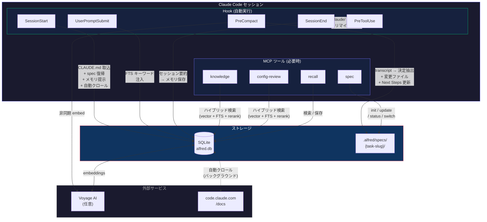
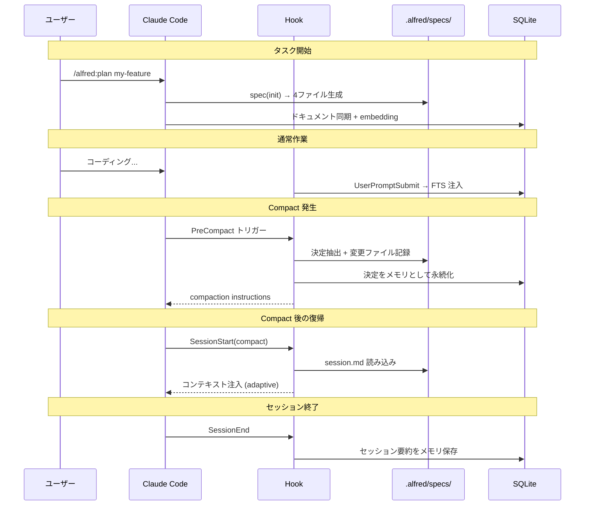

# alfred

[](https://github.com/hir4ta/claude-alfred/releases)
[](https://go.dev/)
[](https://github.com/hir4ta/claude-alfred/blob/main/LICENSE)
[](https://github.com/hir4ta/claude-alfred/releases)

Claude Code の執事。

バックグラウンドで静かに動き、関連するナレッジを提供し、スコープ違反を検出し、Compact を跨いでセッションコンテキストを保持する。開発に集中できる。

[English README](README.md)

## alfred ができること

**ナレッジ注入** — 豊富なドキュメント知識ベースから、Claude Code の設定やアーキテクチャ判断に関連するベストプラクティスを自動で提供。

**Alfred Protocol** — Compact/セッション喪失に強い構造化 spec 管理。要件・設計・決定・セッション状態を `.alfred/specs/` に保存し、自動的にコンテキストを保持・復帰する。

**マルチエージェントコードレビュー** — 3つの特化サブレビューア（セキュリティ、ロジック、設計）が並列で実行、結果を集約・重複排除。各レビューアにLLM盲点の明示的チェックリストを装備。spec とナレッジベースとの照合も実施。

**永続メモリ** — 過去のセッション・意思決定・メモをプロジェクト横断で記憶。セッション要約と設計決定を自動的に永続メモリとして保存。`recall` ツールで過去の経験を検索 — alfred がセッション開始時に関連する記憶を自動で提示。

**自動クロール** — ナレッジベースをバックグラウンドで自動リフレッシュ。SessionStart で最終クロール日時をチェックし、一定期間（デフォルト 7 日）経過していればバックグラウンドプロセスで再クロールを実行。手動で `alfred init` を実行する必要がない。

**Compact 耐性** — PreCompact hook が決定を自動検出し、変更ファイルを追跡し、Next Steps の完了状態を自動更新し、activeContext 形式でセッション状態を保存。SessionStart hook が Compact 後にフルコンテキストを復元。

## 初回セットアップ

### 1. alfred をインストール

```bash
brew install hir4ta/alfred/alfred
```

### 2. プラグインを追加

Claude Code 内で

```
/plugin marketplace add hir4ta/claude-alfred   # マーケットプレイスを登録（初回のみ）
/plugin install alfred                          # プラグインをインストール
```

プラグイン（skills, rules, hooks, agents, MCP 設定）が配置される。

### 3. API キーを設定（オプション・推奨）

```bash
export VOYAGE_API_KEY=your-key  # ~/.zshrc 等に追加
```

[Voyage AI](https://voyageai.com/) で高精度なセマンティック検索（embedding + reranking）が利用可能。
コストはほぼゼロ: ドキュメントの embedding 生成が約 $0.01、検索クエリ 1 回あたり 1 セント未満。

Voyage AI なしでも FTS5 キーワード検索で動作する — API キーなしでも利用可能。

### 4. 知識ベースを初期化

```bash
alfred init
```

対話型 TUI がセットアップをガイド：
- Voyage API キーの入力プロンプト（Esc で FTS-only モードも選択可）
- ドキュメントを SQLite に取り込み、進捗表示
- API キーが設定されていれば embedding を生成

Claude Code を再起動すれば完了。

## アップデート

```bash
alfred update
```

バイナリ（Homebrew または直接ダウンロード）とプラグインバンドルを自動で更新する。
更新後、Claude Code を再起動すれば完了。

## スキル (7)

Claude Code 内で `/alfred:<スキル名>` で呼び出す。

| スキル | 内容 |
|--------|------|
| `/alfred:configure <種類> [名前]` | 単一の設定ファイルを作成・更新（skill, rule, hook, agent, MCP, CLAUDE.md, memory）+ 独立レビュー |
| `/alfred:setup` | プロジェクト全体のセットアップウィザード — 複数ファイルのスキャン+設定、または Claude Code 機能の解説 |
| `/alfred:brainstorm <テーマ>` | マルチエージェント発散 — 3専門家（Visionary, Pragmatist, Critic）が並列でアイデア生成→議論 |
| `/alfred:refine <テーマ>` | 壁打ち（収束）— 論点を固定し、選択肢を絞り、決定を出す |
| `/alfred:plan <task-slug>` | Alfred Protocol — マルチエージェント spec 生成（Architect + Devil's Advocate + Researcher が設計を議論） |
| `/alfred:review [focus]` | マルチエージェントコードレビュー — 3サブレビューア（セキュリティ、ロジック、設計）並列実行 |
| `/alfred:help [機能名]` | 全機能のクイックリファレンス — スキル、エージェント、MCP ツール、CLI コマンド |

## エージェント (2)

| エージェント | 内容 |
|------------|------|
| `alfred` | 執事 — Claude Code の設定・ベストプラクティスに関するサポート |
| `code-reviewer` | マルチエージェントレビューオーケストレーター — 3サブレビューア（セキュリティ、ロジック、設計）を並列起動 |

## MCP ツール (4)

スキルとエージェントのバックエンド。Claude が必要に応じて自動的に呼び出すため、直接呼ぶ必要はない。

| ツール | 内容 |
|--------|------|
| `knowledge` | ハイブリッド vector + FTS5 + Voyage rerank によるドキュメント検索 |
| `config-review` | プロジェクトの .claude/ 設定を深堀り分析（ファイル内容読み込み + KB 照合） |
| `spec` | 統合 spec 管理（action: init / update / status / switch / delete） |
| `recall` | メモリ検索・保存 — 過去のセッション・意思決定・メモ |

## Hook (5)

Claude Code のライフサイクルに応じて自動実行される。ユーザーが意識する必要はない。

| イベント | 動作 |
|----------|------|
| SessionStart | CLAUDE.md 自動取り込み + spec コンテキスト注入（adaptive 復帰）+ 過去メモリ提示 + 自動クロールチェック |
| PreCompact | transcript からコンテキスト抽出 + 決定自動検出 + 変更ファイル追跡 + Next Steps 完了状態更新 → session.md 保存 → 決定をメモリ永続化 → compaction instructions → 非同期 embedding |
| PreToolUse | `.claude/` 設定ファイルへのアクセス時に alfred ツール利用リマインダー（Edit/Write/MultiEdit） |
| UserPromptSubmit | キーワードゲート付き FTS ナレッジ注入 + メモリ検索 — ベストプラクティスと過去の経験を自動提供（`ALFRED_QUIET=1` で抑制可） |
| SessionEnd | セッション要約を永続メモリとして保存（`reason=clear` 時はスキップ） |

## コマンド

| コマンド | 内容 |
|----------|------|
| `init` | 知識ベース初期化（対話型 API キー設定 + TUI 進捗表示） |
| `status [--verbose]` | システム状態表示 — DB 統計、API キー、アクティブタスク、パス |
| `export [--all]` | メモリを JSON エクスポート（`--all` で spec も含む） |
| `memory prune [--confirm]` | 古いメモリの削除（デフォルトは dry-run、`--max-age DAYS` 対応） |
| `memory stats` | プロジェクト別メモリ統計 |
| `settings` | API キーや設定の変更（対話型 TUI） |
| `update` | 最新バージョンに更新（Homebrew / ダウンロード / go install） |
| `version` | バージョン表示 |

## 仕組み

### システム全体像



### Alfred Protocol ライフサイクル



### Alfred Protocol のファイル構成

```
.alfred/specs/{task-slug}/
├── requirements.md  # 要件・成功条件・スコープ外
├── design.md        # 設計・アーキテクチャ
├── decisions.md     # 設計決定と代替案・理由の記録
└── session.md       # activeContext 形式のセッション状態 + Compact Marker
```

`_active.md` (YAML) で複数タスクを管理し、`spec` (action=switch) で切替可能。

### Spec ファイルテンプレート

`/alfred:plan my-feature` を実行すると、以下のファイルが作成される:

**`.alfred/specs/my-feature/requirements.md`**
```
# Requirements: my-feature

## Goal
API ゲートウェイに OAuth2 ログインフローを追加する。

## Success Criteria
- Google/GitHub OAuth でログイン可能
- JWT トークンを 1 時間有効期限で発行
- リフレッシュトークンローテーションを実装

## Out of Scope
- SAML/LDAP 連携
- 多要素認証
```

**`.alfred/specs/my-feature/session.md`** (activeContext 形式)
```
# Session: my-feature

## Status
active

## Currently Working On
cmd/api/auth.go で OAuth コールバックハンドラを実装中

## Recent Decisions (last 3)
1. カスタム実装ではなく golang.org/x/oauth2 を使用
2. リフレッシュトークンは Redis ではなく PostgreSQL に保存

## Next Steps
1. トークンリフレッシュエンドポイントを追加
2. OAuth フローの結合テストを作成

## Blockers
None

## Modified Files (this session)
- cmd/api/auth.go
- internal/auth/oauth.go
```

Compact Marker の例:
```
## Compact Marker [2025-03-08 14:30:00]
### Pre-Compact Context Snapshot
Last user directive: OAuth コールバックにエラーハンドリングを追加
Recent assistant actions:
- internal/auth/oauth.go にプロバイダ抽象化を作成
- internal/auth/oauth_test.go にテストを追加
---
```

## デバッグ

`ALFRED_DEBUG=1` を設定すると `~/.claude-alfred/debug.log` にデバッグログを出力する。

## 依存ライブラリ

| ライブラリ | 用途 |
|-----------|------|
| [mcp-go](https://github.com/mark3labs/mcp-go) | MCP サーバー SDK |
| [go-sqlite3](https://github.com/ncruces/go-sqlite3) | SQLite ドライバ（pure Go, WASM） |
| [bubbletea](https://github.com/charmbracelet/bubbletea) | TUI フレームワーク（setup 画面） |
| [Voyage AI](https://voyageai.com/) | embedding + rerank（voyage-4-large, 2048d） |

## 変更履歴

[CHANGELOG.md](CHANGELOG.md) を参照してください。

## トラブルシューティング

### デバッグログ

```bash
ALFRED_DEBUG=1 claude   # デバッグログを有効化
cat ~/.claude-alfred/debug.log  # ログを確認
```

### よくある問題

| 症状 | 原因 | 対処法 |
|---|---|---|
| serve 時に "no seed docs found" | ナレッジベース未初期化 | `alfred init` を実行 |
| Hook タイムアウト警告 | FTS 検索が遅い、または transcript が大きい | `~/.claude-alfred/debug.log` を確認 |
| init 時に "VOYAGE_API_KEY is required" | API キー未設定 | `alfred settings` で設定、または `export VOYAGE_API_KEY=your-key` |
| ナレッジ検索結果が古い | 自動クロールが未実行または失敗 | `debug.log` を確認。`alfred init` で強制リフレッシュ |
| Hook が発火しない | プラグイン未インストール | `/plugin install alfred` を実行して再起動 |

### 環境変数

| 変数 | デフォルト | 用途 |
|---|---|---|
| `VOYAGE_API_KEY` | (なし) | Voyage AI API キー（ベクトル検索 + リランキング） |
| `ALFRED_DEBUG` | (未設定) | `1` に設定するとデバッグログを有効化 |
| `ALFRED_RELEVANCE_THRESHOLD` | `0.40` | ナレッジ注入の最小スコア |
| `ALFRED_HIGH_CONFIDENCE_THRESHOLD` | `0.65` | 2 件注入のスコア閾値 |
| `ALFRED_SINGLE_KEYWORD_DAMPEN` | `0.80` | 単一キーワードマッチのダンプニング係数 |
| `ALFRED_CRAWL_INTERVAL_DAYS` | `7` | 自動クロール間隔（日数） |
| `ALFRED_QUIET` | `0` | `1` に設定するとナレッジ注入を抑制 |
| `ALFRED_MEMORY_MAX_AGE_DAYS` | `180` | `alfred memory prune` のデフォルト経過日数 |

## ライセンス

MIT
