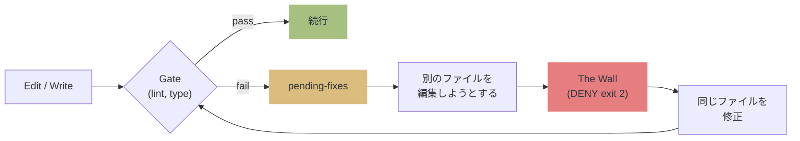

# qult

**qu**ality + c**ult** — コード品質への狂信的なこだわり。

**Quality by Structure, Not by Promise.** コードの品質を壁で守る harness engineering ツール。

> プロンプトは提案。hooks は強制。
> qult は品質低下を **exit 2 (DENY) で止める**。
> Claude Code Plugin として配布。

[English / README.md](README.md)

## なぜ qult？

AI コーディングエージェントは強力だが、自己規律には頼れない。lint エラーを放置して次のファイルに行く。テストなしでコミットする。自分のコードを褒めてレビューを終える。

qult は [Generator-Evaluator パターン](https://www.anthropic.com/engineering/harness-design-long-running-apps) を実装する。生成と評価を分離し、品質を構造的に強制する。

**決定論的ゲート (lint, typecheck) → 実行可能な仕様 (test) → AI レビュー (残余のみ)**

<details>
<summary>背景・参考文献</summary>

- [Anthropic: Harness Design](https://www.anthropic.com/engineering/harness-design-long-running-apps) — Generator-Evaluator パターン、自己評価バイアス
- [Martin Fowler: Harness Engineering](https://martinfowler.com/articles/exploring-gen-ai/harness-engineering.html) — ガイド (フィードフォワード) + センサー (フィードバック)
- [TDAD](https://arxiv.org/abs/2603.17973) — プロンプトのみの TDD でリグレッション悪化 (6%→10%)。構造的強制で 1.8% に低減
- [Specification as Quality Gate](https://arxiv.org/abs/2603.25773) — AI が AI をレビューすると相関エラーが増幅。決定論的ゲートが先
- [Nonstandard Errors](https://arxiv.org/abs/2603.16744) — 異なるモデルファミリーは安定して異なる分析スタイル。レビュアー多様性で相関エラー軽減
- [AgentPex (Microsoft)](https://arxiv.org/abs/2603.23806) — エージェントはプロンプトルールを選択的に無視。構造的強制が必要
- [CodeRabbit Report](https://www.coderabbit.ai/blog/state-of-ai-vs-human-code-generation-report) — AI コードは 1.7 倍の問題を生成。品質ゲートが対策
- [Triple Debt Model](https://arxiv.org/abs/2603.22106) — 技術負債 + 認知負債 + 意図負債

</details>

## 哲学

```
1. 壁は説得されない
   プロンプトは提案。hooks は強制。品質を約束に委ねない。

2. architect が設計し、agent が実装する
   人間は何を作るかを決める。AI はどう作るかを実行する。

3. Proof or Block
   「完了」は証拠ではない。テスト pass、レビュー pass — それが完了。

4. fail-open
   qult の障害で Claude を止めない。壊れたら道を開ける。
```

## 仕組み



## 機能

| 機能 | 仕組み |
|---|---|
| lint/型エラーの拡散をブロック | **The Wall**: 修正するまで DENY |
| コミット前にテスト必須 | `git commit` 時にゲートチェック |
| 4 段階独立コードレビュー | Spec + Quality + Security + Adversarial |
| レビュアーモデルのステージ別設定 | config でモデル多様性を確保 |
| ハルシネーション import 検出 | インストール済みパッケージと照合 |
| export 破壊的変更検出 | git HEAD と比較 |
| セキュリティパターン検出 (25+ ルール) | シークレット、インジェクション、XSS、弱い暗号 |
| セマンティックバグ検出 (6+ パターン) | 空 catch、到達不能コード、switch fallthrough |
| コード重複検出 | ファイル内はブロック、ファイル間は警告 |
| PBT 対応テスト品質チェック | Property-Based Testing の誤検知回避 |
| SAST 統合 (Semgrep 必須) | Semgrep 必須化。未インストール時はコミットをブロック |
| 反復セキュリティ昇格 | 同一ファイル N 回編集で advisory パターンを blocking に昇格 |
| テスト品質 blocking | 空テスト・always-true・trivial assertion をブロック |
| dead import エスカレーション | 警告閾値超過で blocking に昇格 |
| セッション横断学習 (Flywheel) | パターン分析に基づく閾値調整推奨 |
| コンテキスト圧縮後の状態保全 | 圧縮後にセッション状態を再注入 |

## インストール

**[Bun](https://bun.sh) が必要**（hooks と MCP server は Bun ランタイムで実行）。

**必須: [Semgrep](https://semgrep.dev)** — SAST 解析。未インストール時はコミットをブロック（`/qult:skip semgrep-required` で一時的に回避可能）。

```bash
brew install semgrep  # macOS
# or
pip install semgrep   # pip
```

### インストール

```
/plugin marketplace add hir4ta/qult
/plugin install qult@hir4ta-qult
```

インストール後に Claude Code を再起動してください。

### プロジェクトセットアップ

```
/qult:init
```

ツールチェーン (biome/eslint, tsc/pyright, vitest/jest 等) を自動検出し、ゲートを DB に登録します。

プロジェクトディレクトリにはファイルを作成しません。全ての状態は `~/.qult/qult.db` に保存されます。

### 動作確認

```
/qult:doctor
```

### アンインストール

```
/plugin  →  qult を削除
```

アンインストール後、`~/.qult/` ディレクトリ（SQLite DB）はディスクに残ります。不要であれば手動で削除してください:

```bash
rm -rf ~/.qult
```

## コマンド

| コマンド | 説明 |
|---------|------|
| `/qult:init` | プロジェクトのセットアップ |
| `/qult:status` | ゲート状態と pending fixes の表示 |
| `/qult:review` | 4 段階独立コードレビュー |
| `/qult:explore` | architect との設計探索 |
| `/qult:plan-generator` | 構造化された実装計画の生成 |
| `/qult:finish` | ブランチ完了ワークフロー |
| `/qult:debug` | 構造化された原因調査 |
| `/qult:skip` | ゲートの一時無効化/有効化 |
| `/qult:config` | 設定値の表示・変更 |
| `/qult:doctor` | セットアップの健全性チェック |

## 4 段階レビュー

`/qult:review` は 4 つの独立したレビュアーを起動し、各 2 次元 (1-5) でスコアリング:

| ステージ | 次元 | 焦点 |
|---------|------|------|
| Spec | Completeness + Accuracy | コードは計画通りか？ |
| Quality | Design + Maintainability | 設計は適切か？ |
| Security | Vulnerability + Hardening | セキュリティギャップは？ |
| Adversarial | EdgeCases + LogicCorrectness | エッジケース、サイレント障害は？ |

**合計: 8 次元 / 40 点。** デフォルト閾値: 30/40、次元フロア: 4/5。

<details>
<summary>スコア閾値の詳細</summary>

**集約閾値** (デフォルト 30/40): 複数の弱い領域があると不合格。一貫した「良い」(4+4+4+4+4+4+4+4 = 32) は合格。

**次元フロア** (デフォルト 4/5): いずれかの次元がフロアを下回るとブロック。集約スコアに関係なく、「優れたコードだが酷いセキュリティ」を防ぐ。

最大 3 回のレビューイテレーション。レビュアーは read-only（ファイル変更不可）。

</details>

<details>
<summary>対応言語・ツール</summary>

| 言語 | Lint/型チェック | テスト | E2E |
|---|---|---|---|
| TypeScript/JS | biome / eslint / tsc | vitest / jest | playwright / cypress |
| Python | ruff / pyright / mypy | pytest | |
| Go | go vet | go test | |
| Rust | cargo clippy/check | cargo test | |
| Ruby | rubocop | rspec | |
| Deno | deno lint | deno test | |

</details>

## 設定

全ての設定は DB に保存され、`/qult:config` または MCP ツールで管理できます。環境変数によるオーバーライドも対応。

<details>
<summary>設定リファレンス</summary>

| キー | デフォルト | 説明 |
|-----|---------|------|
| `review.score_threshold` | 30 | レビュー合格の集約スコア (/40) |
| `review.max_iterations` | 3 | レビューリトライ回数上限 |
| `review.required_changed_files` | 5 | レビュー必須になるファイル数 |
| `review.dimension_floor` | 4 | 次元ごとの最低スコア (1-5) |
| `review.require_human_approval` | false | コミット前に architect 承認を必須にする |
| `plan_eval.score_threshold` | 12 | プラン評価スコア (/15) |
| `gates.output_max_chars` | 3500 | ゲート出力の最大文字数 |
| `gates.default_timeout` | 10000 | ゲートコマンドのタイムアウト (ms) |
| `security.require_semgrep` | true | Semgrep インストール必須化 |
| `escalation.*_threshold` | 8-10 | ブロックまでの警告回数 |
| `escalation.security_iterative_threshold` | 5 | 同一ファイル編集回数で advisory→blocking |
| `escalation.dead_import_blocking_threshold` | 5 | dead import 警告数で blocking 化 |
| `review.models.*` | spec=sonnet, quality/security=opus, adversarial=sonnet | ステージ別レビュアーモデル |
| `flywheel.enabled` | true | セッション横断の閾値推奨 |
| `flywheel.min_sessions` | 10 | Flywheel 分析に必要な最低セッション数 |

環境変数: `QULT_REVIEW_SCORE_THRESHOLD`, `QULT_REVIEW_MODEL_SPEC`, `QULT_FLYWHEEL_ENABLED` 等。

</details>

## トラブルシューティング

<details>
<summary>DENY したがツールが実行される</summary>

Claude Code の既知のバグ ([#21988](https://github.com/anthropics/claude-code/issues/21988))。qult は正しく exit 2 を返しますが、Claude Code が無視する場合があります。

</details>

<details>
<summary>hooks が発火しない</summary>

`/qult:register-hooks` で `.claude/settings.local.json` にフォールバック登録できます。

</details>

## スタック

TypeScript / Bun 1.3+ / bun:sqlite / vitest / Biome / npm 依存ゼロ
