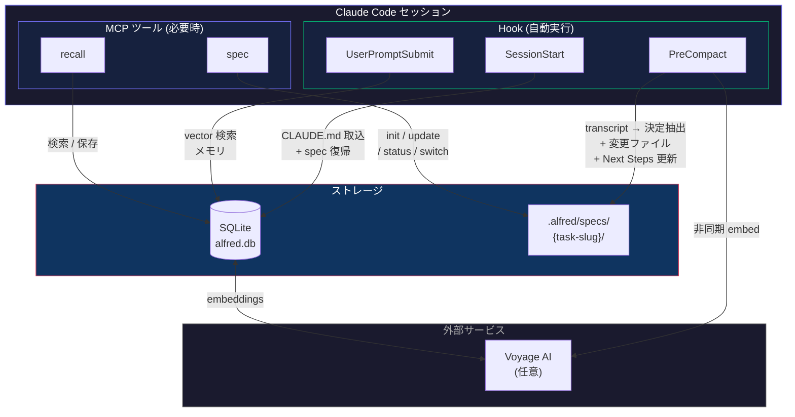
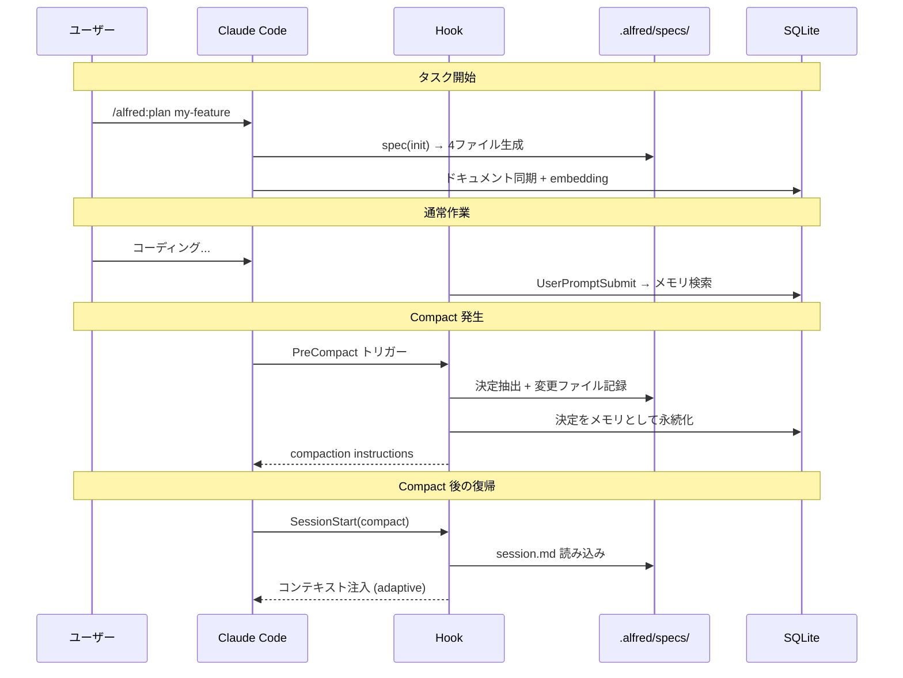

# alfred

[](https://github.com/hir4ta/claude-alfred/releases)
[](https://go.dev/)
[](https://github.com/hir4ta/claude-alfred/blob/main/LICENSE)
[](https://github.com/hir4ta/claude-alfred/releases)

Claude Code の執事。

バックグラウンドで静かに動き、Compact を跨いでセッションコンテキストを保持し、関連するメモリを提示し、spec を管理する。開発に集中できる。

[English README](README.md)

## alfred ができること

**Alfred Protocol** — Compact/セッション喪失に強い構造化 spec 管理。要件・設計・決定・セッション状態を `.alfred/specs/` に保存し、自動的にコンテキストを保持・復帰する。

**プロファイルベース品質レビュー** — 6つの専門レビュープロファイル（code, config, security, docs, architecture, testing）を装備。各プロファイルにチェックリストを搭載。git diff から関連プロファイルを自動検出し、並列でサブレビューアを実行、スコア付きレポートを生成。

**永続メモリ** — 過去のセッション・意思決定・メモをプロジェクト横断で記憶。セッション要約と設計決定を自動的に永続メモリとして保存。`recall` ツールで過去の経験を検索 — Voyage セマンティック検索で関連する記憶を自動で提示。

**Compact 耐性** — PreCompact hook が決定を自動検出し、変更ファイルを追跡し、Next Steps の完了状態を自動更新し、activeContext 形式でセッション状態を保存。SessionStart hook が Compact 後にフルコンテキストを復元。

## 初回セットアップ

### 1. alfred をインストール

```bash
brew install hir4ta/alfred/alfred
```

### 2. プラグインを追加

Claude Code 内で

```
/plugin marketplace add hir4ta/claude-alfred   # マーケットプレイスを登録（初回のみ）
/plugin install alfred                          # プラグインをインストール
```

プラグイン（skills, rules, hooks, agents, MCP 設定）が配置される。追加セットアップ不要 — 初回実行時に DB が自動初期化される。

### 3. API キーを設定（オプション・推奨）

```bash
export VOYAGE_API_KEY=your-key  # ~/.zshrc 等に追加
```

[Voyage AI](https://voyageai.com/) で高精度なセマンティック検索（embedding + reranking）が利用可能。
コストはほぼゼロ: embedding 生成が約 $0.01、検索クエリ 1 回あたり 1 セント未満。

Voyage AI なしでもキーワード検索（LIKE）で動作する — API キーなしでも利用可能。

## スキル (10)

Claude Code 内で `/alfred:<スキル名>` で呼び出す。

| スキル | 内容 |
|--------|------|
| `/alfred:plan <task-slug>` | Alfred Protocol — マルチエージェント spec 生成（Architect + Devil's Advocate + Researcher が設計を議論） |
| `/alfred:develop <task-slug>` | 完全自律開発オーケストレーター — spec 作成、レビューゲート付き実装、セルフレビュー、テストゲート、自動コミット |
| `/alfred:review [プロファイル]` | プロファイルベース品質レビュー — 6プロファイル（code, config, security, docs, architecture, testing）+チェックリスト |
| `/alfred:skill-review [パス]` | Anthropic 公式 33 ページスキル設計ガイドに基づくスキル監査 — 21 チェック項目、スコアレポート、--fix 自動修正 |
| `/alfred:brainstorm <テーマ>` | マルチエージェント発散 — 3専門家（Visionary, Pragmatist, Critic）が並列でアイデア生成→議論 |
| `/alfred:refine <テーマ>` | 壁打ち（収束）— 論点を固定し、選択肢を絞り、決定を出す |
| `/alfred:configure <種類> [名前]` | 単一の設定ファイルを作成・更新（skill, rule, hook, agent, MCP, CLAUDE.md, memory）+ 独立レビュー |
| `/alfred:setup` | プロジェクト全体のセットアップウィザード — 複数ファイルのスキャン+設定、または Claude Code 機能の解説 |
| `/alfred:ingest <ファイル>` | 参照資料（CSV, TXT, PDF, docs）を構造化ナレッジに変換、Compact/セッション喪失に耐える |
| `/alfred:help [機能名]` | 全機能のクイックリファレンス — スキル、エージェント、MCP ツール |

## エージェント (2)

| エージェント | 内容 |
|------------|------|
| `alfred` | 執事 — Claude Code の設定・ベストプラクティスに関するサポート |
| `code-reviewer` | マルチエージェントレビューオーケストレーター — 3サブレビューア（セキュリティ、ロジック、設計）を並列起動 |

## MCP ツール (2)

スキルとエージェントのバックエンド。Claude が必要に応じて自動的に呼び出す。

| ツール | 内容 |
|--------|------|
| `spec` | 統合 spec 管理（action: init / update / status / switch / delete / history / rollback） |
| `recall` | メモリ検索・保存 — 過去のセッション・意思決定・メモ（vector 検索 + キーワードフォールバック） |

## Hook (3)

Claude Code のライフサイクルに応じて自動実行される。ユーザーが意識する必要はない。

| イベント | 動作 |
|----------|------|
| SessionStart | CLAUDE.md 自動取り込み + ユーザールール確認 + spec コンテキスト注入（Compact 後の adaptive 復帰） |
| PreCompact | transcript からコンテキスト抽出 + 決定自動検出 + 変更ファイル追跡 + Next Steps 完了状態更新 → session.md 保存 → 決定をメモリ永続化 → compaction instructions → 非同期 embedding |
| UserPromptSubmit | Voyage セマンティックメモリ検索 — 関連する過去の経験を自動提供 |

## 仕組み

### システム全体像



### Alfred Protocol ライフサイクル



### Alfred Protocol のファイル構成

```
.alfred/specs/{task-slug}/
├── requirements.md  # 要件・成功条件・スコープ外
├── design.md        # 設計・アーキテクチャ
├── decisions.md     # 設計決定と代替案・理由の記録
├── session.md       # activeContext 形式のセッション状態 + Compact Marker
└── .history/        # バージョン履歴（ファイルごと最大 20 件、自動整理）
```

`_active.md` (YAML) で複数タスクを管理し、`spec` (action=switch) で切替可能。

## 依存ライブラリ

| ライブラリ | 用途 |
|-----------|------|
| [mcp-go](https://github.com/mark3labs/mcp-go) | MCP サーバー SDK |
| [go-sqlite3](https://github.com/ncruces/go-sqlite3) | SQLite ドライバ（pure Go, WASM） |
| [Voyage AI](https://voyageai.com/) | embedding + rerank（voyage-4-large, 2048d） |

## トラブルシューティング

### よくある問題

| 症状 | 原因 | 対処法 |
|---|---|---|
| メモリ検索結果がない | VOYAGE_API_KEY 未設定 | `export VOYAGE_API_KEY=your-key` でセマンティック検索を有効化 |
| Hook が発火しない | プラグイン未インストール | `/plugin install alfred` を実行して再起動 |

### 環境変数

| 変数 | デフォルト | 用途 |
|---|---|---|
| `VOYAGE_API_KEY` | (なし) | Voyage AI API キー（ベクトル検索 + リランキング） |

### 情報の探し方

| トピック | 参照先 |
|---------|--------|
| 全機能一覧 | Claude Code 内で `/alfred:help` |
| Hook タイムアウト・内部仕様 | `.claude/rules/hook-internals.md` |
| 検索パイプライン詳細 | `.claude/rules/store-internals.md` |

## ライセンス

MIT
