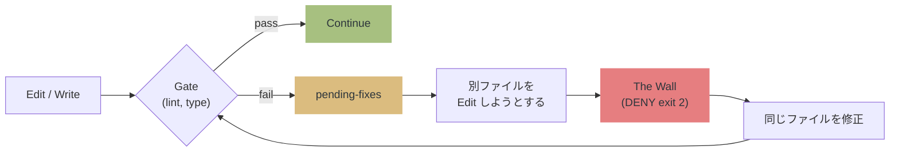

# qult


**Quality by Structure, Not by Promise.** コードの品質を壁で守る harness engineering ツール。

> プロンプトは提案。hooks は強制。
> qult は 7 hooks + MCP server + 3段階独立レビューで、品質低下を **exit 2 (DENY) で止める**。
> Claude Code Plugin として配布。`/plugin install` で導入完了。

## なぜ harness engineering か？

AI コーディングエージェントは強力だが、自己規律には頼れない。

- lint エラーを放置して次のファイルに行く
- テストなしでコミットする
- 自分のコードを褒めてレビューを終える

[OpenAI](https://openai.com/index/harness-engineering/) が命名し、[Martin Fowler](https://martinfowler.com/articles/exploring-gen-ai/harness-engineering.html) が体系化した **harness engineering** はこの問題に対処する。

> **Agent = Model + Harness.** 不変条件を強制し、実装を細かく管理しない。

研究がこのアプローチを裏付けている。

- **TDAD** ([arXiv:2603.17973](https://arxiv.org/abs/2603.17973)): プロンプトのみで TDD 指示を追加すると、リグレッションが 6% → 10% に悪化。構造的な強制で 1.8% に低減
- **Specification as Quality Gate** ([arXiv:2603.25773](https://arxiv.org/abs/2603.25773)): AI が AI をレビューすると相関したエラーが増幅する。決定論的ゲートを先に実行し、AI レビューは残余のみに使う

qult はこのアーキテクチャを実装している。

**決定論的ゲート (lint, typecheck) → 実行可能な仕様 (test) → AI レビュー (残余のみ)**

### 構造を信頼し、モデルを信頼しない

| アプローチ | メカニズム | 保証 |
|----------|-----------|------|
| **プロンプトベース** | 説得力あるスキル文章 | なし。モデルはステップを飛ばしうる |
| **構造ベース** (qult) | Hook exit 2 (DENY) | 構造的保証。モデルが回避不可能 |

Fowler の分類では、qult の hooks は **センサー**（観察して修正するフィードバック制御）、skills と CLAUDE.md は **ガイド**（行動前に方向づけるフィードフォワード制御）にあたる。qult は両方を提供する。

## 哲学

```
Quality by Structure, Not by Promise.

1. The Wall（壁）は説得されない
   プロンプトは提案。hooks は強制。品質を約束に委ねない。

2. architect が設計し、agent が実装する
   人間は何を作るかを決める。AIはどう作るかを実行する。
   曖昧さは architect に問い返す。推測で実装しない。

3. Proof or Block（証拠かブロックか）
   「できた」は証拠ではない。テストが通り、レビューが通過して初めて完了。
   証拠なき完了宣言は構造的にブロックされる。

4. fail-open（品質にカルト的、自分自身に謙虚）
   qult の障害で開発を止めない。壊れたら道を開ける。
   品質への狂信と、ツールへの謙虚さの共存。
```

> [!NOTE]
> セッション開始時に `SessionStart:startup hook error` や `Stop hook error` が表示されることがあります。**これは qult のバグではありません。**
> Claude Code の UI が hook の成功/失敗を正しく判別できない既知のバグです ([#12671](https://github.com/anthropics/claude-code/issues/12671), [#21643](https://github.com/anthropics/claude-code/issues/21643), [#10463](https://github.com/anthropics/claude-code/issues/10463))。
> hook 自体は正常に動作しています。

> [!WARNING]
> **PreToolUse hook の DENY が無視される場合があります。** qult は正しく `exit 2` を返しますが、
> Claude Code がブロックせずにツールを実行してしまうケースが報告されています
> ([#21988](https://github.com/anthropics/claude-code/issues/21988), [#4669](https://github.com/anthropics/claude-code/issues/4669), [#24327](https://github.com/anthropics/claude-code/issues/24327))。
> Claude Code 側の修正待ちです。

[English README / README.md](README.md)

## 仕組み



Anthropic の [Harness Design](https://www.anthropic.com/engineering/harness-design-long-running-apps) 記事が示す Generator-Evaluator パターンで動作する。

```mermaid
flowchart TB
    subgraph Generator["Generator (7 hooks)"]
        Claude["Claude 本体\n+ 決定論的ゲート"]
    end
    subgraph Evaluator["3段階 Evaluator"]
        Spec["Stage 1: Spec Reviewer\n(Completeness + Accuracy)"]
        Quality["Stage 2: Quality Reviewer\n(Design + Maintainability)"]
        Security["Stage 3: Security Reviewer\n(Vulnerability + Hardening)"]
    end

    Claude -- "タスク完了" --> TV["TaskCompleted\nVerify 即時実行"]
    TV -- "FAIL → 即修正" --> Claude
    TV -- "PASS" --> Claude
    Claude -- "全タスク完了" --> Spec
    Spec --> Quality
    Quality --> Security
    Security -- "FAIL / aggregate < 24 / dimension < 4" --> Claude
    Security -- "PASS + aggregate ≥ 26/30 + 全次元 ≥ 4" --> Done["Commit"]

    style Generator fill:#7fbbb3,color:#2d353b,stroke:#7fbbb3
    style Evaluator fill:#e69875,color:#2d353b,stroke:#e69875
    style Done fill:#a7c080,color:#2d353b,stroke:#a7c080
    style TV fill:#dbbc7f,color:#2d353b,stroke:#dbbc7f
```



## 何を防ぐか

| 状況 | 行動 |
| --- | --- |
| lint/type エラーを放置して別ファイルへ | **The Wall**: 修正するまでブロック |
| テスト未実行で git commit | **The Wall**: テスト pass を要求 |
| 存在しないパッケージの import（幻覚 import） | **The Wall**: 修正するまで pending-fix |
| exit code 0 の確認なしで git commit | **The Wall**: テスト pass の明示的な証拠を要求 |
| レビュー未実行/FAIL で完了宣言 | **block**: /qult:review を要求 |
| レビュー PASS だが合計スコアが低い | **block**: 傾向分析付きで再レビュー（最大3回） |
| レビュー PASS だが個別次元がフロア未満 | **block**: 例えば Security=3 は合計が高くてもブロック（フロア=4） |
| レビュースコアが不自然に均一 | **warn**: スコアバイアス検出（同一スコア/低分散） |
| Plan 確定時に漏れがある | **The Wall**: セッション全体の漏れチェックを強制（1回） |
| Plan の途中で完了宣言 | **block**: 全タスク完了を要求 |
| Plan タスク完了時 | **verify**: Verify テストを即時実行 |
| Verify テストのアサーション数が少ない | **warn**: テスト品質の浅さを警告 |
| 同じファイルにレビュー指摘が繰り返される | **warn**: Agentic Flywheel が .claude/rules/ エントリを提案 |

## 完全なワークフロー

qult は 12 スキルと 6 エージェントで完全な開発ワークフローを提供する。

```
/qult:explore        → architect にインタビュー、設計探索
/qult:plan-generator → 構造化実装計画の生成
    [Plan mode]      → architect がレビュー・承認
/qult:review         → 3段階独立レビュー (Spec → Quality → Security)
/qult:finish         → ブランチ完了 (merge/PR/hold/discard)
/qult:debug          → 構造化根本原因デバッグ
```

## 7 Hooks + MCP Server

| 分類 | Hook | 役割 |
| --- | --- | --- |
| **初期化** (advisory) | SessionStart | state ディレクトリ初期化、stale ファイル掃除、startup 時に pending-fixes クリア |
| **The Wall** (enforcement) | PostToolUse | lint/type gate 実行 + 幻覚 import 検出 + export 破壊変更検出。gate サマリーを stderr に出力 |
| **The Wall** (enforcement) | PreToolUse | pending-fixes 未修正なら DENY、commit 前にテスト/レビュー要求、ExitPlanMode 時に漏れチェック強制 |
| **完了ゲート** (enforcement) | Stop | 未修正エラー・未完了タスク・レビュー未実施ならブロック |
| **サブエージェント** (enforcement) | SubagentStop | レビュー出力検証、次元フロア + 合計閾値強制 (26/30)、スコアバイアス検出、Agentic Flywheel |
| **タスク検証** (advisory) | TaskCompleted | Verify テスト即時実行、テスト品質チェック（アサーション数） |
| **コンテキスト** (advisory) | PostCompact | compaction 後に pending-fixes と session 状態を再注入 |

| MCP Tool | 役割 |
| --- | --- |
| get_pending_fixes | lint/typecheck エラーの詳細を返す |
| get_session_status | テスト/レビュー状態を返す |
| get_gate_config | ゲート設定を返す |
| disable_gate | ゲートを一時的に無効化 |
| enable_gate | 無効化したゲートを再有効化 |
| set_config | .qult/config.json の設定値を変更 |
| clear_pending_fixes | pending-fixes を全クリア |

## インストール

### 1. プラグインの導入（1回だけ）

```
/plugin marketplace add hir4ta/qult
/plugin install qult@hir4ta-qult
```

インストール後、Claude Code を再起動する（セッションを終了して新しいセッションを開始）。

### 2. プロジェクトのセットアップ（プロジェクトごとに1回）

```
/qult:init
```

init が行うこと:

- `.qult/` ディレクトリ作成
- `.qult/gates.json` 生成（プロジェクトの lint/typecheck/test ツールを自動検出）
- `.gitignore` に `.qult/` 追加
- レガシーファイルの削除（古い rules, hooks）

品質ルールは MCP server instructions で配信される。`.qult/` 以外のファイルはプロジェクトに配置されない。

### 3. 動作確認

```
/qult:doctor
```

### init 後に使えるコマンド

| コマンド | 説明 |
| --- | --- |
| `/qult:explore` | 設計探索。architect にインタビューしてからコーディング |
| `/qult:plan-generator` | 機能説明から構造化 Plan を生成 |
| `/qult:review` | 3段階独立コードレビュー (Spec + Quality + Security) |
| `/qult:finish` | ブランチ完了ワークフロー (merge/PR/hold/discard) |
| `/qult:debug` | 構造化根本原因デバッグ |
| `/qult:status` | 現在の品質ゲート状態を表示 |
| `/qult:skip` | ゲートの一時無効化/有効化、pending-fixes クリア |
| `/qult:config` | 設定値の確認・変更（閾値、イテレーション上限等） |
| `/qult:doctor` | セットアップの健全性チェック |
| `/qult:register-hooks` | hooks を settings.local.json に登録（フォールバック） |
| `/qult:writing-skills` | スキル作成の TDD 手法 |

hooks (SessionStart, PostToolUse, PreToolUse, Stop, SubagentStop, TaskCompleted, PostCompact) と MCP server は自動で動作する。

### hooks が発火しない場合

plugin hooks は一部の環境で正常に発火しない既知の問題がある ([#18547](https://github.com/anthropics/claude-code/issues/18547), [#10225](https://github.com/anthropics/claude-code/issues/10225))。インストール後に hooks が動かない場合:

```
/qult:register-hooks
```

同じ hooks を `.claude/settings.local.json` にフォールバックとして登録する。plugin hooks と settings hooks の両方が存在する場合、Claude Code が重複排除する（同一コマンドは1回だけ実行）。`.claude/settings.local.json` は gitignore されるため、チームメンバーに影響しない。

## 3段階レビュー

qult のレビュー (`/qult:review`) は3つの専門 Opus レビュアーを順番にスポーンする。

| ステージ | エージェント | 評価次元 | 焦点 |
| --- | --- | --- | --- |
| 1 | **Spec Reviewer** | Completeness + Accuracy | 実装が Plan に合致しているか。コンシューマは更新されているか |
| 2 | **Quality Reviewer** | Design + Maintainability | コード設計は適切か。エッジケースは処理されているか |
| 3 | **Security Reviewer** | Vulnerability + Hardening | インジェクションリスクはないか。多層防御は適用されているか |

各エージェントが2次元を採点（各1-5）。合計 **6次元 / 30点満点**。

### 二重閾値による品質強制

qult は2つのレベルで品質を強制する。

1. **次元フロア**（デフォルト: 4/5）
   - 個別の次元がフロア未満なら、合計スコアに関係なく即座にブロック
   - 「優秀なコードだがセキュリティが壊滅的」という状態を防ぐ
2. **合計閾値**（デフォルト: 26/30）
   - 全3ステージ完了後、6次元の合計スコアが閾値を満たす必要がある
   - 最大3イテレーション

全レビュアー完了後、Judge フィルタが各検出事項の簡潔性・正確性・実行可能性を検証する。

## 更新

`/plugin` > qult 詳細 > 更新。hooks, skills, agents, MCP server がすべて自動更新される。追加のコマンドは不要。品質ルールは MCP instructions で配信されるため、プロジェクトファイルの更新は不要。

## アンインストール

`/plugin` > qult を削除。プロジェクトの `.qult/` は手動で削除。

## 設定

`.qult/config.json` で閾値をカスタマイズできる（すべてオプション）。

```json
{
  "review": {
    "score_threshold": 26,
    "max_iterations": 3,
    "required_changed_files": 5,
    "dimension_floor": 4
  },
  "gates": {
    "output_max_chars": 2000,
    "default_timeout": 10000
  }
}
```

| キー | 型 | デフォルト | 説明 |
| --- | --- | --- | --- |
| `review.score_threshold` | number | 26 | 3段階レビュー合格に必要な合計スコア（最大30） |
| `review.max_iterations` | number | 3 | レビュー再試行の最大回数 |
| `review.required_changed_files` | number | 5 | レビュー必須になる変更ファイル数 |
| `review.dimension_floor` | number | 4 | 次元ごとの最低スコア（1-5）。フロア未満の次元があると合計に関係なくブロック |
| `gates.output_max_chars` | number | 2000 | ゲート出力の最大文字数（超過分は truncate） |
| `gates.default_timeout` | number | 10000 | ゲートコマンドのタイムアウト（ms） |

環境変数でのオーバーライド: `QULT_REVIEW_SCORE_THRESHOLD`, `QULT_REVIEW_MAX_ITERATIONS`, `QULT_REVIEW_REQUIRED_FILES`, `QULT_REVIEW_DIMENSION_FLOOR`, `QULT_GATE_OUTPUT_MAX`, `QULT_GATE_DEFAULT_TIMEOUT`

<details>
<summary><strong>レビュースコア閾値の根拠</strong></summary>

3段階レビューは6つの観点 (Completeness, Accuracy, Design, Maintainability, Vulnerability, Hardening) を各1-5で採点する。

**合計閾値**（デフォルト 26/30）:

| スコア例 | 合計 | 結果 |
| --- | --- | --- |
| 5+4+5+4+4+4 | 26 | 合格。堅実なコードはこのラインで通過する |
| 4+4+4+4+4+4 | 24 | 不合格。一貫した「良好」でも足りない。AI レビュアーは甘くなりがちなため |
| 3+3+3+3+3+3 | 18 | 大幅に不合格。全体的な品質不足は確実に検出される |
| 5+5+4+4+5+5 | 28 | 余裕で合格 |

**次元フロア**（デフォルト 4/5）:

| スコア例 | 合計 | 結果 |
| --- | --- | --- |
| 5+5+5+5+3+3 | 26 | 合計は通過するが **ブロック**。Vulnerability=3 がフロア未満 |
| 4+4+4+4+5+5 | 26 | 合格。全次元がフロア以上 |

次元フロアは、一部の高スコアで他の致命的な弱点（特にセキュリティ）を隠すパターンを防ぐ。quality-reviewer のルーブリックで 3/5 は「到達可能なコードパスが間違った出力を生む」を意味し、本番コードとしては許容できない。

設定変更可能:
- プロトタイプなら下げる: `"dimension_floor": 3`
- 安全性が重要なシステムなら上げる: `"dimension_floor": 5`

**スコアバイアス検出**: 6次元すべてが同一スコア、またはスコアの分散が低い（レンジ < 2）場合に警告する。テンプレート的な AI レビュー応答を検出するための仕組み。

スコアは LLM 生成のため完全な再現性はない。トレンド検知付きイテレーション（最大 `max_iterations` 回再試行）で補正する。スコアが改善傾向ならフィードバックが機能している証拠。停滞なら別のアプローチを提案する。

</details>

<details>
<summary><strong>対応言語・ツール</strong></summary>

| 言語 | on_write (lint/type) | on_commit (test) | on_review (e2e) |
| --- | --- | --- | --- |
| **TypeScript/JS** | biome / eslint / tsc | vitest / jest / mocha | |
| **Python** | ruff / pyright / mypy | pytest | |
| **Go** | go vet | go test | |
| **Rust** | cargo clippy / check | cargo test | |
| **Ruby** | rubocop | rspec | |
| **Java/Kotlin** | ktlint / detekt | gradle test / mvn test | |
| **Elixir** | credo | mix test | |
| **Deno** | deno lint | deno test | |
| **Frontend** | stylelint | | playwright / cypress / wdio |

</details>

### カスタムゲート

`.qult/gates.json` を直接編集してゲートの追加・変更・削除ができる。

```json
{
  "on_write": {
    "lint": { "command": "biome check {file}", "timeout": 3000 },
    "typecheck": { "command": "bun tsc --noEmit", "timeout": 10000, "run_once_per_batch": true },
    "custom-check": { "command": "my-tool check {file}", "timeout": 5000 }
  },
  "on_commit": {
    "test": { "command": "bun vitest run", "timeout": 30000 }
  },
  "on_review": {
    "e2e": { "command": "playwright test", "timeout": 120000 }
  }
}
```

**ゲートフィールド:**

| フィールド | 必須 | 説明 |
| --- | --- | --- |
| `command` | Yes | シェルコマンド。`{file}` は編集されたファイルパスに置換される |
| `timeout` | No | タイムアウト（ms）。省略時は `gates.default_timeout` |
| `run_once_per_batch` | No | true の場合、同一セッション内での再実行をスキップ（`tsc --noEmit` のようなプロジェクト全体チェック向け） |
| `extensions` | No | チェック対象の拡張子配列（例: `[".ts", ".tsx"]`）。省略時はコマンドから推定 |

**ゲートカテゴリ:**

| カテゴリ | 実行タイミング | 典型的なゲート |
| --- | --- | --- |
| `on_write` | Edit/Write のたびに実行 | lint, typecheck |
| `on_commit` | `git commit` 検出時 | test |
| `on_review` | `/qult:review` 実行時 | e2e |

### ゲートの無効化

`.qult/gates.json` からゲートのエントリを削除するか、カテゴリごと削除する。

```json
{
  "on_write": {
    "lint": { "command": "biome check {file}", "timeout": 3000 }
  }
}
```

一時的に全ゲートを無効化するには `.qult/gates.json` をリネームまたは削除する。qult は fail-open 設計のため、ゲートがなければ制約もない。`/qult:init` で再生成できる。

### モノレポ・ワークスペース

qult はプロジェクトルートからゲートを検出する。ワークスペースごとに異なるツールを使う場合は `.qult/gates.json` を手動で編集する。

```json
{
  "on_write": {
    "lint-frontend": {
      "command": "cd packages/frontend && eslint {file}",
      "timeout": 5000,
      "extensions": [".tsx", ".jsx"]
    },
    "lint-backend": {
      "command": "cd packages/backend && biome check {file}",
      "timeout": 3000,
      "extensions": [".ts"]
    },
    "typecheck": {
      "command": "tsc --noEmit",
      "timeout": 15000,
      "run_once_per_batch": true
    }
  }
}
```

`extensions` でファイルを適切なリンターにルーティングする。`{file}` プレースホルダには編集されたファイルの絶対パスが入る。

## プラグインアーキテクチャ

qult は Claude Code Plugin が提供するすべてのコンポーネントを活用している。

```
plugin/
├── .claude-plugin/plugin.json    マニフェスト
├── .mcp.json                     MCP server (状態管理 + ルール注入)
├── .lsp.json                     LSP server (TS/Python/Go/Rust)
├── settings.json                 デフォルトエージェント (quality-guardian)
├── hooks/hooks.json              7 enforcement hooks
├── agents/                       6 エージェント
├── skills/                       12 スキル
├── bin/qult-gate                 CLI ツール (status, run-lint, run-test)
├── output-styles/quality-first.md  出力スタイル
└── dist/                         バンドル (hook + MCP server)
```

| コンポーネント | Fowler の分類 | 役割 |
| --- | --- | --- |
| **hooks** | センサー（フィードバック） | 品質違反を DENY (exit 2) でブロック |
| **MCP server** | センサー（可観測性） | 状態管理 + instructions でルール注入 |
| **skills** | ガイド（フィードフォワード） | 対話ワークフロー (explore, review, debug, finish) |
| **agents** | ガイド + センサー | 独立評価者 (plan, spec, quality, security) |
| **settings.json** | ガイド | quality-guardian をデフォルトセッションエージェントに設定 |
| **.lsp.json** | センサー（リアルタイム） | リアルタイム diagnostics (TypeScript, Python, Go, Rust) |
| **bin/** | センサー（手動） | `qult-gate` CLI で手動ゲート操作 |
| **output-styles/** | ガイド | "Quality First" 出力スタイル。簡潔、証拠ベース、ゲート対応 |

### 出力スタイル

`/config` > Output style で "Quality First" を選択できる。qult 用語を使い、レスポンスにゲートステータスを含める。

### CLI ツール

プラグイン有効時、`qult-gate` が PATH に追加される。

```bash
qult-gate status       # ゲート設定と保留中の修正を表示
qult-gate run-lint <f> # on_write ゲートをファイルに対して実行
qult-gate run-test     # on_commit ゲートを実行
qult-gate version      # qult バージョン表示
```

### LSP 連携

TypeScript, Python, Go, Rust の LSP サーバー設定を提供する。LSP により Claude がリアルタイムで診断情報を取得できるため、ゲート実行前にエラーを検出できる。

> LSP サーバーは別途インストールが必要 (`npm i -g typescript-language-server`, `pip install pyright`, `gopls`, `rust-analyzer`)。

## AI 固有の品質機能

従来の lint やテストに加え、AI コーディングエージェント特有の失敗モードに対処する機能を提供する。

| 機能 | AI の失敗モード | qult の対処 |
| --- | --- | --- |
| **幻覚 import 検出** | AI が存在しないパッケージを使う（AI パッケージ推薦の約20%が実在しない） | PostToolUse が全 `import` を `node_modules` と照合。存在しないパッケージは pending-fix になる |
| **export 破壊変更検出** | AI がコンシューマを確認せずに export を削除する | PostToolUse が git HEAD と比較し、削除された export を pending-fix として通知 |
| **テスト偽陽性防止** | AI が exit code を確認せずにテスト pass を記録する | `exit code 0` の明示的な出力を要求。「失敗がないこと」は「成功の証拠」ではない |
| **Verify テスト品質チェック** | AI が浅いテストを書く（アサーション1つ、エッジケースなし） | TaskCompleted がテストあたりのアサーション平均 < 2 で警告 |
| **スコアバイアス検出** | AI レビュアーが同一または近似のスコアをつける（テンプレート応答） | 均一スコアまたは低分散（レンジ < 2）で警告 |
| **指示ドリフト防御** | AI がセッション中に制約を忘れる（コンテキスト使用率約60%で劣化） | 全 deny/block メッセージに状態サマリーを含める + 全編集時にゲートサマリー + compaction 時に完全再注入 |
| **Agentic Flywheel** | 同じミスがセッションをまたいで繰り返される | レビュー指摘を永続化 + 繰り返しパターンを検出 + .claude/rules/ エントリを提案 |
| **コードベース連動 explore** | AI がプロジェクト固有でなく一般的な質問をする | Phase 0 でコードベースを走査し、関連する型やパターンに基づいた質問を生成 |

## 設計原則

| 原則 | Fowler の分類 | 意味 |
| --- | --- | --- |
| **The Wall > 情報提示** | センサー > ガイド | DENY (exit 2) で止める。advisory は無視される前提で設計 |
| **fail-open** | センサー安全性 | 全 hook は try-catch で握りつぶす。qult の障害で Claude を止めない |
| **Proof or Block** | センサー強制 | 証拠なき完了宣言は許さない |
| **決定論的ゲート優先** | ゲート順序 | lint/typecheck → test → AI review。学術的推奨に準拠 |
| **次元フロア** | センサー閾値 | 個別次元がフロア未満ならブロック。平均で弱点を隠せない |
| **依存ゼロ** | サプライチェーン | 全 devDependencies + bun build バンドル |

## エージェント

| エージェント | モデル | 役割 |
| --- | --- | --- |
| **quality-guardian** | inherit | デフォルトセッションエージェント。qult 哲学を全対話に埋め込む |
| **plan-generator** | Opus | コードベース分析、構造化実装計画の生成 |
| **plan-evaluator** | Opus | 実装前の計画品質評価 (Feasibility, Completeness, Clarity) |
| **spec-reviewer** | Opus | 実装が計画に合致しているか検証 (Completeness, Accuracy) |
| **quality-reviewer** | Opus | コード品質とエッジケースの評価 (Design, Maintainability) |
| **security-reviewer** | Opus | OWASP Top 10 セキュリティレビュー (Vulnerability, Hardening) |

## データストレージ

```
.qult/
└── .state/
    ├── session-state-{id}.json       セッションごとの品質状態
    ├── pending-fixes-{id}.json       セッションごとの lint/type エラー
    ├── latest-session.json           MCP 用セッションマーカー
    └── review-findings-history.json  Agentic Flywheel（クロスセッション）
```

- セッション ID でスコープ（並行セッション安全、session_id はパストラバーサル検証済み）
- 24h 経過した古いファイルは自動クリーンアップ
- レビュー指摘履歴はセッションをまたいで永続化（最大100件、パターン検出に使用）

## トラブルシューティング

<details>
<summary><strong>"Hook Error" がセッション開始時に表示される</strong></summary>

qult のバグではない。Claude Code の UI が hook の成功/失敗を正しく判別できない既知のバグ ([#12671](https://github.com/anthropics/claude-code/issues/12671), [#34713](https://github.com/anthropics/claude-code/issues/34713))。hook は正常に動作している。

</details>

<details>
<summary><strong>DENY したのにツールが実行される</strong></summary>

Claude Code 側の既知バグ ([#21988](https://github.com/anthropics/claude-code/issues/21988), [#24327](https://github.com/anthropics/claude-code/issues/24327))。qult は正しく exit 2 を返しているが、Claude Code がブロックしないケースがある。修正待ち。

</details>

<details>
<summary><strong>ゲートが検出されない</strong></summary>

`/qult:init` を実行。ツールのバイナリが PATH にあることを確認する (`which biome`, `which tsc` 等)。`node_modules/.bin` も自動的に検索される。

</details>

<details>
<summary><strong>state ファイルが壊れた</strong></summary>

`.qult/.state/` 内のファイルを削除して新しいセッションを開始する。qult は fail-open 設計のため、state ファイルが破損しても Claude は止まらない。

</details>

<details>
<summary><strong>特定のファイルでゲートをスキップしたい</strong></summary>

`.qult/gates.json` の各ゲートに `extensions` フィールドを追加して、対象拡張子を制限できる。

```json
{
  "on_write": {
    "lint": { "command": "biome check {file}", "extensions": [".ts", ".tsx"] }
  }
}
```

</details>

<details>
<summary><strong>ゲートが誤検出する（実際にはエラーでないのにブロックされる）</strong></summary>

1. ゲートコマンドをターミナルで手動実行して結果を確認
2. ツール設定の問題なら `.eslintrc.json` や `biome.json` 等を修正
3. qult が間違ったツールを実行しているなら `.qult/gates.json` のコマンドを修正
4. 最終手段として `.qult/gates.json` からゲートを削除

qult は `gates.json` のコマンドをそのまま実行する。誤検出はツール設定の問題であり、qult 側の修正は不要。

</details>

<details>
<summary><strong>レビューが低スコアで繰り返しブロックされる</strong></summary>

レビューイテレーション上限はデフォルト3回。3回後は通過する。スコアイテレーションをスキップしたい場合:

- `.qult/config.json` の `review.score_threshold` を下げる
- 環境変数 `QULT_REVIEW_SCORE_THRESHOLD=18` を設定する

スコアが停滞する場合（同じスコアが繰り返される）、SubagentStop hook が根本的に異なるアプローチを提案する。これは設計通り: 同じ修正戦略を繰り返してもスコアは改善しない。

</details>

<details>
<summary><strong>qult がコミットをブロックするが今すぐコミットしたい</strong></summary>

qult は PreToolUse hook でゲートを強制する。緊急時の回避方法:

1. ターミナルで直接コミット（Claude Code の外）: `git commit -m "emergency fix"`
2. 一時的に qult を無効化: `/plugin` > qult を無効化 > コミット > 再有効化

`.qult/.state/` を削除してバイパスしないこと。セッション追跡がすべてクリアされ、予期しない動作の原因になる。

</details>

## 参考文献

qult の設計を裏付ける学術論文と業界リソース:

- [OpenAI: Harness Engineering](https://openai.com/index/harness-engineering/) — "Agent = Model + Harness. Enforce invariants, not micromanage implementations."
- [Martin Fowler: Harness Engineering](https://martinfowler.com/articles/exploring-gen-ai/harness-engineering.html) — Guides (feedforward) + Sensors (feedback) の分類体系
- [TDAD: Test-Driven Agentic Development](https://arxiv.org/abs/2603.17973) — プロンプトのみの TDD はリグレッションを増加させる。構造的強制で低減
- [The Specification as Quality Gate](https://arxiv.org/abs/2603.25773) — 決定論的検証を先に、AI レビューは残余のみ
- [VibeGuard](https://arxiv.org/abs/2604.01052) — AI 生成コード向けセキュリティゲートフレームワーク
- [Anthropic: Harness Design](https://www.anthropic.com/engineering/harness-design-long-running-apps) — Generator-Evaluator パターン
- [IEEE Spectrum: AI Coding Degrades](https://spectrum.ieee.org/ai-coding-degrades) — AI 生成コードのサイレント障害
- [arXiv: AI-Specific Code Smells](https://arxiv.org/abs/2509.20491) — SpecDetect4AI: 22 の AI 固有コードスメル、精度88.66%
- [Martin Fowler: Humans and Agents](https://martinfowler.com/articles/exploring-gen-ai/humans-and-agents.html) — "On the Loop" モデル、Agentic Flywheel
- [PGS: Property-Generated Solver](https://ai-scholar.tech/en/articles/llm-paper/property-generated-solver) — プロパティベーステストで正確性 +37.3%

## スタック

TypeScript / Bun 1.3+ / vitest (テスト) / Biome (lint) / 依存ゼロ

Claude Code Plugin として配布。開発には Bun 1.3+ が必要。
