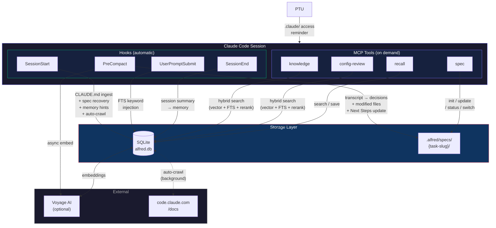
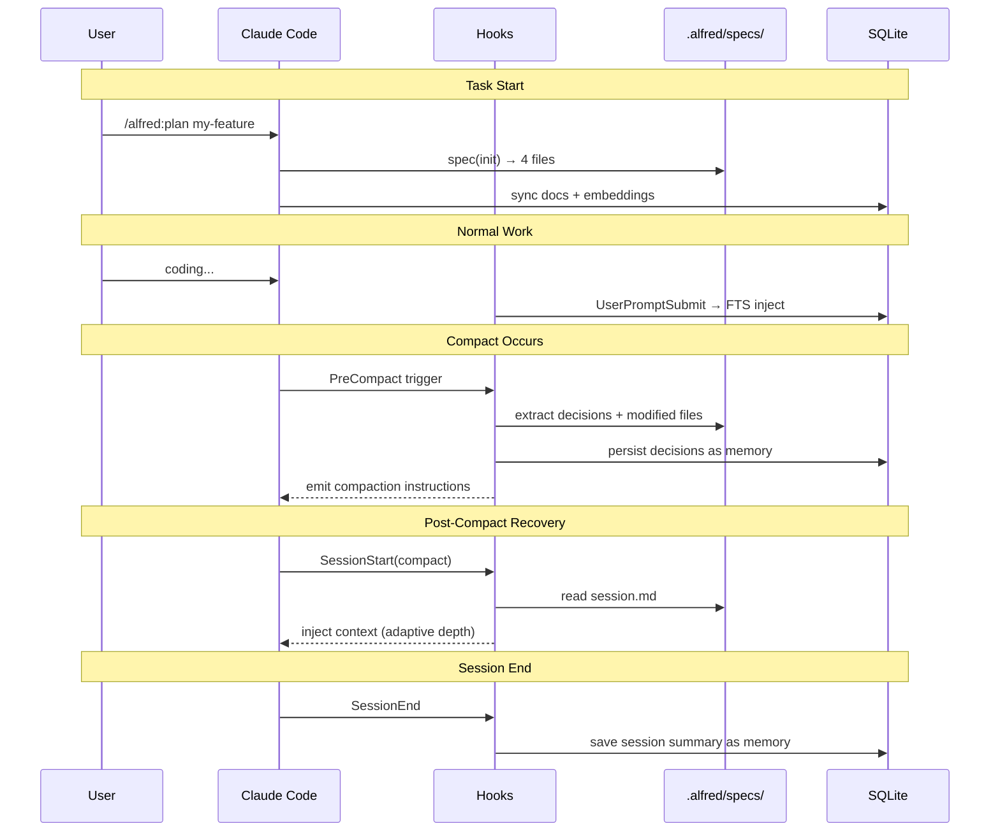

# alfred

[](https://github.com/hir4ta/claude-alfred/releases)
[](https://go.dev/)
[](https://github.com/hir4ta/claude-alfred/blob/main/LICENSE)
[](https://github.com/hir4ta/claude-alfred/releases)

Your silent butler for Claude Code.

Works silently in the background — surfacing relevant knowledge, catching scope violations, and preserving session context across compactions — so you can focus on building.

[日本語版 README](README.ja.md)

## What alfred does

**Knowledge Injection** — Automatically surfaces relevant best practices from an extensive document knowledge base when you're working on Claude Code configuration, architecture decisions, or any topic covered by the docs.

**Alfred Protocol** — Structured spec management resilient to Compact and session loss. Saves requirements, design, decisions, and session state to `.alfred/specs/`, with automatic context preservation and recovery.

**Multi-Agent Code Review** — 3 specialized sub-reviewers (security, logic, design) run in parallel, then findings are aggregated and deduplicated. Each reviewer has explicit checklists for LLM blind spots. Cross-checks against active specs and knowledge base.

**Persistent Memory** — Remembers past sessions, decisions, and notes across projects. Automatically saves session summaries and design decisions as permanent memory. Search past experience with the `recall` tool — alfred automatically surfaces relevant memories at session start.

**Auto-Crawl** — Knowledge base automatically refreshes in the background. SessionStart checks when docs were last crawled and spawns a background process if they're stale (default: 7 days). No manual `alfred init` needed to stay current.

**Compact Resilience** — PreCompact hook auto-extracts decisions, tracks modified files, saves session state in activeContext format, and auto-updates Next Steps completion status. SessionStart hook restores full context after compaction.

## Getting Started

### 1. Install alfred

```bash
brew install hir4ta/alfred/alfred
```

### 2. Add the plugin

In Claude Code

```
/plugin marketplace add hir4ta/claude-alfred   # Register the marketplace (once)
/plugin install alfred                          # Install the plugin
```

Skills, rules, hooks, agents, and MCP configuration will be installed.

### 3. Set API key (optional but recommended)

```bash
export VOYAGE_API_KEY=your-key  # Add to ~/.zshrc or equivalent
```

[Voyage AI](https://voyageai.com/) enables high-precision semantic search with embedding + reranking.
Cost is near-zero: embedding docs costs ~$0.01, and each search query costs fractions of a cent.

Without Voyage AI, alfred still works using FTS5 keyword search — no API key needed to run.

### 4. Initialize the knowledge base

```bash
alfred init
```

Interactive TUI guides you through setup:
- Prompts for Voyage API key (or press Esc for FTS-only mode)
- Ingests documentation into SQLite with progress display
- Generates embeddings if API key is provided

Restart Claude Code to finish setup.

## Updating

```bash
alfred update
```

Updates both the binary (via Homebrew or direct download) and the plugin bundle automatically.
Restart Claude Code after updating.

## Skills (7)

Invoke with `/alfred:<skill>` in Claude Code.

| Skill | Description |
|-------|-------------|
| `/alfred:configure <type> [name]` | Create or polish a single config file (skill, rule, hook, agent, MCP, CLAUDE.md, memory) with independent review |
| `/alfred:setup` | Project-wide setup wizard — multi-file scan + configuration, or Claude Code feature explainer |
| `/alfred:brainstorm <theme>` | Multi-agent divergent thinking — 3 specialists (Visionary, Pragmatist, Critic) generate ideas in parallel, then debate |
| `/alfred:refine <theme>` | Convergent thinking — fix the issue, narrow options, score, and decide |
| `/alfred:plan <task-slug>` | Alfred Protocol — multi-agent spec generation (Architect + Devil's Advocate + Researcher deliberate on design) |
| `/alfred:review [focus]` | Multi-agent code review — 3 sub-reviewers (security, logic, design) in parallel |
| `/alfred:help [feature]` | Quick reference for all capabilities — skills, agents, MCP tools, CLI commands |

## Agents (2)

| Agent | Description |
|-------|-------------|
| `alfred` | Silent butler — Claude Code configuration and best practices support |
| `code-reviewer` | Multi-agent review orchestrator — spawns 3 sub-reviewers (security, logic, design) in parallel |

## MCP Tools (4)

Backend for skills and agents. Claude calls these automatically as needed.

| Tool | Description |
|------|-------------|
| `knowledge` | Hybrid vector + FTS5 + Voyage rerank document search |
| `config-review` | Deep audit of .claude/ config (file contents + KB cross-reference) |
| `spec` | Unified spec management (action: init / update / status / switch / delete / history / rollback) |
| `recall` | Memory search and save — past sessions, decisions, and notes |

## Hooks (4)

Run automatically during Claude Code lifecycle. No user action needed.

| Event | Action |
|-------|--------|
| SessionStart | Auto-ingest CLAUDE.md + spec context injection (adaptive recovery) + past memory hints + auto-crawl check |
| PreCompact | Extract context from transcript + auto-detect decisions + track modified files + auto-update Next Steps completion → save session.md → persist decisions as memory → emit compaction instructions → async embedding |
| UserPromptSubmit | Keyword-gated FTS knowledge injection + memory search — auto-surfaces best practices and past experience (suppressed by `ALFRED_QUIET=1`) |
| SessionEnd | Persist session summary as permanent memory for future recall (skips on `reason=clear`) |

## Commands

| Command | Description |
|---------|-------------|
| `init` | Initialize knowledge base (interactive API key setup + TUI progress) |
| `status [--verbose]` | Show system status — DB stats, API key, active tasks, paths |
| `doctor` | Run 11 diagnostic checks — DB, schema, FTS, plugin, hooks, Voyage, embeddings, crawl |
| `analytics` | Show feedback loop stats — injection activity, top boosted/penalized docs |
| `export [--all]` | Export memories to JSON (`--all` includes specs) |
| `memory prune [--confirm]` | Remove old memories (dry-run by default, `--max-age DAYS` supported) |
| `memory stats` | Show memory statistics by project |
| `settings` | Configure API keys and preferences (interactive TUI) |
| `update` | Update to latest version (Homebrew / download / go install) |
| `version` | Show version |

## Architecture

### System Overview



### Alfred Protocol Lifecycle



### Alfred Protocol File Structure

```
.alfred/specs/{task-slug}/
├── requirements.md  # Goals, success criteria, out of scope
├── design.md        # Architecture, tech decisions
├── decisions.md     # Design decisions with alternatives and rationale
├── session.md       # Session state in activeContext format + Compact Markers
└── .history/        # Version history (max 20 per file, auto-pruned)
```

`_active.md` (YAML) manages multiple tasks; switch with `spec` (action=switch).

### Spec File Templates

When you run `/alfred:plan my-feature`, alfred creates these files:

**`.alfred/specs/my-feature/requirements.md`**
```
# Requirements: my-feature

## Goal
Add OAuth2 login flow to the API gateway.

## Success Criteria
- Users can login via Google/GitHub OAuth
- JWT tokens issued with 1h expiry
- Refresh token rotation implemented

## Out of Scope
- SAML/LDAP integration
- Multi-factor authentication
```

**`.alfred/specs/my-feature/session.md`** (activeContext format)
```
# Session: my-feature

## Status
active

## Currently Working On
Implementing the OAuth callback handler in cmd/api/auth.go

## Recent Decisions (last 3)
1. Use golang.org/x/oauth2 instead of custom implementation
2. Store refresh tokens in PostgreSQL, not Redis

## Next Steps
1. Add token refresh endpoint
2. Write integration tests for OAuth flow

## Blockers
None

## Modified Files (this session)
- cmd/api/auth.go
- internal/auth/oauth.go
```

Compact Marker example:
```
## Compact Marker [2025-03-08 14:30:00]
### Pre-Compact Context Snapshot
Last user directive: Add error handling to the OAuth callback
Recent assistant actions:
- Created internal/auth/oauth.go with provider abstraction
- Added tests in internal/auth/oauth_test.go
---
```

## Per-Project Configuration

Create `.alfred/config.json` in any project root to override default thresholds and add custom knowledge sources:

```json
{
  "relevance_threshold": 0.35,
  "high_confidence_threshold": 0.60,
  "crawl_interval_days": 3,
  "quiet": false,
  "custom_sources": [
    { "url": "https://example.com/docs/page", "label": "Internal API docs" }
  ]
}
```

All fields are optional — only specified values override the defaults.

For global custom sources (shared across all projects), create `~/.claude-alfred/sources.json`:

```json
[
  { "url": "https://docs.example.com/guide", "label": "Company style guide" }
]
```

Custom sources are crawled alongside official docs during auto-crawl.

## Debugging

Set `ALFRED_DEBUG=1` to output debug logs to `~/.claude-alfred/debug.log`.

## Dependencies

| Library | Purpose |
|---------|---------|
| [mcp-go](https://github.com/mark3labs/mcp-go) | MCP server SDK |
| [go-sqlite3](https://github.com/ncruces/go-sqlite3) | SQLite driver (pure Go, WASM) |
| [bubbletea](https://github.com/charmbracelet/bubbletea) | TUI framework (setup screen) |
| [Voyage AI](https://voyageai.com/) | Embedding + rerank (voyage-4-large, 2048d) |

## Changelog

See [CHANGELOG.md](CHANGELOG.md) for version history.

## Troubleshooting

### Debug logging

```bash
ALFRED_DEBUG=1 claude   # Enable debug log
cat ~/.claude-alfred/debug.log  # View logs
```

### Common issues

| Symptom | Cause | Fix |
|---|---|---|
| "no seed docs found" on serve | Knowledge base not initialized | Run `alfred init` |
| Hook timeout warnings | Slow FTS search or large transcript | Check `~/.claude-alfred/debug.log` |
| "VOYAGE_API_KEY is required" on init | API key not set | Run `alfred settings` or `export VOYAGE_API_KEY=your-key` |
| Knowledge results feel stale | Auto-crawl hasn't run or failed | Check `debug.log`; run `alfred init` to force refresh |
| Hook not firing | Plugin not installed | Run `/plugin install alfred` and restart |

### Environment variables

| Variable | Default | Purpose |
|---|---|---|
| `VOYAGE_API_KEY` | (none) | Voyage AI API key for vector search + reranking |
| `ALFRED_DEBUG` | (unset) | Set to `1` to enable debug logging |
| `ALFRED_RELEVANCE_THRESHOLD` | `0.40` | Minimum score for knowledge injection |
| `ALFRED_HIGH_CONFIDENCE_THRESHOLD` | `0.65` | Score threshold for injecting 2 results |
| `ALFRED_SINGLE_KEYWORD_DAMPEN` | `0.80` | Dampening factor for single-keyword matches |
| `ALFRED_CRAWL_INTERVAL_DAYS` | `7` | Auto-crawl interval in days |
| `ALFRED_QUIET` | `0` | Set to `1` to suppress knowledge injection |
| `ALFRED_MEMORY_MAX_AGE_DAYS` | `180` | Default cutoff age for `alfred memory prune` |

## License

MIT
