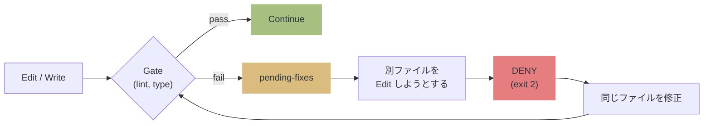
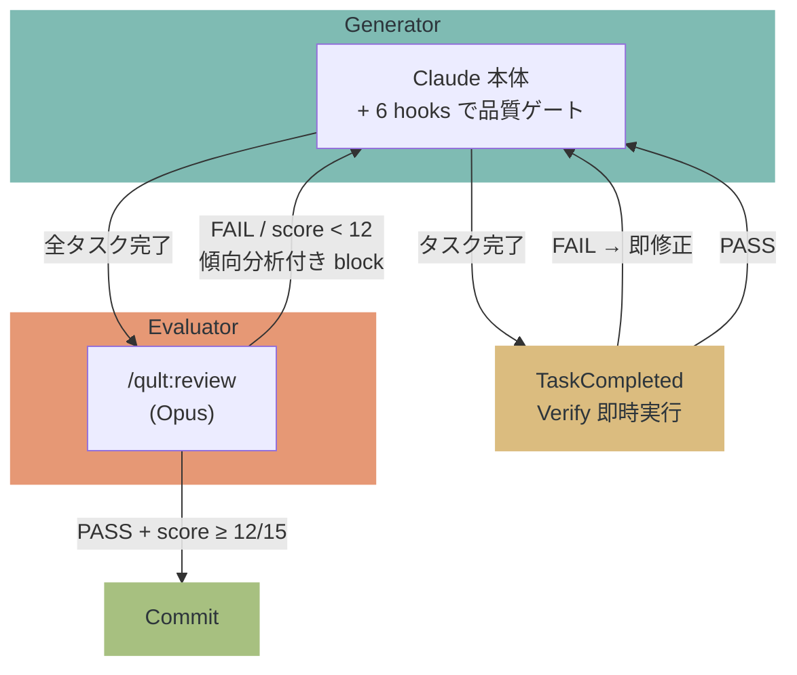

# qult


**Claude の悪い癖を物理的に止める。** コードの品質を構造で守る evaluator harness。

> Claude は優秀だが、lint エラーを放置して次のファイルに行く。テストなしでコミットする。自分のコードを褒めてレビューを終える。
> qult は 5 hooks + MCP server + 独立 Opus evaluator で、それを **お願い (advisory) ではなく exit 2 (DENY) で止める**。
> Claude Code Plugin として配布。`/plugin install` で導入完了。

> [!NOTE]
> セッション開始時に `SessionStart:startup hook error` や `Stop hook error` と表示されることがありますが、**これは qult のバグではありません**。
> Claude Code の UI が hook の成功/失敗を正しく判別できない既知のバグです ([#12671](https://github.com/anthropics/claude-code/issues/12671), [#21643](https://github.com/anthropics/claude-code/issues/21643), [#10463](https://github.com/anthropics/claude-code/issues/10463))。
> hook 自体は正常に動作しています。

> [!WARNING]
> **PreToolUse hook の DENY が無視される場合があります。** qult は正しく `exit 2` を返しますが、
> Claude Code がブロックせずにツールを実行してしまうケースが報告されています
> ([#21988](https://github.com/anthropics/claude-code/issues/21988), [#4669](https://github.com/anthropics/claude-code/issues/4669), [#24327](https://github.com/anthropics/claude-code/issues/24327))。
> Claude Code 側の修正待ちです。

---

## How it works



Anthropic の [Harness Design](https://www.anthropic.com/engineering/harness-design-long-running-apps) 記事が示した Generator-Evaluator パターンで動作:



---

## 何を防ぐか

| 状況 | 行動 |
|---|---|
| lint/type エラーを放置して別ファイルへ | **DENY** — 修正するまでブロック |
| テスト未実行で git commit | **DENY** — テスト pass を要求 |
| レビュー未実行/FAIL で完了宣言 | **block** — /qult:review を要求 |
| レビュー PASS だがスコア低い | **block** — 傾向分析付きで再レビュー (最大3回) |
| Plan 確定時に漏れがある | **DENY** — セッション全体の漏れチェックを強制 (1回) |
| Plan の途中で完了宣言 | **block** — 全タスク完了を要求 |
| Plan タスク完了時 | **verify** — Verify フィールドのテストを即時実行 |

---

## 5 Hooks + MCP Server

| 分類 | Hook | 役割 |
|------|------|------|
| **壁** (enforcement) | PostToolUse | Edit/Write 後に lint/type gate 実行、state に書き込み |
| **壁** (enforcement) | PreToolUse | pending-fixes 未修正なら DENY、commit 前にテスト/レビュー要求、ExitPlanMode 時に漏れチェック強制 |
| **完了ゲート** (enforcement) | Stop | 未修正エラー・未完了タスク・レビュー未実施なら block |
| **サブエージェント** (enforcement) | SubagentStop | レビュー出力検証 + 傾向分析付きスコア閾値強制 (12/15) |
| **タスク検証** (advisory) | TaskCompleted | Plan タスク完了時に Verify テストを即時実行 |

| MCP Tool | 役割 |
|----------|------|
| get_pending_fixes | lint/typecheck エラーの詳細を返す |
| get_session_status | テスト/レビュー状態を返す |
| get_gate_config | ゲート設定を返す |

---

## インストール

### 1. プラグインの導入 (1回だけ)

```
/plugin marketplace add hir4ta/qult
/plugin install qult@hir4ta-qult
```

インストール後、Claude Code を再起動する（セッションを終了して新しいセッションを開始）。

### 2. プロジェクトのセットアップ (プロジェクトごとに1回)

```
/qult:init
```

init が行うこと:
- `.qult/` ディレクトリ作成
- `.qult/gates.json` 生成 — プロジェクトの lint/typecheck/test ツールを自動検出
- `.claude/rules/qult-gates.md` 配置 — MCP tool の呼び出しルール (DENY 時に `get_pending_fixes` を呼ぶ等)
- `.claude/rules/qult-quality.md` 配置 — テスト駆動、スコープ管理ルール
- `.claude/rules/qult-plan.md` 配置 — Plan 構造ルール
- `.gitignore` に `.qult/` 追加

### 3. 動作確認

```
/qult:doctor
```

### init 後に使えるコマンド

| コマンド | 説明 |
|---------|------|
| `/qult:status` | 現在の品質ゲート状態を表示 |
| `/qult:review` | 独立コードレビュー (Opus evaluator) |
| `/qult:detect-gates` | ゲート設定を再検出 |
| `/qult:plan-generator` | 機能説明から構造化 Plan を生成 |
| `/qult:doctor` | セットアップの健全性チェック |
| `/qult:update` | プラグイン更新後に rules ファイルを最新化 |

hooks (PostToolUse, PreToolUse, Stop, SubagentStop, TaskCompleted) と MCP server は自動で動作する。

## 更新

1. `/plugin` > qult 詳細 > 更新 (hooks, skills, agents, MCP server が更新される)
2. `/qult:update` (プロジェクトの rules ファイルを最新化)

## アンインストール

`/plugin` > qult を削除。プロジェクトの `.qult/` と `.claude/rules/qult*.md` は手動で削除。

## 設定

`.qult/config.json` で閾値をカスタマイズできる (全てオプション):

```json
{
  "review": {
    "score_threshold": 12,
    "max_iterations": 3,
    "required_changed_files": 5
  },
  "gates": {
    "output_max_chars": 2000,
    "default_timeout": 10000
  }
}
```

環境変数でも上書き可能: `QULT_REVIEW_SCORE_THRESHOLD`, `QULT_GATE_OUTPUT_MAX` など。

<details>
<summary><strong>対応言語・ツール</strong></summary>

| 言語 | on_write (lint/type) | on_commit (test) | on_review (e2e) |
|---|---|---|---|
| **TypeScript/JS** | biome / eslint / tsc | vitest / jest / mocha | — |
| **Python** | ruff / pyright / mypy | pytest | — |
| **Go** | go vet | go test | — |
| **Rust** | cargo clippy / check | cargo test | — |
| **Ruby** | rubocop | rspec | — |
| **Java/Kotlin** | ktlint / detekt | gradle test / mvn test | — |
| **Elixir** | credo | mix test | — |
| **Deno** | deno lint | deno test | — |
| **Frontend** | stylelint | — | playwright / cypress / wdio |

</details>

---

## 設計原則

| 原則 | 意味 |
|------|------|
| **壁 > 情報提示** | DENY (exit 2) で止める。advisory は無視される前提 |
| **fail-open** | 全 hook は try-catch。qult の障害で Claude を止めない |
| **structural guarantee** | 品質を構造で保証する。仮定を stress-test し、崩れたら削除 |
| **dependencies ゼロ** | 全て devDependencies + bun build バンドル |

---

## Plan 自動生成

```
/qult:plan-generator "JWT認証をAPIに追加"
  → Opus が codebase を分析
  → WHAT/WHERE/VERIFY/BOUNDARY/SIZE 形式の Plan を生成
  → .claude/plans/ に書き出し
```

---

## データストレージ

```
.qult/
└── .state/
    ├── session-state-{id}.json
    └── pending-fixes-{id}.json
```

- セッション ID でスコープ (並行セッション安全)
- 24h 経過した古いファイルは自動クリーンアップ

---

## スタック

TypeScript / MCP SDK / vitest (テスト) / Biome (lint)

Claude Code Plugin として配布。開発には Bun 1.3+ が必要。
