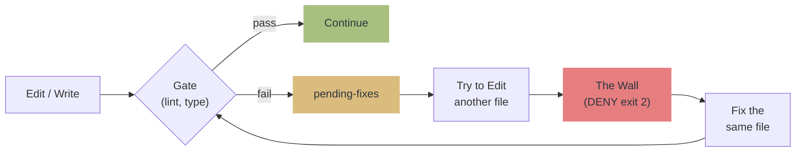
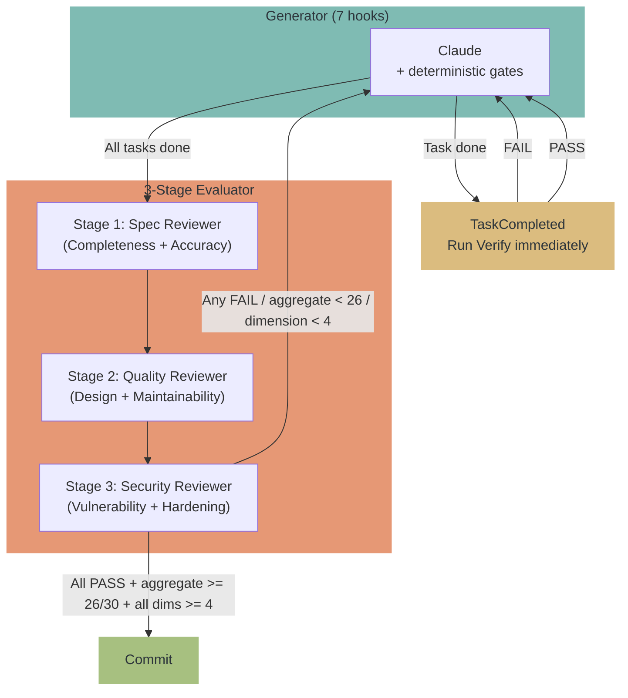

# qult


**Quality by Structure, Not by Promise.** A harness engineering tool that enforces code quality through walls, not words.

> Prompts are suggestions. Hooks are enforcement.
> qult uses 7 hooks + MCP server + 3-stage independent review to block quality regressions with **exit 2 (DENY), not advisory messages**.
> Distributed as a Claude Code Plugin. Install with `/plugin install`.

## Why harness engineering?

AI coding agents are powerful but unreliable at self-regulation. They leave lint errors behind and move to the next file. They commit without running tests. They praise their own code and call the review done.

The emerging discipline of **harness engineering** — first named by [OpenAI](https://openai.com/index/harness-engineering/) and formalized by [Martin Fowler](https://martinfowler.com/articles/exploring-gen-ai/harness-engineering.html) — addresses this:

> **Agent = Model + Harness.** Enforce invariants, don't micromanage implementations.

Research validates this approach:

- **TDAD** ([arXiv:2603.17973](https://arxiv.org/abs/2603.17973)): Adding TDD instructions via prompts alone **increased regressions** from 6% to 10% — worse than no intervention. Structural enforcement reduced them to 1.8%.
- **Specification as Quality Gate** ([arXiv:2603.25773](https://arxiv.org/abs/2603.25773)): AI reviewing AI is structurally circular — correlated errors echo rather than cancel. Deterministic gates must come first, AI review only for the residual.

qult implements this architecture: **deterministic gates (lint, typecheck) → executable specifications (test) → AI review (residual only)**.

### Trust structure, not models

| Approach | Mechanism | Guarantee |
|----------|-----------|-----------|
| **Prompt-based** (superpowers, etc.) | Persuasive skill prose | None — model may skip steps |
| **Structure-based** (qult) | Hook exit 2 (DENY) | Structural — cannot be bypassed by the model |

In Fowler's taxonomy: qult's hooks are **sensors** (feedback controls that observe and correct), while skills and CLAUDE.md are **guides** (feedforward controls that steer before action). Both are necessary; qult provides both.

## Philosophy

```
Quality by Structure, Not by Promise.

1. The Wall doesn't negotiate.
   Prompts are suggestions. Hooks are enforcement. Quality is not left to promises.

2. The architect designs, the agent implements.
   Humans decide what to build. AI decides how to build it.
   Ambiguity is resolved by asking, never by guessing.

3. Proof or Block.
   "Done" is not evidence. Tests pass, review passes — then it's done.
   Claims without evidence are structurally blocked.

4. fail-open — cult of quality, humble about ourselves.
   qult's own failures never block Claude. Break? Open the gate.
   Fanatical about quality. Humble about our tools.
```

> [!NOTE]
> You may see `SessionStart:startup hook error` or `Stop hook error` at session start. **This is not a qult bug.**
> It's a known Claude Code UI bug that misreports hook success/failure ([#12671](https://github.com/anthropics/claude-code/issues/12671), [#21643](https://github.com/anthropics/claude-code/issues/21643), [#10463](https://github.com/anthropics/claude-code/issues/10463)).
> Hooks are working correctly.

> [!WARNING]
> **PreToolUse DENY may be ignored.** qult correctly returns `exit 2`, but
> Claude Code sometimes executes the tool anyway
> ([#21988](https://github.com/anthropics/claude-code/issues/21988), [#4669](https://github.com/anthropics/claude-code/issues/4669), [#24327](https://github.com/anthropics/claude-code/issues/24327)).
> Waiting for a Claude Code fix.

[Japanese README / README.ja.md](README.ja.md)

## How it works



Operates on the Generator-Evaluator pattern from Anthropic's [Harness Design](https://www.anthropic.com/engineering/harness-design-long-running-apps) article:



## What it prevents

| Situation | Action |
|---|---|
| Lint/type errors left behind, moves to another file | **The Wall** — DENY until fixed |
| `git commit` without running tests | **The Wall** — requires test pass |
| Import of non-existent package (hallucinated import) | **The Wall** — pending-fix until corrected |
| `git commit` without exit code 0 confirmation | **The Wall** — requires positive evidence of test pass |
| Declares done without review or after FAIL | **block** — requires /qult:review |
| Review PASS but low aggregate score | **block** — trend-aware re-review (up to 3x) |
| Review PASS but any single dimension below floor | **block** — e.g., Security=3 blocks even if aggregate is high (floor=4) |
| Review scores suspiciously uniform | **warn** — score bias detection (identical/low-variance) |
| Plan finalized with omissions | **The Wall** — forces session-wide check (once) |
| Declares done mid-plan | **block** — requires all tasks completed |
| Plan task completed | **verify** — runs Verify test immediately |
| Verify test has too few assertions | **warn** — shallow test quality warning |
| Same file gets review findings repeatedly | **warn** — Agentic Flywheel suggests .claude/rules/ entry |

## Complete Workflow

qult provides a full development workflow through 12 skills and 6 agents:

```
/qult:explore    → Interview the architect, explore design
/qult:plan-generator → Generate structured implementation plan
    [Plan mode]  → Architect reviews and approves
/qult:review     → 3-stage independent review (Spec → Quality → Security)
/qult:finish     → Structured branch completion (merge/PR/hold/discard)
/qult:debug      → Structured root-cause debugging
```

## 7 Hooks + MCP Server

| Type | Hook | Role |
|------|------|------|
| **Init** (advisory) | SessionStart | Initialize state directory, clean stale files, clear pending-fixes on startup |
| **The Wall** (enforcement) | PostToolUse | Runs lint/type gates + hallucinated import + export breaking change detection, outputs gate summary to stderr |
| **The Wall** (enforcement) | PreToolUse | DENY if pending fixes, require test/review before commit, force selfcheck on ExitPlanMode |
| **Completion gate** (enforcement) | Stop | Block if unresolved errors, incomplete tasks, or missing review |
| **Subagent** (enforcement) | SubagentStop | Validates review output, enforces dimension floor + aggregate threshold (26/30), score bias detection, Agentic Flywheel |
| **Task verify** (advisory) | TaskCompleted | Runs Verify test immediately, checks test quality (assertion count) |
| **Context** (advisory) | PostCompact | Re-injects pending fixes, session state, disabled gates, review iteration, plan progress |

| MCP Tool | Role |
|----------|------|
| get_pending_fixes | Returns lint/typecheck error details |
| get_session_status | Returns test/review state |
| get_gate_config | Returns gate configuration |
| disable_gate | Temporarily disable a gate for this session |
| enable_gate | Re-enable a previously disabled gate |
| set_config | Change a config value in .qult/config.json |
| clear_pending_fixes | Clear all pending lint/typecheck fixes |

## Installation

### 1. Install the plugin (once)

```
/plugin marketplace add hir4ta/qult
/plugin install qult@hir4ta-qult
```

Restart Claude Code after installation (end the session and start a new one).

### 2. Project setup (once per project)

```
/qult:init
```

What init does:
- Creates `.qult/` directory
- Generates `.qult/gates.json` — auto-detects project lint/typecheck/test tools
- Adds `.qult/` to `.gitignore`
- Cleans up legacy files (old rules, hooks)

All quality rules are delivered via MCP server instructions — no files are placed in your project except `.qult/`.

### 3. Verify setup

```
/qult:doctor
```

### Available commands after init

| Command | Description |
|---------|-------------|
| `/qult:explore` | Design exploration — interview the architect before coding |
| `/qult:plan-generator` | Generate structured plan from feature description |
| `/qult:review` | 3-stage independent code review (Spec + Quality + Security) |
| `/qult:finish` | Structured branch completion (merge/PR/hold/discard) |
| `/qult:debug` | Structured root-cause debugging |
| `/qult:status` | Show current quality gate status |
| `/qult:skip` | Temporarily disable/enable gates or clear pending fixes |
| `/qult:config` | View or change config values (thresholds, iterations) |
| `/qult:doctor` | Health check for setup |
| `/qult:register-hooks` | Register hooks in settings.local.json (fallback) |
| `/qult:writing-skills` | TDD methodology for creating new skills |

Hooks (SessionStart, PostToolUse, PreToolUse, Stop, SubagentStop, TaskCompleted, PostCompact) and MCP server run automatically.

### If hooks don't fire

Plugin hooks have known reliability issues in some environments ([#18547](https://github.com/anthropics/claude-code/issues/18547), [#10225](https://github.com/anthropics/claude-code/issues/10225)). If hooks don't trigger after install:

```
/qult:register-hooks
```

This registers the same hooks in `.claude/settings.local.json` as a fallback. When both plugin hooks and settings hooks are present, Claude Code deduplicates them (same command runs once). The `.claude/settings.local.json` file is gitignored, so it does not affect other team members.

## 3-Stage Review

qult's review (`/qult:review`) spawns three specialized Opus reviewers in sequence:

| Stage | Agent | Dimensions | Focus |
|-------|-------|-----------|-------|
| 1 | **Spec Reviewer** | Completeness + Accuracy | Does the implementation match the plan? Are consumers updated? |
| 2 | **Quality Reviewer** | Design + Maintainability | Is the code well-designed? Are edge cases handled? |
| 3 | **Security Reviewer** | Vulnerability + Hardening | Are there injection risks? Is defense-in-depth applied? |

Each agent scores 2 dimensions (1-5 each). Total: **6 dimensions / 30 points**.

### Dual threshold enforcement

qult enforces quality at two levels:

1. **Dimension floor** (default: 3/5) — Any single dimension below the floor blocks immediately, regardless of aggregate score. This prevents "excellent code with terrible security" from passing.
2. **Aggregate threshold** (default: 24/30) — After all 3 stages complete, the combined score across all 6 dimensions must meet the threshold. Maximum 3 iterations.

After all reviewers complete, a Judge filter validates each finding for Succinctness, Accuracy, and Actionability.

## Updating

`/plugin` > qult details > update. All hooks, skills, agents, and MCP server are updated automatically. No additional commands needed — quality rules are delivered via MCP instructions, not project files.

## Uninstalling

`/plugin` > delete qult. Manually remove `.qult/` from the project.

## Configuration

Customize thresholds in `.qult/config.json` (all optional):

```json
{
  "review": {
    "score_threshold": 26,
    "max_iterations": 3,
    "required_changed_files": 5,
    "dimension_floor": 4
  },
  "gates": {
    "output_max_chars": 2000,
    "default_timeout": 10000
  }
}
```

| Key | Type | Default | Description |
|-----|------|---------|-------------|
| `review.score_threshold` | number | 26 | Aggregate score required to pass 3-stage review (max 30) |
| `review.max_iterations` | number | 3 | Maximum review retry iterations |
| `review.required_changed_files` | number | 5 | Number of changed files that triggers mandatory review |
| `review.dimension_floor` | number | 4 | Minimum score per dimension (1-5). Any dimension below this blocks regardless of aggregate |
| `gates.output_max_chars` | number | 2000 | Max gate output chars (excess is truncated) |
| `gates.default_timeout` | number | 10000 | Gate command timeout (ms) |

Environment variable overrides: `QULT_REVIEW_SCORE_THRESHOLD`, `QULT_REVIEW_MAX_ITERATIONS`, `QULT_REVIEW_REQUIRED_FILES`, `QULT_REVIEW_DIMENSION_FLOOR`, `QULT_GATE_OUTPUT_MAX`, `QULT_GATE_DEFAULT_TIMEOUT`

<details>
<summary><strong>Review score threshold rationale</strong></summary>

The 3-stage reviewer scores six dimensions (Completeness, Accuracy, Design, Maintainability, Vulnerability, Hardening) on a 1-5 scale.

**Aggregate threshold** (default 26/30):
- 5+4+5+4+4+4 = 26: Solid code passes at the threshold
- 4+4+4+4+4+4 = 24: Fails. Consistent "good" is no longer enough — AI reviewers tend toward leniency
- 3+3+3+3+3+3 = 18: Fails significantly. Consistent mediocrity is caught
- 5+5+4+4+5+5 = 28: Strong code passes comfortably

**Dimension floor** (default 4/5):
- 5+5+5+5+3+3 = 26: Aggregate passes, but **blocked** — Vulnerability=3 is below floor (3/5 means "reachable wrong output" per quality-reviewer rubric)
- 4+4+4+4+5+5 = 26: Passes — all dimensions at or above floor

The dimension floor prevents a dangerous pattern where excellent scores in some areas mask critical weakness in others (especially security). The default of 4 was chosen because 3/5 in the quality-reviewer rubric means "a reachable code path produces wrong output" — not acceptable for production code. Configurable: lower it for prototypes (`"dimension_floor": 3`), raise it for safety-critical systems (`"dimension_floor": 5`).

**Score bias detection**: qult warns when all 6 dimensions have identical scores or when score variance is low (range < 2). This helps detect template-like AI reviewer responses that lack genuine differentiation.

Scores are LLM-generated and not perfectly reproducible. The trend-aware iteration system (up to `max_iterations` retries) compensates: if the score improves across iterations, the feedback is working. If it stagnates, the system advises a different approach.

</details>

<details>
<summary><strong>Supported languages and tools</strong></summary>

| Language | on_write (lint/type) | on_commit (test) | on_review (e2e) |
|---|---|---|---|
| **TypeScript/JS** | biome / eslint / tsc | vitest / jest / mocha | -- |
| **Python** | ruff / pyright / mypy | pytest | -- |
| **Go** | go vet | go test | -- |
| **Rust** | cargo clippy / check | cargo test | -- |
| **Ruby** | rubocop | rspec | -- |
| **Java/Kotlin** | ktlint / detekt | gradle test / mvn test | -- |
| **Elixir** | credo | mix test | -- |
| **Deno** | deno lint | deno test | -- |
| **Frontend** | stylelint | -- | playwright / cypress / wdio |

</details>

### Custom gates

Edit `.qult/gates.json` directly to add, modify, or remove gates:

```json
{
  "on_write": {
    "lint": { "command": "biome check {file}", "timeout": 3000 },
    "typecheck": { "command": "bun tsc --noEmit", "timeout": 10000, "run_once_per_batch": true },
    "custom-check": { "command": "my-tool check {file}", "timeout": 5000 }
  },
  "on_commit": {
    "test": { "command": "bun vitest run", "timeout": 30000 }
  },
  "on_review": {
    "e2e": { "command": "playwright test", "timeout": 120000 }
  }
}
```

**Gate fields:**

| Field | Required | Description |
|-------|----------|-------------|
| `command` | Yes | Shell command. `{file}` is replaced with the edited file path |
| `timeout` | No | Timeout in ms (default: `gates.default_timeout`) |
| `run_once_per_batch` | No | If true, skip re-running within the same session (useful for whole-project checks like `tsc --noEmit`) |
| `extensions` | No | Array of file extensions to check (e.g. `[".ts", ".tsx"]`). If omitted, qult infers from the command |

**Gate categories:**

| Category | When it runs | Typical gates |
|----------|-------------|---------------|
| `on_write` | After every Edit/Write | lint, typecheck |
| `on_commit` | When `git commit` is detected | test |
| `on_review` | During `/qult:review` | e2e |

### Disabling a gate

Remove the gate entry from `.qult/gates.json`, or remove the entire category:

```json
{
  "on_write": {
    "lint": { "command": "biome check {file}", "timeout": 3000 }
  }
}
```

To temporarily disable all gates, rename or delete `.qult/gates.json`. qult is fail-open: missing gates means no enforcement. Run `/qult:init` to regenerate.

### Monorepo and workspace projects

qult detects gates from the project root. For monorepos with different tools per workspace, edit `.qult/gates.json` manually:

```json
{
  "on_write": {
    "lint-frontend": {
      "command": "cd packages/frontend && eslint {file}",
      "timeout": 5000,
      "extensions": [".tsx", ".jsx"]
    },
    "lint-backend": {
      "command": "cd packages/backend && biome check {file}",
      "timeout": 3000,
      "extensions": [".ts"]
    },
    "typecheck": {
      "command": "tsc --noEmit",
      "timeout": 15000,
      "run_once_per_batch": true
    }
  }
}
```

Use `extensions` to route files to the correct linter. The `{file}` placeholder receives the absolute path of the edited file.

## Plugin Architecture

qult uses every component available in the Claude Code Plugin system:

```
plugin/
├── .claude-plugin/plugin.json    Manifest
├── .mcp.json                     MCP server (state + quality rules)
├── .lsp.json                     LSP servers (TS/Python/Go/Rust)
├── settings.json                 Default agent (quality-guardian)
├── hooks/hooks.json              7 enforcement hooks
├── agents/                       6 agents
├── skills/                       12 skills
├── bin/qult-gate                 CLI tool (status, run-lint, run-test)
├── output-styles/quality-first.md  Output style
└── dist/                         Bundled hook + MCP server
```

| Component | Fowler's taxonomy | Role |
|-----------|-------------------|------|
| **hooks** | Sensor (feedback) | Enforcement — DENY (exit 2) on quality violations |
| **MCP server** | Sensor (observability) | State management + quality rule injection via instructions |
| **skills** | Guide (feedforward) | Interactive workflows (explore, review, debug, finish) |
| **agents** | Guide + Sensor | Independent evaluators (plan, spec, quality, security) |
| **settings.json** | Guide | Sets quality-guardian as default session agent |
| **.lsp.json** | Sensor (real-time) | Provides real-time diagnostics (TypeScript, Python, Go, Rust) |
| **bin/** | Sensor (manual) | `qult-gate` CLI for manual gate operations |
| **output-styles/** | Guide | "Quality First" output style — concise, evidence-based, gate-aware |

### Output style

Select the "Quality First" output style via `/config` > Output style. It uses qult terminology and includes gate status in every response.

### CLI tool

`qult-gate` is added to PATH when the plugin is active:

```bash
qult-gate status       # Show gate config and pending fixes
qult-gate run-lint <f> # Run on_write gates on a file
qult-gate run-test     # Run on_commit gates
qult-gate version      # Show qult version
```

### LSP integration

qult provides LSP server configurations for TypeScript, Python, Go, and Rust. LSP gives Claude real-time diagnostics — errors are caught before gates run, not after.

> LSP servers must be installed separately (`npm i -g typescript-language-server`, `pip install pyright`, `gopls`, `rust-analyzer`).

## AI-Specific Quality Features

Beyond traditional linting and testing, qult addresses failure modes specific to AI coding agents:

| Feature | LLM Failure Mode | How qult addresses it |
|---------|------------------|----------------------|
| **Hallucinated import detection** | AI invents non-existent packages (~20% of AI package recommendations don't exist) | PostToolUse checks every `import` against `node_modules`. Missing packages become pending-fixes |
| **Export breaking change detection** | AI removes exports without checking consumers | PostToolUse compares with git HEAD, flags removed exports as pending-fixes |
| **Test false positive prevention** | AI records test pass without verifying exit code | Requires explicit `exit code 0` in output — absence of failure is not evidence of success |
| **Verify test quality check** | AI writes shallow tests (single assertion, no edge cases) | TaskCompleted warns when average assertions/test < 2 |
| **Score bias detection** | AI reviewers give identical or near-identical scores (template responses) | Warns on uniform scores (all same) or low variance (range < 2) |
| **Instruction drift defense** | AI forgets constraints mid-session (context rot at ~60% utilization) | State summary in every deny/block message + gate summary on every edit + full re-injection on compaction |
| **Agentic Flywheel** | Same mistakes repeated across sessions | Review findings persisted + repeated patterns detected + .claude/rules/ suggestions |
| **Codebase-aware explore** | AI asks generic questions instead of project-specific ones | Phase 0 scans codebase for relevant types/patterns and generates context questions |

## Design principles

| Principle | Fowler's category | Meaning |
|-----------|-------------------|---------|
| **The Wall > advisory** | Sensor > Guide | Stop with DENY (exit 2). Advisories are assumed to be ignored |
| **fail-open** | Sensor safety | All hooks use try-catch. qult failures never block Claude |
| **Proof or Block** | Sensor enforcement | No completion claims without verification evidence |
| **deterministic first** | Gate ordering | lint/typecheck → test → AI review. Matches academic recommendation |
| **dimension floor** | Sensor threshold | Any single dimension below floor blocks. No weak spots hidden by averages |
| **zero dependencies** | Supply chain | All devDependencies + bun build bundle |

## Agents

| Agent | Model | Purpose |
|-------|-------|---------|
| **quality-guardian** | inherit | Default session agent. Embeds qult philosophy into every interaction |
| **plan-generator** | Opus | Analyzes codebase, generates structured implementation plans |
| **plan-evaluator** | Opus | Evaluates plan quality (Feasibility, Completeness, Clarity) |
| **spec-reviewer** | Opus | Verifies implementation matches the plan (Completeness, Accuracy) |
| **quality-reviewer** | Opus | Evaluates code quality (Design, Maintainability) |
| **security-reviewer** | Opus | OWASP Top 10 security review (Vulnerability, Hardening) |

## Data storage

```
.qult/
└── .state/
    ├── session-state-{id}.json       Per-session quality state
    ├── pending-fixes-{id}.json       Per-session lint/type errors
    ├── latest-session.json           Session marker for MCP
    └── review-findings-history.json  Agentic Flywheel (cross-session)
```

- Session-scoped by ID (concurrent session safe, session_id validated against path traversal)
- Stale session files auto-cleaned after 24h
- Findings history persists across sessions (max 100 entries, used for pattern detection)

## Troubleshooting

<details>
<summary><strong>"Hook Error" shown at session start</strong></summary>

Not a qult bug. Known Claude Code UI bug that misreports hook success/failure ([#12671](https://github.com/anthropics/claude-code/issues/12671), [#34713](https://github.com/anthropics/claude-code/issues/34713)). Hooks are working correctly.

</details>

<details>
<summary><strong>DENY issued but tool still executes</strong></summary>

Known Claude Code bug ([#21988](https://github.com/anthropics/claude-code/issues/21988), [#24327](https://github.com/anthropics/claude-code/issues/24327)). qult correctly returns exit 2, but Claude Code sometimes does not block. Awaiting fix.

</details>

<details>
<summary><strong>Gates not detected</strong></summary>

Run `/qult:init`. Ensure tool binaries are on PATH (`which biome`, `which tsc`, etc.). `node_modules/.bin` is searched automatically.

</details>

<details>
<summary><strong>Corrupt state files</strong></summary>

Delete files in `.qult/.state/` and start a new session. qult is fail-open by design — corrupt state files will not block Claude.

</details>

<details>
<summary><strong>Skip gates for specific files</strong></summary>

Add an `extensions` field to gates in `.qult/gates.json` to restrict which file types are checked:

```json
{
  "on_write": {
    "lint": { "command": "biome check {file}", "extensions": [".ts", ".tsx"] }
  }
}
```

</details>

<details>
<summary><strong>Gate false positive (lint reports error that is not real)</strong></summary>

1. Check if the gate command itself is correct: run it manually in terminal
2. If the tool config is wrong, fix the tool config (e.g. `.eslintrc.json`, `biome.json`)
3. If qult is running the wrong tool, edit `.qult/gates.json` to use the correct command
4. As a last resort, remove the gate from `.qult/gates.json`

qult runs the exact command in `gates.json`. If the command produces false positives, the fix is in the tool config, not in qult.

</details>

<details>
<summary><strong>Review blocks repeatedly with low score</strong></summary>

The review iteration limit defaults to 3. After 3 attempts, the review proceeds regardless. If you want to skip review iteration:

- Lower `review.score_threshold` in `.qult/config.json`
- Or set `QULT_REVIEW_SCORE_THRESHOLD=18` as an environment variable

If scores stagnate (same score across iterations), the SubagentStop hook suggests trying a fundamentally different approach. This is by design: the same fix strategy applied repeatedly will not improve the score.

</details>

<details>
<summary><strong>qult blocks commit but I need to commit now</strong></summary>

qult enforces gates via PreToolUse hooks. To bypass in an emergency:

1. Commit directly in terminal (outside Claude Code): `git commit -m "emergency fix"`
2. Or temporarily disable qult: `/plugin` > disable qult, commit, re-enable

Do not delete `.qult/.state/` to bypass. This clears all session tracking and may cause unexpected behavior.

</details>

## References

Academic papers and industry sources that validate qult's design:

- [OpenAI: Harness Engineering](https://openai.com/index/harness-engineering/) — "Agent = Model + Harness. Enforce invariants, not micromanage implementations."
- [Martin Fowler: Harness Engineering](https://martinfowler.com/articles/exploring-gen-ai/harness-engineering.html) — Guides (feedforward) + Sensors (feedback) taxonomy
- [TDAD: Test-Driven Agentic Development](https://arxiv.org/abs/2603.17973) — Prompt-only TDD increases regressions; structural enforcement reduces them
- [The Specification as Quality Gate](https://arxiv.org/abs/2603.25773) — Deterministic verification first, AI review for residual only
- [VibeGuard](https://arxiv.org/abs/2604.01052) — Security gate framework for AI-generated code
- [Anthropic: Harness Design](https://www.anthropic.com/engineering/harness-design-long-running-apps) — Generator-Evaluator pattern
- [IEEE Spectrum: AI Coding Degrades](https://spectrum.ieee.org/ai-coding-degrades) — Silent failures in AI-generated code
- [arXiv: AI-Specific Code Smells](https://arxiv.org/abs/2509.20491) — SpecDetect4AI: 22 AI-specific code smells, 88.66% precision
- [Martin Fowler: Humans and Agents](https://martinfowler.com/articles/exploring-gen-ai/humans-and-agents.html) — "On the Loop" model, Agentic Flywheel
- [PGS: Property-Generated Solver](https://ai-scholar.tech/en/articles/llm-paper/property-generated-solver) — +37.3% correctness via property-based testing

## Stack

TypeScript / Bun 1.3+ / vitest (tests) / Biome (lint) / zero dependencies

Distributed as a Claude Code Plugin. Development requires Bun 1.3+.
