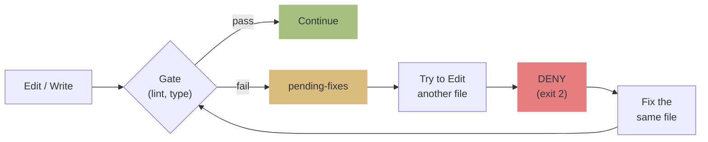
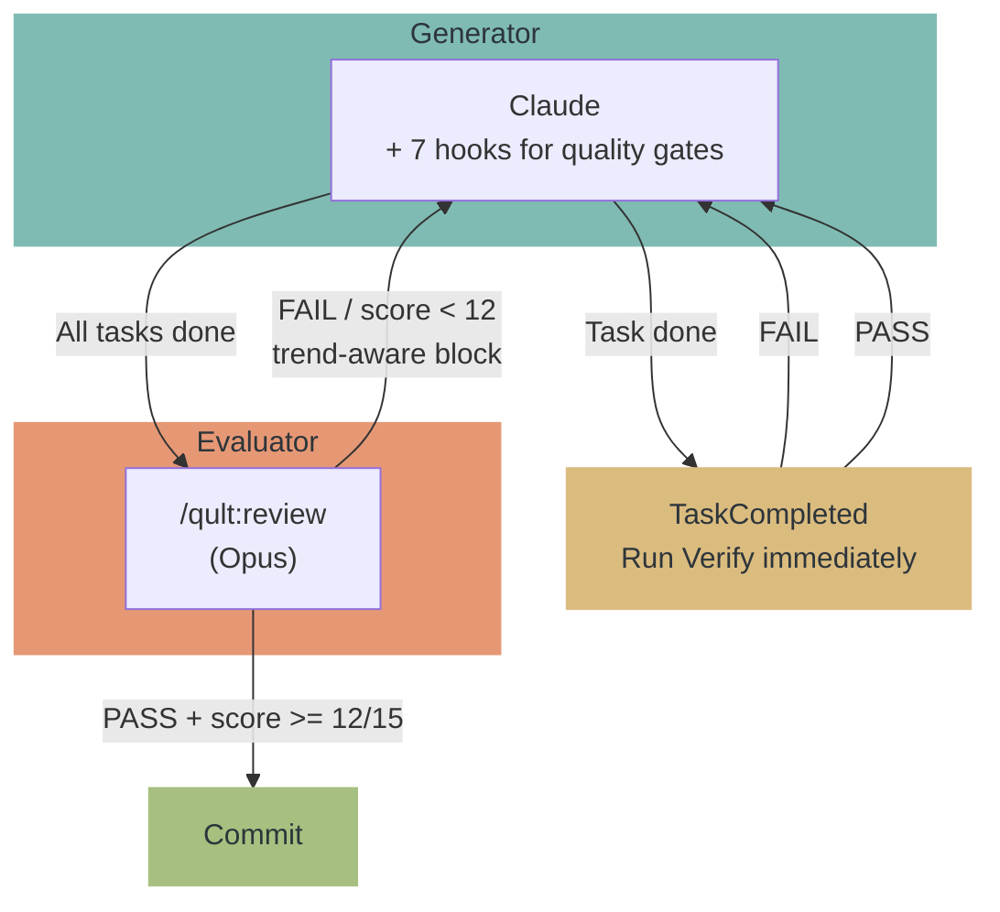

# qult


**Physically stop Claude's bad habits.** An evaluator harness that enforces code quality through structure.

> Claude is capable, but it leaves lint errors behind and moves to the next file. It commits without tests. It praises its own code and calls the review done.
> qult uses 7 hooks + MCP server + independent Opus evaluator to stop that with **exit 2 (DENY), not advisory messages**.
> Distributed as a Claude Code Plugin. Install with `/plugin install`.

> [!NOTE]
> You may see `SessionStart:startup hook error` or `Stop hook error` at session start. **This is not a qult bug.**
> It's a known Claude Code UI bug that misreports hook success/failure ([#12671](https://github.com/anthropics/claude-code/issues/12671), [#21643](https://github.com/anthropics/claude-code/issues/21643), [#10463](https://github.com/anthropics/claude-code/issues/10463)).
> Hooks are working correctly.

> [!WARNING]
> **PreToolUse DENY may be ignored.** qult correctly returns `exit 2`, but
> Claude Code sometimes executes the tool anyway
> ([#21988](https://github.com/anthropics/claude-code/issues/21988), [#4669](https://github.com/anthropics/claude-code/issues/4669), [#24327](https://github.com/anthropics/claude-code/issues/24327)).
> Waiting for a Claude Code fix.

[Japanese README / README.ja.md](README.ja.md)

## How it works



Operates on the Generator-Evaluator pattern from Anthropic's [Harness Design](https://www.anthropic.com/engineering/harness-design-long-running-apps) article:



## What it prevents

| Situation | Action |
|---|---|
| Lint/type errors left behind, moves to another file | **DENY** -- blocked until fixed |
| `git commit` without running tests | **DENY** -- requires test pass |
| Declares done without review or after FAIL | **block** -- requires /qult:review |
| Review PASS but low score | **block** -- trend-aware re-review (up to 3x) |
| Plan finalized with omissions | **DENY** -- forces session-wide check (once) |
| Declares done mid-plan | **block** -- requires all tasks completed |
| Plan task completed | **verify** -- runs Verify test immediately |

## 7 Hooks + MCP Server

| Type | Hook | Role |
|------|------|------|
| **Init** (advisory) | SessionStart | Initialize state directory, clean stale files, clear pending-fixes on startup |
| **Wall** (enforcement) | PostToolUse | Runs lint/type gates after Edit/Write, writes state |
| **Wall** (enforcement) | PreToolUse | DENY if pending fixes, require test/review before commit, force selfcheck on ExitPlanMode |
| **Completion gate** (enforcement) | Stop | Block if unresolved errors, incomplete tasks, or missing review |
| **Subagent** (enforcement) | SubagentStop | Validates review output + enforces trend-aware score threshold (12/15) |
| **Task verify** (advisory) | TaskCompleted | Runs Verify test immediately when plan task completes |
| **Context** (advisory) | PostCompact | Re-injects pending fixes and session state after context compaction |

| MCP Tool | Role |
|----------|------|
| get_pending_fixes | Returns lint/typecheck error details |
| get_session_status | Returns test/review state |
| get_gate_config | Returns gate configuration |

## Installation

### 1. Install the plugin (once)

```
/plugin marketplace add hir4ta/qult
/plugin install qult@hir4ta-qult
```

Restart Claude Code after installation (end the session and start a new one).

### 2. Project setup (once per project)

```
/qult:init
```

What init does:
- Creates `.qult/` directory
- Generates `.qult/gates.json` -- auto-detects project lint/typecheck/test tools
- Places `.claude/rules/qult-gates.md` -- MCP tool invocation rules
- Places `.claude/rules/qult-quality.md` -- test-driven, scope management rules
- Places `.claude/rules/qult-plan.md` -- plan structure rules
- Adds `.qult/` to `.gitignore`

### 3. Verify setup

```
/qult:doctor
```

### Available commands after init

| Command | Description |
|---------|-------------|
| `/qult:status` | Show current quality gate status |
| `/qult:review` | Independent code review (Opus evaluator) |
| `/qult:detect-gates` | Re-detect gate configuration |
| `/qult:plan-generator` | Generate structured plan from feature description |
| `/qult:doctor` | Health check for setup |
| `/qult:update` | Update rules files after plugin update |
| `/qult:register-hooks` | Register hooks in settings.local.json (fallback) |

Hooks (SessionStart, PostToolUse, PreToolUse, Stop, SubagentStop, TaskCompleted, PostCompact) and MCP server run automatically.

### If hooks don't fire

Plugin hooks have known reliability issues in some environments ([#18547](https://github.com/anthropics/claude-code/issues/18547), [#10225](https://github.com/anthropics/claude-code/issues/10225)). If hooks don't trigger after install:

```
/qult:register-hooks
```

This registers the same hooks in `.claude/settings.local.json` as a fallback. When both plugin hooks and settings hooks are present, Claude Code deduplicates them (same command runs once). The `.claude/settings.local.json` file is gitignored, so it does not affect other team members.

## Updating

1. `/plugin` > qult details > update (hooks, skills, agents, MCP server are updated)
2. `/qult:update` (updates project rules files to latest)

## Uninstalling

`/plugin` > delete qult. Manually remove `.qult/` and `.claude/rules/qult*.md` from the project.

## Configuration

Customize thresholds in `.qult/config.json` (all optional):

```json
{
  "review": {
    "score_threshold": 12,
    "max_iterations": 3,
    "required_changed_files": 5
  },
  "gates": {
    "output_max_chars": 2000,
    "default_timeout": 10000
  }
}
```

| Key | Type | Default | Description |
|-----|------|---------|-------------|
| `review.score_threshold` | number | 12 | Aggregate score required to pass review (max 15) |
| `review.max_iterations` | number | 3 | Maximum review retry iterations |
| `review.required_changed_files` | number | 5 | Number of changed files that triggers mandatory review |
| `gates.output_max_chars` | number | 2000 | Max gate output chars (excess is truncated) |
| `gates.default_timeout` | number | 10000 | Gate command timeout (ms) |

Environment variable overrides: `QULT_REVIEW_SCORE_THRESHOLD`, `QULT_REVIEW_MAX_ITERATIONS`, `QULT_REVIEW_REQUIRED_FILES`, `QULT_GATE_OUTPUT_MAX`, `QULT_GATE_DEFAULT_TIMEOUT`

<details>
<summary><strong>Review score threshold rationale</strong></summary>

The reviewer agent scores three dimensions (Correctness, Design, Security) on a 1-5 scale. The default threshold of 12/15 means:

- 5+5+2 = 12: A security-weak change still passes (acceptable for internal tools)
- 4+4+4 = 12: Balanced "good enough" across all dimensions
- 3+3+3 = 9: Fails. Consistent mediocrity is caught

The threshold is configurable because acceptable quality varies by project. Lower it for prototypes (`"score_threshold": 9`), raise it for production APIs (`"score_threshold": 14`).

Scores are LLM-generated and not perfectly reproducible. The trend-aware iteration system (up to `max_iterations` retries) compensates: if the score improves across iterations, the feedback is working. If it stagnates, the system advises a different approach.

</details>

<details>
<summary><strong>Supported languages and tools</strong></summary>

| Language | on_write (lint/type) | on_commit (test) | on_review (e2e) |
|---|---|---|---|
| **TypeScript/JS** | biome / eslint / tsc | vitest / jest / mocha | -- |
| **Python** | ruff / pyright / mypy | pytest | -- |
| **Go** | go vet | go test | -- |
| **Rust** | cargo clippy / check | cargo test | -- |
| **Ruby** | rubocop | rspec | -- |
| **Java/Kotlin** | ktlint / detekt | gradle test / mvn test | -- |
| **Elixir** | credo | mix test | -- |
| **Deno** | deno lint | deno test | -- |
| **Frontend** | stylelint | -- | playwright / cypress / wdio |

</details>

### Custom gates

Edit `.qult/gates.json` directly to add, modify, or remove gates:

```json
{
  "on_write": {
    "lint": { "command": "biome check {file}", "timeout": 3000 },
    "typecheck": { "command": "bun tsc --noEmit", "timeout": 10000, "run_once_per_batch": true },
    "custom-check": { "command": "my-tool check {file}", "timeout": 5000 }
  },
  "on_commit": {
    "test": { "command": "bun vitest run", "timeout": 30000 }
  },
  "on_review": {
    "e2e": { "command": "playwright test", "timeout": 120000 }
  }
}
```

**Gate fields:**

| Field | Required | Description |
|-------|----------|-------------|
| `command` | Yes | Shell command. `{file}` is replaced with the edited file path |
| `timeout` | No | Timeout in ms (default: `gates.default_timeout`) |
| `run_once_per_batch` | No | If true, skip re-running within the same session (useful for whole-project checks like `tsc --noEmit`) |
| `extensions` | No | Array of file extensions to check (e.g. `[".ts", ".tsx"]`). If omitted, qult infers from the command |

**Gate categories:**

| Category | When it runs | Typical gates |
|----------|-------------|---------------|
| `on_write` | After every Edit/Write | lint, typecheck |
| `on_commit` | When `git commit` is detected | test |
| `on_review` | During `/qult:review` | e2e |

### Disabling a gate

Remove the gate entry from `.qult/gates.json`, or remove the entire category:

```json
{
  "on_write": {
    "lint": { "command": "biome check {file}", "timeout": 3000 }
  }
}
```

To temporarily disable all gates, rename or delete `.qult/gates.json`. qult is fail-open: missing gates means no enforcement. Run `/qult:detect-gates` to regenerate.

### Monorepo and workspace projects

qult detects gates from the project root. For monorepos with different tools per workspace, edit `.qult/gates.json` manually:

```json
{
  "on_write": {
    "lint-frontend": {
      "command": "cd packages/frontend && eslint {file}",
      "timeout": 5000,
      "extensions": [".tsx", ".jsx"]
    },
    "lint-backend": {
      "command": "cd packages/backend && biome check {file}",
      "timeout": 3000,
      "extensions": [".ts"]
    },
    "typecheck": {
      "command": "tsc --noEmit",
      "timeout": 15000,
      "run_once_per_batch": true
    }
  }
}
```

Use `extensions` to route files to the correct linter. The `{file}` placeholder receives the absolute path of the edited file.

## Design principles

| Principle | Meaning |
|-----------|---------|
| **Wall > advisory** | Stop with DENY (exit 2). Advisories are assumed to be ignored |
| **fail-open** | All hooks use try-catch. qult failures never block Claude |
| **structural guarantee** | Quality enforced by structure. Stress-test assumptions, remove if broken |
| **zero dependencies** | All devDependencies + bun build bundle |

## Plan generation

```
/qult:plan-generator "Add JWT auth to the API"
  -> Opus analyzes the codebase
  -> Generates plan in WHAT/WHERE/VERIFY/BOUNDARY/SIZE format
  -> Writes to .claude/plans/
```

## Data storage

```
.qult/
└── .state/
    ├── session-state-{id}.json
    └── pending-fixes-{id}.json
```

- Scoped by session ID (concurrent session safe)
- Stale files auto-cleaned after 24h

## Troubleshooting

<details>
<summary><strong>"Hook Error" shown at session start</strong></summary>

Not a qult bug. Known Claude Code UI bug that misreports hook success/failure ([#12671](https://github.com/anthropics/claude-code/issues/12671), [#34713](https://github.com/anthropics/claude-code/issues/34713)). Hooks are working correctly.

</details>

<details>
<summary><strong>DENY issued but tool still executes</strong></summary>

Known Claude Code bug ([#21988](https://github.com/anthropics/claude-code/issues/21988), [#24327](https://github.com/anthropics/claude-code/issues/24327)). qult correctly returns exit 2, but Claude Code sometimes does not block. Awaiting fix.

</details>

<details>
<summary><strong>Gates not detected</strong></summary>

Run `/qult:detect-gates`. Ensure tool binaries are on PATH (`which biome`, `which tsc`, etc.). `node_modules/.bin` is searched automatically.

</details>

<details>
<summary><strong>Corrupt state files</strong></summary>

Delete files in `.qult/.state/` and start a new session. qult is fail-open by design -- corrupt state files will not block Claude.

</details>

<details>
<summary><strong>Skip gates for specific files</strong></summary>

Add an `extensions` field to gates in `.qult/gates.json` to restrict which file types are checked:

```json
{
  "on_write": {
    "lint": { "command": "biome check {file}", "extensions": [".ts", ".tsx"] }
  }
}
```

</details>

<details>
<summary><strong>Gate false positive (lint reports error that is not real)</strong></summary>

1. Check if the gate command itself is correct: run it manually in terminal
2. If the tool config is wrong, fix the tool config (e.g. `.eslintrc.json`, `biome.json`)
3. If qult is running the wrong tool, edit `.qult/gates.json` to use the correct command
4. As a last resort, remove the gate from `.qult/gates.json`

qult runs the exact command in `gates.json`. If the command produces false positives, the fix is in the tool config, not in qult.

</details>

<details>
<summary><strong>Review blocks repeatedly with low score</strong></summary>

The review iteration limit defaults to 3. After 3 attempts, the review proceeds regardless. If you want to skip review iteration:

- Lower `review.score_threshold` in `.qult/config.json`
- Or set `QULT_REVIEW_SCORE_THRESHOLD=9` as an environment variable

If scores stagnate (same score across iterations), the SubagentStop hook suggests trying a fundamentally different approach. This is by design: the same fix strategy applied repeatedly will not improve the score.

</details>

<details>
<summary><strong>qult blocks commit but I need to commit now</strong></summary>

qult enforces gates via PreToolUse hooks. To bypass in an emergency:

1. Commit directly in terminal (outside Claude Code): `git commit -m "emergency fix"`
2. Or temporarily disable qult: `/plugin` > disable qult, commit, re-enable

Do not delete `.qult/.state/` to bypass. This clears all session tracking and may cause unexpected behavior.

</details>

## Stack

TypeScript / MCP SDK / vitest (tests) / Biome (lint)

Distributed as a Claude Code Plugin. Development requires Bun 1.3+.
