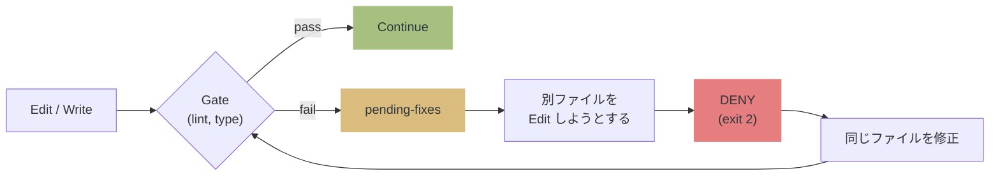
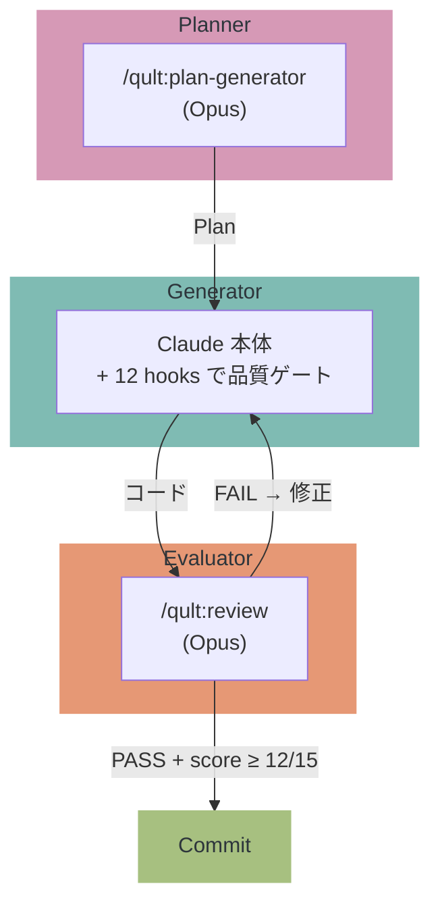
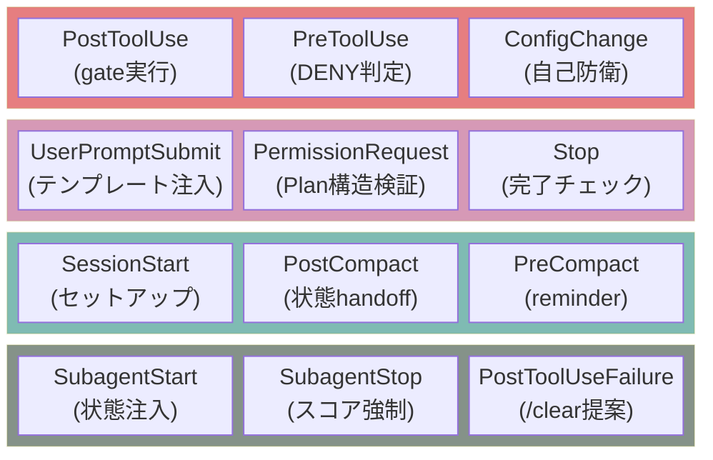

# qult


Claude Code の品質を構造で守る **evaluator harness**。quality + cult = qult。

> Claude は優秀だが、lint エラーを放置して次のファイルに行く。テストなしでコミットする。自分のコードを褒めてレビューを終える。
> qult はそれを **物理的に止める**。お願い (advisory) ではなく、exit 2 (DENY) で。

> [!NOTE]
> セッション開始時に `SessionStart:startup hook error` や `Stop hook error` と表示されることがありますが、**これは qult のバグではありません**。
> Claude Code の UI が hook の成功/失敗を正しく判別できない既知のバグです ([#12671](https://github.com/anthropics/claude-code/issues/12671), [#21643](https://github.com/anthropics/claude-code/issues/21643), [#10463](https://github.com/anthropics/claude-code/issues/10463))。
> hook 自体は正常に動作しています。

---

## How it works



Anthropic の [Harness Design](https://www.anthropic.com/engineering/harness-design-long-running-apps) 記事が示した 3-agent パターンで動作:



---

## 何を防ぐか

| 状況 | 行動 |
|---|---|
| lint/type エラーを放置して別ファイルへ | **DENY** — 修正するまでブロック |
| テスト未実行で git commit | **DENY** — テスト pass を要求 |
| レビュー未実行/FAIL で完了宣言 | **block** — /qult:review を要求 |
| レビュー PASS だがスコア低い | **block** — 再レビュー (最大3回反復) |
| Plan に曖昧な Criteria / Verify なし | **DENY** — 具体的な基準を要求 |
| 200行超の変更 (コミット間) | **DENY** — コミットを要求 |
| 120分超 + 15ファイル変更 | **DENY** — スコープ肥大を阻止 |
| hook 設定を変更しようとする | **DENY** — 自己防衛 |

---

## 12 Hooks



| 分類 | Hooks | 役割 |
|------|-------|------|
| **壁** (enforcement) | PostToolUse, PreToolUse, ConfigChange | 壊れたコードを通さない |
| **Plan増幅** (enforcement) | UserPromptSubmit, PermissionRequest, Stop | 設計の質を底上げ、中途半端に終わらせない |
| **実行支援** (advisory) | SessionStart, PostCompact, PreCompact | セットアップ、状態保持、リマインダー |
| **サブエージェント** (mixed) | SubagentStart, SubagentStop, PostToolUseFailure | 品質ルール伝搬、スコア閾値強制 |

---

## インストール

```bash
bun install && bun build.ts && bun link

qult init       # ~/.claude/ に 12 hooks + skill + agent + rules を配置
qult doctor     # セットアップの健全性を確認
```

Gate は自動検出:

```bash
/qult:detect-gates    # → .qult/gates.json に書き込み
```

<details>
<summary><strong>対応言語・ツール</strong></summary>

| 言語 | on_write (lint/type) | on_commit (test) | on_review (e2e) |
|---|---|---|---|
| **TypeScript/JS** | biome / eslint / tsc | vitest / jest / mocha | — |
| **Python** | ruff / pyright / mypy | pytest | — |
| **Go** | go vet | go test | — |
| **Rust** | cargo clippy / check | cargo test | — |
| **Ruby** | rubocop | rspec | — |
| **Java/Kotlin** | ktlint / detekt | gradle test / mvn test | — |
| **Elixir** | credo | mix test | — |
| **Deno** | deno lint | deno test | — |
| **Frontend** | stylelint | — | playwright / cypress / wdio |

</details>

---

## 設計原則

| 原則 | 意味 |
|------|------|
| **壁 > 情報提示** | DENY (exit 2) で止める。advisory は無視される前提 |
| **リサーチ駆動** | SWE-bench / Anthropic 記事 / Self-Refine 論文の裏付け |
| **fail-open** | 全 hook は try-catch。qult の障害で Claude を止めない |
| **simplest solution** | 全コンポーネントは仮定を持つ。崩れたら捨てる |
| **dependencies ゼロ** | 全て devDependencies + bun build バンドル |

---

## 効果測定

```bash
qult doctor --metrics
```

```
--- Metrics (293 actions across 5 sessions) ---

  Actions:       DENY 105 (43 actionable) | block 5 | respond 32
  Effectiveness: First-pass 80% | Gate pass 67% | DENYs/commit 4.3
  Review:        Pass 100% (3 reviews) | Findings avg 3 | Misses 1
  Commits:       10 commits, avg 22m | Clean commit rate 70%
  Plans:         Approved 4, Rejected 1 (80% pass)
```

<details>
<summary><strong>メトリクス詳細</strong></summary>

### Actions

| 項目 | 意味 |
|------|------|
| **DENY** (actionable) | lint/typecheck 失敗等の修正すべきブロック |
| **DENY** (defensive) | hook 設定保護 (正常動作) |
| **block** | 「完了」を止めた回数 (未修正エラー、レビュー未実行等) |
| **respond** | コンテキストに情報を注入した回数 |
| **review:miss** | レビュー PASS 後に gate 失敗 (evaluator の見逃し) |

### Effectiveness

| 指標 | 目安 |
|------|------|
| **First-pass clean** | ファイル初回編集時に全 gate 通過した率。高いほど良い |
| **Gate pass rate** | 全 gate 実行の通過率。70%+ が目安 |
| **DENYs per commit** | 1コミットまでの DENY 回数。低いほどスムーズ |
| **DENY resolution** | DENY 後に修正成功した率 |
| **Avg fix effort** | DENY 解消に要した編集回数。1-2 が理想 |

### Review

| 指標 | 意味 |
|------|------|
| **Pass rate** | Opus evaluator のレビュー PASS 率 |
| **Findings** | severity 別 (critical/high/medium/low) の指摘件数 |
| **Misses** | PASS 後に gate 失敗した回数 |

### Artifact quality

| 指標 | 意味 |
|------|------|
| **Clean commit rate** | DENY ゼロでコミットできた割合 |
| **Avg review scores** | Correctness/Design/Security (1-5) |
| **Hotspot files** | gate 失敗率の高いファイル |

### False Positives

| 指標 | 意味 |
|------|------|
| **Pace-red FP rate** | pace-red DENY 後に clean commit できた割合 |
| **LOC-limit FP rate** | loc-limit DENY 後に clean commit できた割合 |

FP 率 >20% で自動キャリブレーションが閾値を緩和。

</details>

<details>
<summary><strong>自動キャリブレーション</strong></summary>

24時間ごとに metrics から閾値を自動調整 (線形補間):

| 閾値 | デフォルト | 範囲 | 調整基準 |
|------|-----------|------|----------|
| **pace_files** | 15 | 10-30 | first-pass rate + FP rate |
| **loc_limit** | 200 | 150-400 | fix effort + FP rate |
| **review_file_threshold** | 5 | 3-7 | review-miss rate |
| **review_score_threshold** | 12 | 12-14 | review-miss rate |
| **context_budget** | 2000 | 1500-2500 | respond-skipped rate |
| **plan_task_threshold** | 3 | 2-5 | plan compliance score |

**コールドスタート**: メトリクス不足時は `gates.json` の gate 数からヒューリスティック初期値を設定。

</details>

---

## Plan 自動生成

```
/qult:plan-generator "JWT認証をAPIに追加"
  → Opus が codebase を分析
  → WHAT/WHERE/VERIFY/BOUNDARY/SIZE 形式の Plan を生成
  → 4+ tasks なら自動で plan-review
  → .claude/plans/ に書き出し
```

---

## データストレージ

```
.qult/
├── metrics/            # hook アクション (日次ローテーション)
├── gate-history/       # gate 結果 + コミット履歴 (日次)
├── context-providers.json
└── .state/
    ├── session-state-{id}.json
    ├── pending-fixes-{id}.json
    └── calibration.json
```

- セッション ID でスコープ (並行セッション安全)
- 24h 経過した古いファイルは自動クリーンアップ
- `qult doctor --metrics` で全日分を集計表示

---

## スタック

TypeScript (Bun 1.3+, ESM) / citty (CLI) / vitest (テスト) / Biome (lint)
