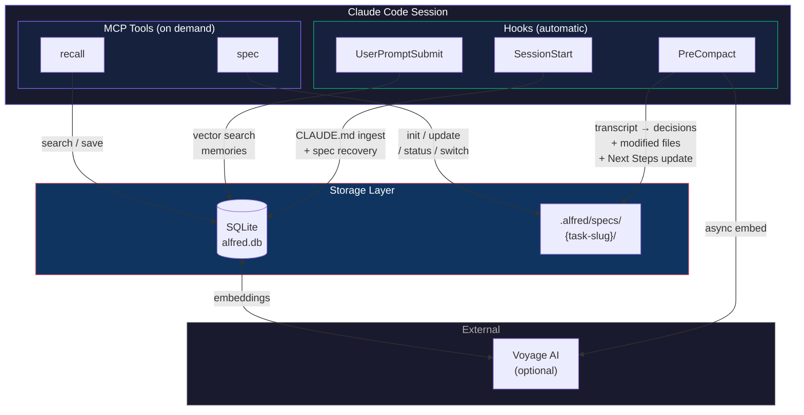
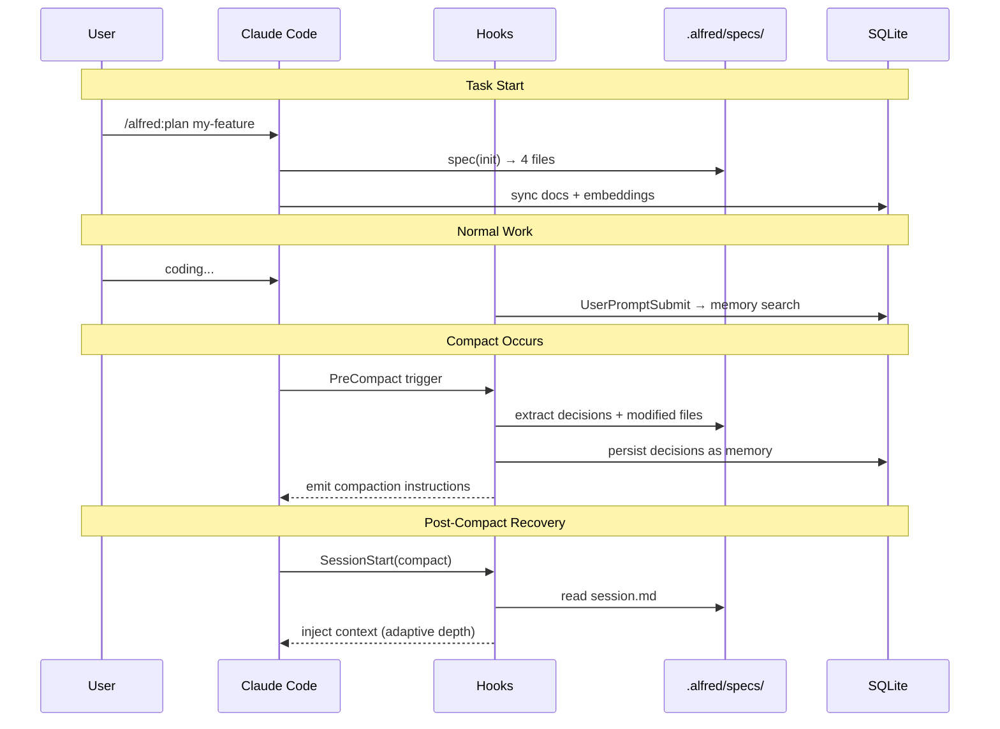

# alfred

[](https://github.com/hir4ta/claude-alfred/releases)
[](https://go.dev/)
[](https://github.com/hir4ta/claude-alfred/blob/main/LICENSE)
[](https://github.com/hir4ta/claude-alfred/releases)

Your silent butler for Claude Code.

Works silently in the background — preserving session context across compactions, surfacing relevant memories, and managing development specs — so you can focus on building.

[日本語版 README](README.ja.md)

## What alfred does

**Alfred Protocol** — Structured spec management resilient to Compact and session loss. Saves requirements, design, decisions, and session state to `.alfred/specs/`, with automatic context preservation and recovery.

**Profile-Based Quality Review** — 6 specialized review profiles (code, config, security, docs, architecture, testing), each with curated checklists. Auto-detects relevant profiles from git diff, spawns parallel sub-reviewers, and produces scored reports with actionable fixes.

**Persistent Memory** — Remembers past sessions, decisions, and notes across projects. Automatically saves session summaries and design decisions as permanent memory. Search past experience with the `recall` tool — alfred automatically surfaces relevant memories via semantic search.

**Compact Resilience** — PreCompact hook auto-extracts decisions, tracks modified files, saves session state in activeContext format, and auto-updates Next Steps completion status. SessionStart hook restores full context after compaction.

## Getting Started

### 1. Install alfred

```bash
brew install hir4ta/alfred/alfred
```

### 2. Add the plugin

In Claude Code

```
/plugin marketplace add hir4ta/claude-alfred   # Register the marketplace (once)
/plugin install alfred                          # Install the plugin
```

Skills, rules, hooks, agents, and MCP configuration will be installed. No further setup required — alfred auto-initializes the database on first run.

### 3. Set API key (optional but recommended)

```bash
export VOYAGE_API_KEY=your-key  # Add to ~/.zshrc or equivalent
```

[Voyage AI](https://voyageai.com/) enables high-precision semantic search with embedding + reranking.
Cost is near-zero: embedding docs costs ~$0.01, and each search query costs fractions of a cent.

Without Voyage AI, alfred still works using keyword search (LIKE) — no API key needed.

## Skills (10)

Invoke with `/alfred:<skill>` in Claude Code.

| Skill | Description |
|-------|-------------|
| `/alfred:plan <task-slug>` | Alfred Protocol — multi-agent spec generation (Architect + Devil's Advocate + Researcher deliberate on design) |
| `/alfred:develop <task-slug>` | Fully autonomous development orchestrator — spec creation, implementation with review gates, self-review, test gate, and auto-commit |
| `/alfred:review [profile]` | Profile-based quality review — 6 profiles (code, config, security, docs, architecture, testing) with curated checklists |
| `/alfred:skill-review [path]` | Audit skills against Anthropic's official 33-page skill design guide — 21 checks, scored report, --fix auto-repair |
| `/alfred:brainstorm <theme>` | Multi-agent divergent thinking — 3 specialists (Visionary, Pragmatist, Critic) generate ideas in parallel, then debate |
| `/alfred:refine <theme>` | Convergent thinking — fix the issue, narrow options, score, and decide |
| `/alfred:configure <type> [name]` | Create or polish a single config file (skill, rule, hook, agent, MCP, CLAUDE.md, memory) with independent review |
| `/alfred:setup` | Project-wide setup wizard — multi-file scan + configuration, or Claude Code feature explainer |
| `/alfred:ingest <files>` | Ingest reference materials (CSV, TXT, PDF, docs) into structured knowledge that survives compaction |
| `/alfred:help [feature]` | Quick reference for all capabilities — skills, agents, MCP tools |

## Agents (2)

| Agent | Description |
|-------|-------------|
| `alfred` | Silent butler — Claude Code configuration and best practices support |
| `code-reviewer` | Multi-agent review orchestrator — spawns 3 sub-reviewers (security, logic, design) in parallel |

## MCP Tools (2)

Backend for skills and agents. Claude calls these automatically as needed.

| Tool | Description |
|------|-------------|
| `spec` | Unified spec management (action: init / update / status / switch / delete / history / rollback) |
| `recall` | Memory search and save — past sessions, decisions, and notes (vector search + keyword fallback) |

## Hooks (3)

Run automatically during Claude Code lifecycle. No user action needed.

| Event | Action |
|-------|--------|
| SessionStart | Auto-ingest CLAUDE.md + ensure user rules + spec context injection (adaptive recovery after compact) |
| PreCompact | Extract context from transcript + auto-detect decisions + track modified files + auto-update Next Steps completion → save session.md → persist decisions as memory → emit compaction instructions → async embedding |
| UserPromptSubmit | Voyage semantic memory search — auto-surfaces relevant past experience |

## Architecture

### System Overview



### Alfred Protocol Lifecycle



### Alfred Protocol File Structure

```
.alfred/specs/{task-slug}/
├── requirements.md  # Goals, success criteria, out of scope
├── design.md        # Architecture, tech decisions
├── decisions.md     # Design decisions with alternatives and rationale
├── session.md       # Session state in activeContext format + Compact Markers
└── .history/        # Version history (max 20 per file, auto-pruned)
```

`_active.md` (YAML) manages multiple tasks; switch with `spec` (action=switch).

### Spec File Templates

When you run `/alfred:plan my-feature`, alfred creates these files:

**`.alfred/specs/my-feature/requirements.md`**
```
# Requirements: my-feature

## Goal
Add OAuth2 login flow to the API gateway.

## Success Criteria
- Users can login via Google/GitHub OAuth
- JWT tokens issued with 1h expiry
- Refresh token rotation implemented

## Out of Scope
- SAML/LDAP integration
- Multi-factor authentication
```

**`.alfred/specs/my-feature/session.md`** (activeContext format)
```
# Session: my-feature

## Status
active

## Currently Working On
Implementing the OAuth callback handler in cmd/api/auth.go

## Recent Decisions (last 3)
1. Use golang.org/x/oauth2 instead of custom implementation
2. Store refresh tokens in PostgreSQL, not Redis

## Next Steps
1. Add token refresh endpoint
2. Write integration tests for OAuth flow

## Blockers
None

## Modified Files (this session)
- cmd/api/auth.go
- internal/auth/oauth.go
```

## Dependencies

| Library | Purpose |
|---------|---------|
| [mcp-go](https://github.com/mark3labs/mcp-go) | MCP server SDK |
| [go-sqlite3](https://github.com/ncruces/go-sqlite3) | SQLite driver (pure Go, WASM) |
| [Voyage AI](https://voyageai.com/) | Embedding + rerank (voyage-4-large, 2048d) |

## Troubleshooting

### Common issues

| Symptom | Cause | Fix |
|---|---|---|
| No memory results | VOYAGE_API_KEY not set | `export VOYAGE_API_KEY=your-key` for semantic search |
| Hook not firing | Plugin not installed | Run `/plugin install alfred` and restart |

### Environment variables

| Variable | Default | Purpose |
|---|---|---|
| `VOYAGE_API_KEY` | (none) | Voyage AI API key for vector search + reranking |

### Where to find things

| Topic | Where to look |
|-------|--------------|
| All capabilities overview | `/alfred:help` in Claude Code |
| Hook timeouts & internals | `.claude/rules/hook-internals.md` |
| Search pipeline details | `.claude/rules/store-internals.md` |

## License

MIT
