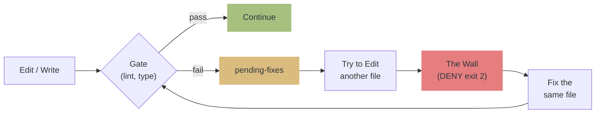

# qult

**Quality by Structure, Not by Promise.** A harness that enforces code quality through walls, not words.

> Prompts are suggestions. Hooks are enforcement.
> qult blocks quality regressions with **exit 2 (DENY)**, not advisory messages.
> Distributed as a Claude Code Plugin.

[Japanese / README.ja.md](README.ja.md)

## Why qult?

AI coding agents are powerful but unreliable at self-regulation — they leave lint errors behind, commit without testing, and praise their own code.

qult implements the [Generator-Evaluator pattern](https://www.anthropic.com/engineering/harness-design-long-running-apps): separate generation from evaluation, enforce quality structurally.

**Deterministic gates (lint, typecheck) → Executable specs (test) → AI review (residual only)**

<details>
<summary>Background & references</summary>

- [Anthropic: Harness Design](https://www.anthropic.com/engineering/harness-design-long-running-apps) — Generator-Evaluator pattern, self-evaluation bias
- [Martin Fowler: Harness Engineering](https://martinfowler.com/articles/exploring-gen-ai/harness-engineering.html) — Guides (feedforward) + Sensors (feedback)
- [TDAD](https://arxiv.org/abs/2603.17973) — Prompt-only TDD increases regressions (6%→10%); structural enforcement reduces to 1.8%
- [Specification as Quality Gate](https://arxiv.org/abs/2603.25773) — AI reviewing AI is circular; deterministic gates must come first
- [Nonstandard Errors](https://arxiv.org/abs/2603.16744) — Different model families have stable analytical styles; reviewer diversity reduces correlated errors
- [AgentPex (Microsoft)](https://arxiv.org/abs/2603.23806) — Agents selectively ignore prompt rules; structural enforcement required
- [CodeRabbit Report](https://www.coderabbit.ai/blog/state-of-ai-vs-human-code-generation-report) — AI code creates 1.7x more issues; quality gates as mitigation
- [Triple Debt Model](https://arxiv.org/abs/2603.22106) — Technical + Cognitive + Intent debt in AI-assisted development

</details>

## Philosophy

```
1. The Wall doesn't negotiate.
   Prompts are suggestions. Hooks are enforcement.

2. The architect designs, the agent implements.
   Humans decide what to build. AI decides how.

3. Proof or Block.
   "Done" is not evidence. Tests pass, review passes — then it's done.

4. fail-open.
   qult's own failures never block Claude. Break? Open the gate.
```

## How it works



## Features

| What it does | How |
|---|---|
| Blocks lint/type errors from spreading | **The Wall**: DENY until fixed |
| Requires tests before commit | Gate check on `git commit` |
| 4-stage independent code review | Spec + Quality + Security + Adversarial reviewers |
| Configurable reviewer models per stage | Override model via config for review diversity |
| Detects hallucinated imports | Checks imports against installed packages |
| Detects export breaking changes | Compares with git HEAD |
| Detects security patterns (25+ rules) | Secrets, injection, XSS, SSRF, weak crypto |
| Detects semantic bugs (6+ patterns) | Empty catch, unreachable code, loose equality, switch fallthrough |
| Detects code duplication | Intra-file blocking, cross-file advisory |
| PBT-aware test quality checks | Skips false positives for property-based tests |
| SAST integration (Semgrep on-write) | Auto-detects `.semgrep.yml`, runs per-file |
| Cross-session learning (Flywheel) | Threshold adjustment recommendations based on patterns |
| Preserves state across context compaction | Re-injects session state after compaction |

## Installation

**Requires [Bun](https://bun.sh)** (hooks and MCP server run on Bun runtime).

### Install

```
/plugin marketplace add hir4ta/qult
/plugin install qult@hir4ta-qult
```

Restart Claude Code after installation.

### Project setup

```
/qult:init
```

Auto-detects your toolchain (biome/eslint, tsc/pyright, vitest/jest, etc.) and registers gates in the DB.

No files are created in your project directory. All state is stored in `~/.qult/qult.db`.

### Verify

```
/qult:doctor
```

### Uninstall

```
/plugin  →  delete qult
```

After uninstalling, `~/.qult/` directory remains on disk (contains the SQLite DB with session history). Remove it manually if desired:

```bash
rm -rf ~/.qult
```

## Commands

| Command | Description |
|---------|-------------|
| `/qult:init` | Set up qult for current project |
| `/qult:status` | Show gate status and pending fixes |
| `/qult:review` | 4-stage independent code review |
| `/qult:explore` | Design exploration with the architect |
| `/qult:plan-generator` | Generate structured implementation plan |
| `/qult:finish` | Structured branch completion |
| `/qult:debug` | Structured root-cause debugging |
| `/qult:skip` | Temporarily disable/enable gates |
| `/qult:config` | View or change config values |
| `/qult:doctor` | Health check |

## 4-Stage Review

`/qult:review` spawns four independent reviewers, each scoring 2 dimensions (1-5):

| Stage | Dimensions | Focus |
|-------|-----------|-------|
| Spec | Completeness + Accuracy | Does the code match the plan? |
| Quality | Design + Maintainability | Is it well-designed? |
| Security | Vulnerability + Hardening | Are there security gaps? |
| Adversarial | EdgeCases + LogicCorrectness | Edge cases, silent failures? |

**Total: 8 dimensions / 40 points.** Default threshold: 30/40, dimension floor: 4/5. Reviewer models are configurable per stage via `review.models.*` config.

<details>
<summary>Score threshold details</summary>

**Aggregate threshold** (default 30/40): Multiple weak areas fail. Consistent "good" (4+4+4+4+4+4+4+4 = 32) passes.

**Dimension floor** (default 4/5): Any single dimension below the floor blocks, regardless of aggregate. Prevents "excellent code with terrible security" from passing.

Maximum 3 review iterations. Reviewers are read-only (cannot modify files).

</details>

<details>
<summary>Supported languages and tools</summary>

| Language | Lint/Type | Test | E2E |
|---|---|---|---|
| TypeScript/JS | biome / eslint / tsc | vitest / jest | playwright / cypress |
| Python | ruff / pyright / mypy | pytest | |
| Go | go vet | go test | |
| Rust | cargo clippy/check | cargo test | |
| Ruby | rubocop | rspec | |
| Deno | deno lint | deno test | |

</details>

## Configuration

All config is stored in the DB, manageable via `/qult:config` or MCP tools. Environment variable overrides are also supported.

<details>
<summary>Config reference</summary>

| Key | Default | Description |
|-----|---------|-------------|
| `review.score_threshold` | 30 | Aggregate score to pass review (/40) |
| `review.max_iterations` | 3 | Max review retry iterations |
| `review.required_changed_files` | 5 | File count that triggers mandatory review |
| `review.dimension_floor` | 4 | Min score per dimension (1-5) |
| `review.require_human_approval` | false | Require architect approval before commit |
| `plan_eval.score_threshold` | 12 | Plan evaluation score (/15) |
| `gates.output_max_chars` | 3500 | Max gate output chars |
| `gates.default_timeout` | 10000 | Gate command timeout (ms) |
| `escalation.*_threshold` | 8-10 | Warning count before blocking |
| `review.models.*` | spec=sonnet, quality/security=opus, adversarial=sonnet | Per-stage reviewer model |
| `flywheel.enabled` | true | Cross-session threshold recommendations |
| `flywheel.min_sessions` | 10 | Min sessions for flywheel analysis |

Env overrides: `QULT_REVIEW_SCORE_THRESHOLD`, `QULT_REVIEW_MODEL_SPEC`, `QULT_FLYWHEEL_ENABLED`, etc.

</details>

<details>
<summary>Custom gates</summary>

Gates are stored in the DB via `/qult:init`. To customize, re-run `/qult:init` after changing your toolchain, or use the MCP tools.

Gate categories:
- `on_write` — After every Edit/Write (lint, typecheck)
- `on_commit` — Before git commit (test)
- `on_review` — During `/qult:review` (e2e)

</details>

## Troubleshooting

<details>
<summary>"Hook Error" at session start</summary>

Not a qult bug. Known Claude Code UI bug ([#12671](https://github.com/anthropics/claude-code/issues/12671)). Hooks are working correctly.

</details>

<details>
<summary>DENY issued but tool still executes</summary>

Known Claude Code bug ([#21988](https://github.com/anthropics/claude-code/issues/21988)). qult correctly returns exit 2, but Claude Code sometimes ignores it.

</details>

<details>
<summary>Hooks don't fire</summary>

Run `/qult:register-hooks` to register hooks in `.claude/settings.local.json` as a fallback.

</details>

## Stack

TypeScript / Bun 1.3+ / bun:sqlite / vitest / Biome / zero npm dependencies
