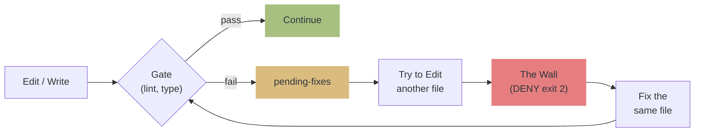

# qult

**qu**ality + c**ult** — A fanatical devotion to code quality.

**Quality by Structure, Not by Promise.** A harness that enforces code quality through walls, not words.

> Prompts are suggestions. Hooks are enforcement.
> qult blocks quality regressions with **exit 2 (DENY)**, not advisory messages.
> Distributed as a Claude Code Plugin.

[Japanese / README.ja.md](README.ja.md)

## The Problem: AI Code Quality Crisis

AI coding agents ship code fast — but the research shows a consistent pattern of quality degradation:

| Finding | Source |
|---------|--------|
| AI code produces **1.7x more issues** than human code | [CodeRabbit Report](https://www.coderabbit.ai/blog/state-of-ai-vs-human-code-generation-report) |
| AI code has **2.74x more vulnerabilities** | [SoftwareSeni Analysis](https://www.softwareseni.com/ai-generated-code-security-risks-why-vulnerabilities-increase-2-74x-and-how-to-prevent-them/) |
| Iterative AI edits **increase critical vulnerabilities by 37.6%** | [Security Degradation Study](https://arxiv.org/abs/2506.11022) |
| Agents **selectively ignore 83% of prompt rules** | [AgentPex, Microsoft Research](https://arxiv.org/abs/2603.23806) |
| AI review comments have **only 0.9–19.2% adoption rate** | [Code Review Agents Study](https://arxiv.org/abs/2604.03196) |
| AI-assisted commits **leak secrets at 2x the baseline rate** | [GitGuardian 2026](https://blog.gitguardian.com/state-of-secrets-sprawl-2026/) |

**The core issue**: Telling an AI agent "write clean code" is like telling a human "don't make mistakes." Rules at the prompt level [structurally fail](https://www.technologyreview.com/2026/01/28/1131003/rules-fail-at-the-prompt-succeed-at-the-boundary/). Existing tools (CodeRabbit, Copilot review, Qodo) can only **suggest** — and suggestions get ignored.

## How qult Solves It

qult doesn't suggest. It **blocks**.

Instead of adding comments to a PR, qult intercepts Claude Code's tool calls at runtime and returns `exit 2` (DENY) when quality gates fail. The agent literally cannot proceed until the issue is fixed.

This implements the [Generator-Evaluator pattern](https://www.anthropic.com/engineering/harness-design-long-running-apps) as a [reference monitor](https://arxiv.org/abs/2602.16708) — the same architecture that raised policy compliance from 48% to 93% in research.

```
Deterministic gates (lint, typecheck)
  → Executable specs (test)
    → AI review (residual only, multi-model for diversity)
      → Proof or Block
```

| Approach | Mechanism | Compliance |
|----------|-----------|------------|
| Prompt rules ("write clean code") | Advisory | ~17% ([AgentPex](https://arxiv.org/abs/2603.23806)) |
| AI code review (CodeRabbit, etc.) | Suggestion | 0.9–19.2% ([study](https://arxiv.org/abs/2604.03196)) |
| **qult (exit 2 DENY)** | **Structural enforcement** | **Deterministic** |

<details>
<summary>Research foundations</summary>

- [Anthropic: Harness Design](https://www.anthropic.com/engineering/harness-design-long-running-apps) — Generator-Evaluator pattern, self-evaluation bias
- [Martin Fowler: Harness Engineering](https://martinfowler.com/articles/exploring-gen-ai/harness-engineering.html) — Guides (feedforward) + Sensors (feedback)
- [TDAD](https://arxiv.org/abs/2603.17973) — Prompt-only TDD increases regressions (6%→10%); structural enforcement reduces to 1.8%
- [Specification as Quality Gate](https://arxiv.org/abs/2603.25773) — AI reviewing AI is circular; deterministic gates must come first
- [PCAS: Policy Compiler](https://arxiv.org/abs/2602.16708) — Reference monitor pattern; compliance 48%→93%
- [AgentSpec: Behavioral Contracts](https://arxiv.org/abs/2602.22302) — Drift Bounds theorem; 88–100% hard constraint compliance at <10ms overhead
- [Nonstandard Errors](https://arxiv.org/abs/2603.16744) — Different model families have stable analytical styles; reviewer diversity reduces correlated errors
- [AgentPex (Microsoft)](https://arxiv.org/abs/2603.23806) — Agents selectively ignore prompt rules; structural enforcement required
- [CodeRabbit Report](https://www.coderabbit.ai/blog/state-of-ai-vs-human-code-generation-report) — AI code creates 1.7x more issues; quality gates as mitigation
- [Triple Debt Model](https://arxiv.org/abs/2603.22106) — Technical + Cognitive + Intent debt in AI-assisted development
- [Semgrep + LLM Hybrid](https://semgrep.dev/products/semgrep-code/) — SAST alone 35.7% precision → hybrid with LLM triage 89.5%

</details>

## Philosophy

```
1. The Wall doesn't negotiate.
   Prompts are suggestions. Hooks are enforcement.

2. The architect designs, the agent implements.
   Humans decide what to build. AI decides how.

3. Proof or Block.
   "Done" is not evidence. Tests pass, review passes — then it's done.

4. fail-open.
   qult's own failures never block Claude. Break? Open the gate.
```

## How it works



## Features

| What it does | How |
|---|---|
| Blocks lint/type errors from spreading | **The Wall**: DENY until fixed |
| Requires tests before commit | Gate check on `git commit` |
| 4-stage independent code review | Spec + Quality + Security + Adversarial reviewers |
| Configurable reviewer models per stage | Override model via config for review diversity |
| Detects hallucinated imports | Checks imports against installed packages |
| Detects export breaking changes | Compares with git HEAD |
| AST dataflow taint analysis (7 languages) | Tree-sitter WASM: tracks user input → dangerous sinks (eval, exec, SQL) across 3 hops |
| Cyclomatic/cognitive complexity metrics (7 languages) | AST-based per-function complexity; warns when thresholds exceeded |
| Detects security patterns (25+ rules) | Secrets, injection, XSS, SSRF, weak crypto |
| Dependency vulnerability scanning | osv-scanner (all ecosystems: npm, pip, cargo, go, gem, composer, etc.) |
| Hallucinated package detection | Blocks install of packages that don't exist in registry (AI-specific) |
| SBOM generation (MCP tool) | CycloneDX JSON via osv-scanner or syft |
| Detects semantic bugs (6+ patterns) | Empty catch, unreachable code, loose equality, switch fallthrough |
| Detects code duplication | Intra-file blocking, cross-file advisory |
| PBT-aware test quality checks | Relaxes weak-matcher warnings for PBT files; suggests PBT for validation/serialization |
| Test coverage gate (opt-in) | Blocks commit when coverage falls below threshold |
| SAST integration (Semgrep required) | Semgrep mandatory; blocks commit when not installed |
| Dependency summary (MCP tool) | Ecosystem-level package count and vulnerability overview |
| Iterative security escalation | Advisory patterns promoted to blocking after N edits to same file |
| Test quality blocking | Empty tests, always-true, trivial assertions blocked as pending-fixes |
| Dead import escalation | Advisory dead imports promoted to blocking after warning threshold |
| Mutation testing integration | Stryker/mutmut gate detection + score parsing + PBT recommendation |
| Cross-session learning (Flywheel) | Threshold adjustment recommendations based on patterns |
| Flywheel auto-apply | Auto-raises thresholds when metrics are stable; cross-project knowledge transfer |
| Preserves state across context compaction | Re-injects session state after compaction |

## Installation

**Requires [Bun](https://bun.sh)** (hooks and MCP server run on Bun runtime).

**Required: [Semgrep](https://semgrep.dev)** for SAST analysis. qult blocks commits when Semgrep is not installed (`/qult:skip semgrep-required` to temporarily bypass).

**Recommended: [osv-scanner](https://google.github.io/osv-scanner/)** for dependency vulnerability scanning across all ecosystems (npm, pip, cargo, go, gem, composer, etc.). Also supports SBOM generation.

```bash
brew install semgrep    # macOS
brew install osv-scanner  # optional: dependency scanning
# or
pip install semgrep     # pip
```

### Install

```
/plugin marketplace add hir4ta/qult
/plugin install qult@hir4ta-qult
```

Restart Claude Code after installation.

### Project setup

```
/qult:init
```

Auto-detects your toolchain (biome/eslint, tsc/pyright, vitest/jest, etc.) and registers gates in the DB.

No files are created in your project directory. All state is stored in `~/.qult/qult.db`.

### Verify

```
/qult:doctor
```

### Optional: LSP Integration

Installing language servers enhances qult's detection capabilities:

- **Hallucination detection**: Classify type checker errors (undefined methods, non-existent symbols) beyond import-level checks
- **Cross-file impact analysis**: Find all consumers of changed files across Python, Go, Rust (in addition to TypeScript/JavaScript)
- **Unused import detection**: Semantic analysis replaces regex-based heuristics when LSP is available

```bash
# TypeScript/JavaScript
npm install -g typescript-language-server typescript

# Python
pip install pyright

# Go
go install golang.org/x/tools/gopls@latest

# Rust
rustup component add rust-analyzer
```

`/qult:init` auto-detects installed language servers. LSP is **optional** — qult falls back to regex-based detection when servers are not available (fail-open).

### Uninstall

```
/plugin  →  delete qult
```

After uninstalling, `~/.qult/` directory remains on disk (contains the SQLite DB with session history). Remove it manually if desired:

```bash
rm -rf ~/.qult
```

## Commands

| Command | Description |
|---------|-------------|
| `/qult:init` | Set up qult for current project |
| `/qult:status` | Show gate status and pending fixes |
| `/qult:review` | 4-stage independent code review |
| `/qult:explore` | Design exploration with the architect |
| `/qult:plan-generator` | Generate structured implementation plan |
| `/qult:finish` | Structured branch completion |
| `/qult:debug` | Structured root-cause debugging |
| `/qult:skip` | Temporarily disable/enable gates |
| `/qult:config` | View or change config values |
| `/qult:doctor` | Health check |

## 4-Stage Review

`/qult:review` spawns four independent reviewers, each scoring 2 dimensions (1-5):

| Stage | Dimensions | Focus |
|-------|-----------|-------|
| Spec | Completeness + Accuracy | Does the code match the plan? |
| Quality | Design + Maintainability | Is it well-designed? |
| Security | Vulnerability + Hardening | Are there security gaps? |
| Adversarial | EdgeCases + LogicCorrectness | Edge cases, silent failures? |

**Total: 8 dimensions / 40 points.** Default threshold: 30/40, dimension floor: 4/5. Reviewer models are configurable per stage via `review.models.*` config.

<details>
<summary>Score threshold details</summary>

**Aggregate threshold** (default 30/40): Multiple weak areas fail. Consistent "good" (4+4+4+4+4+4+4+4 = 32) passes.

**Dimension floor** (default 4/5): Any single dimension below the floor blocks, regardless of aggregate. Prevents "excellent code with terrible security" from passing.

Maximum 3 review iterations. Reviewers are read-only (cannot modify files).

</details>

<details>
<summary>Supported languages and tools</summary>

| Language | Lint/Type | Test | E2E |
|---|---|---|---|
| TypeScript/JS | biome / eslint / tsc | vitest / jest | playwright / cypress |
| Python | ruff / pyright / mypy | pytest | |
| Go | go vet | go test | |
| Rust | cargo clippy/check | cargo test | |
| Ruby | rubocop | rspec | |
| Deno | deno lint | deno test | |

</details>

## Configuration

All config is stored in the DB, manageable via `/qult:config` or MCP tools. Environment variable overrides are also supported.

<details>
<summary>Config reference</summary>

| Key | Default | Description |
|-----|---------|-------------|
| `review.score_threshold` | 30 | Aggregate score to pass review (/40) |
| `review.max_iterations` | 3 | Max review retry iterations |
| `review.required_changed_files` | 5 | File count that triggers mandatory review |
| `review.dimension_floor` | 4 | Min score per dimension (1-5) |
| `review.require_human_approval` | false | Require architect approval before commit |
| `plan_eval.score_threshold` | 12 | Plan evaluation score (/15) |
| `gates.output_max_chars` | 3500 | Max gate output chars |
| `gates.default_timeout` | 10000 | Gate command timeout (ms) |
| `security.require_semgrep` | true | Require Semgrep installation |
| `escalation.*_threshold` | 8-10 | Warning count before blocking |
| `escalation.security_iterative_threshold` | 5 | Same-file edit count before advisory→blocking |
| `escalation.dead_import_blocking_threshold` | 5 | Dead import warnings before blocking |
| `gates.coverage_threshold` | 0 | Min test coverage % (0 = disabled, opt-in) |
| `review.models.*` | all opus | Per-stage reviewer model |
| `gates.complexity_threshold` | 15 | Cyclomatic complexity warning threshold |
| `gates.function_size_limit` | 50 | Function line count warning threshold |
| `gates.mutation_score_threshold` | 0 | Min mutation score % (0 = disabled, opt-in) |
| `flywheel.enabled` | true | Cross-session threshold recommendations |
| `flywheel.min_sessions` | 10 | Min sessions for flywheel analysis |
| `flywheel.auto_apply` | false | Auto-apply raise-direction recommendations |

Env overrides: `QULT_REVIEW_SCORE_THRESHOLD`, `QULT_REVIEW_MODEL_SPEC`, `QULT_FLYWHEEL_ENABLED`, etc.

</details>

<details>
<summary>Custom gates</summary>

Gates are stored in the DB via `/qult:init`. To customize, re-run `/qult:init` after changing your toolchain, or use the MCP tools.

Gate categories:
- `on_write` — After every Edit/Write (lint, typecheck)
- `on_commit` — Before git commit (test)
- `on_review` — During `/qult:review` (e2e)

</details>

## Troubleshooting

<details>
<summary>DENY issued but tool still executes</summary>

Known Claude Code bug ([#21988](https://github.com/anthropics/claude-code/issues/21988)). qult correctly returns exit 2, but Claude Code sometimes ignores it.

</details>

<details>
<summary>Hooks don't fire</summary>

Run `/qult:register-hooks` to register hooks in `.claude/settings.local.json` as a fallback.

</details>

## Stack

TypeScript / Bun 1.3+ / bun:sqlite / vitest / Biome / web-tree-sitter (WASM) / mutation-testing-metrics
