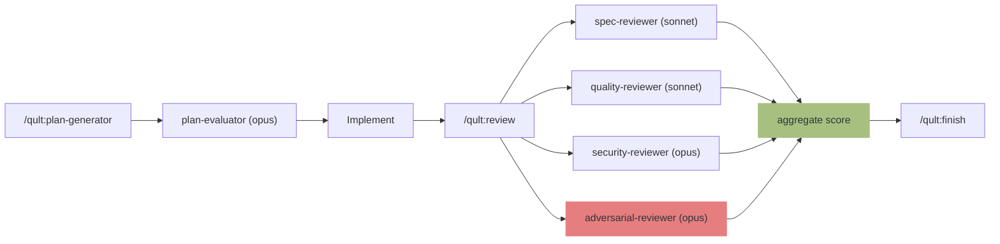

# qult

**qu**ality + c**ult** — A fanatical devotion to code quality.

**Quality by Convention, Not by Coercion.** A harness that guides Claude with workflow rules, independent reviewers, and on-demand checks — without interrupting your edits.

> v0.29: hooks fully removed. Workflow is now governed by `~/.claude/rules/qult-*.md` (installed by `/qult:init`), the `/qult:review` 4-stage independent review, and the MCP server for state.
> Distributed as a Claude Code Plugin.

[Japanese / README.ja.md](README.ja.md)

## The Problem: AI Code Quality Crisis

AI coding agents ship code fast — but the research shows a consistent pattern of quality degradation:

| Finding | Source |
|---------|--------|
| AI code produces **1.7x more issues** than human code | [CodeRabbit Report](https://www.coderabbit.ai/blog/state-of-ai-vs-human-code-generation-report) |
| AI code has **2.74x more vulnerabilities** | [SoftwareSeni Analysis](https://www.softwareseni.com/ai-generated-code-security-risks-why-vulnerabilities-increase-2-74x-and-how-to-prevent-them/) |
| Iterative AI edits **increase critical vulnerabilities by 37.6%** | [Security Degradation Study](https://arxiv.org/abs/2506.11022) |
| Agents **selectively ignore 83% of prompt rules** | [AgentPex, Microsoft Research](https://arxiv.org/abs/2603.23806) |
| AI review comments have **only 0.9–19.2% adoption rate** | [Code Review Agents Study](https://arxiv.org/abs/2604.03196) |
| AI-assisted commits **leak secrets at 2x the baseline rate** | [GitGuardian 2026](https://blog.gitguardian.com/state-of-secrets-sprawl-2026/) |

## How qult v0.29 Solves It

qult installs **workflow rules** at `~/.claude/rules/qult-*.md`. Rules are loaded into every Claude Code session and guide the agent through:

1. **Plan** via `/qult:plan-generator` (independent plan-evaluator scores it)
2. **Implement** with `TaskCreate` task tracking
3. **Review** via `/qult:review` (4-stage independent review with reviewer model diversity)
4. **Finish** via `/qult:finish` (structured branch completion)

Rules are advisory at the prompt level, but the **independent review pipeline** is the structural backstop: reviewers run in separate subagent contexts (sonnet × 3 + opus × 1) so they catch what the implementing model missed. The "AI Code Review Fails to Catch AI-Generated Vulnerabilities" research shows self-review misses 64.5% of self-introduced bugs — model diversity reduces correlated errors.

### Why hooks were removed in v0.29

- **Mid-edit interruption** killed productivity (Edit/Write DENY fired on every keystroke pattern)
- **Cross-project leakage** (`Bash(git commit*)` matcher fired in `/tmp/`, in unrelated repos, etc.)
- **Stop hook noise** during ordinary discussion turns
- **Plugin hook stability** (#16538 stdout bug, #21988 DENY ignored)
- **Opus 4.7 reasoning** is strong enough that rule-following is more reliable than in earlier models
- **Clean uninstall** — `rm ~/.claude/rules/qult-*.md` removes all qult traces from the user environment

The structural enforcement layer is now `/qult:review` independent reviewers + the human architect "on the loop" — not runtime exit-2 walls.

<details>
<summary>Research foundations</summary>

- [Anthropic: Harness Design](https://www.anthropic.com/engineering/harness-design-long-running-apps) — Generator-Evaluator pattern, self-evaluation bias
- [Martin Fowler: Harness Engineering](https://martinfowler.com/articles/exploring-gen-ai/harness-engineering.html) — Guides (feedforward) + Sensors (feedback)
- [Nonstandard Errors](https://arxiv.org/abs/2603.16744) — Different model families have stable analytical styles; reviewer diversity reduces correlated errors
- [AI Code Review Self-Review Failure](https://www.augmentedswe.com/p/ai-code-review-security) — Self-review misses 64.5% of own errors; independent reviewers required
- [CodeRabbit Report](https://www.coderabbit.ai/blog/state-of-ai-vs-human-code-generation-report) — AI code creates 1.7x more issues
- [Triple Debt Model](https://arxiv.org/abs/2603.22106) — Technical + Cognitive + Intent debt in AI-assisted development
- [Semgrep + LLM Hybrid](https://semgrep.dev/products/semgrep-code/) — SAST alone 35.7% precision → hybrid with LLM triage 89.5%
- [TDAD](https://arxiv.org/abs/2603.17973) — Prompt-only TDD increases regressions; structural enforcement reduces. v0.29 dropped TDD enforcement to avoid the prompt-only failure mode.

</details>

## Philosophy

```
1. Rules guide, reviewers verify.
   The implementing model isn't trustworthy alone. Independent reviewers are.

2. The architect designs, the agent implements.
   Humans decide what to build. AI decides how.

3. Reviewer diversity beats single-model judgment.
   sonnet × 2 + opus × 2 (security + adversarial on opus). Different families catch different errors.

4. fail-open.
   qult's own failures never block Claude. Break? Open the gate.
```

## How it works



## Features

| What it does | How |
|---|---|
| Workflow guidance | 5 rules at `~/.claude/rules/qult-*.md` (installed by `/qult:init`) |
| 4-stage independent code review | Spec + Quality + Security + Adversarial reviewers |
| Reviewer model diversity (B+ plan) | sonnet × 2 + opus × 2 (security + adversarial on opus for high-stakes) |
| Configurable reviewer models per stage | Override model via config / env vars |
| Plan generation + evaluation | `plan-generator` and `plan-evaluator` subagents (sonnet) |
| Detects hallucinated imports | Checks imports against installed packages |
| Detects export breaking changes | Compares with git HEAD |
| AST dataflow taint analysis (7 languages) — opt-in | Tree-sitter WASM: tracks user input → dangerous sinks across 3 hops |
| Cyclomatic/cognitive complexity metrics — opt-in | AST-based per-function complexity |
| Detects security patterns (25+ rules) | Secrets, injection, XSS, SSRF, weak crypto |
| Dependency vulnerability scanning | osv-scanner (npm, pip, cargo, go, gem, composer, etc.) |
| Hallucinated package detection | Verifies packages exist in registry before install |
| SBOM generation (MCP tool) | CycloneDX JSON via osv-scanner or syft |
| Detects code duplication — opt-in | Intra-file blocking, cross-file advisory |
| PBT-aware test quality checks | Empty tests, always-true, trivial assertions |
| Mutation testing integration — opt-in | Stryker/mutmut score parsing |
| Cross-session learning (Flywheel) | Threshold adjustment recommendations based on patterns |
| Flywheel auto-apply | Auto-raises thresholds when metrics are stable; cross-project knowledge transfer |
| Detector findings via MCP | `get_detector_summary`, `get_file_health_score` for reviewer ground truth |
| State across context compaction | DB-backed; `~/.qult/qult.db` (SQLite WAL) |

## Installation

**Requires [Bun](https://bun.sh)** (MCP server runs on Bun runtime).

**Recommended: [Semgrep](https://semgrep.dev)** for SAST analysis used by security reviewer.

**Recommended: [osv-scanner](https://google.github.io/osv-scanner/)** for dependency vulnerability scanning. Also supports SBOM generation.

```bash
brew install semgrep    # macOS
brew install osv-scanner  # optional: dependency scanning
# or
pip install semgrep     # pip
```

### Install

```
/plugin marketplace add hir4ta/qult
/plugin install qult@hir4ta-qult
```

Restart Claude Code after installation.

### Project setup

```
/qult:init
```

`/qult:init` does the following:

- Auto-detects your toolchain (biome/eslint, tsc/pyright, vitest/jest, etc.) and registers gates in `~/.qult/qult.db`
- Installs workflow rules to `~/.claude/rules/qult-*.md` (overwriting on every run so you always have the latest)
- Cleans up legacy `.qult/` directories or hook references from older qult versions

No files are created in your project directory. All state is stored in `~/.qult/qult.db`. Rules live in `~/.claude/rules/`.

### Verify

```
/qult:doctor
```

### Optional: LSP Integration

Installing language servers enhances qult's detection capabilities:

- **Cross-file impact analysis**: Find all consumers of changed files across Python, Go, Rust (in addition to TypeScript/JavaScript)
- **Unused import detection**: Semantic analysis replaces regex-based heuristics when LSP is available

```bash
# TypeScript/JavaScript
npm install -g typescript-language-server typescript

# Python
pip install pyright

# Go
go install golang.org/x/tools/gopls@latest

# Rust
rustup component add rust-analyzer
```

`/qult:init` auto-detects installed language servers. LSP is **optional** — qult falls back to regex-based detection when servers are not available (fail-open).

### Uninstall

```
/plugin  →  delete qult
rm -f ~/.claude/rules/qult-*.md
rm -rf ~/.qult                        # optional: removes the SQLite DB
```

## Commands

| Command | Description |
|---------|-------------|
| `/qult:init` | Set up qult for current project + install rules |
| `/qult:status` | Show gate status and pending fixes |
| `/qult:review` | 4-stage independent code review |
| `/qult:explore` | Design exploration with the architect |
| `/qult:plan-generator` | Generate structured implementation plan |
| `/qult:finish` | Structured branch completion |
| `/qult:debug` | Structured root-cause debugging |
| `/qult:skip` | Temporarily disable/enable gates |
| `/qult:config` | View or change config values |
| `/qult:doctor` | Health check |

## 4-Stage Review

`/qult:review` spawns four independent reviewers, each scoring 2 dimensions (1-5):

| Stage | Model | Dimensions | Focus |
|-------|-------|-----------|-------|
| Spec | sonnet | Completeness + Accuracy | Does the code match the plan? |
| Quality | sonnet | Design + Maintainability | Is it well-designed? |
| **Security** | **opus** | Vulnerability + Hardening | High-stakes vulnerability check |
| **Adversarial** | **opus** | EdgeCases + LogicCorrectness | Final guardian: edge cases, silent failures |

**Total: 8 dimensions / 40 points.** Default threshold: 30/40, dimension floor: 4/5. Reviewer models are configurable per stage via `review.models.*` config.

<details>
<summary>Score threshold details</summary>

**Aggregate threshold** (default 30/40): Multiple weak areas fail. Consistent "good" (4+4+4+4+4+4+4+4 = 32) passes.

**Dimension floor** (default 4/5): Any single dimension below the floor blocks, regardless of aggregate.

Maximum 3 review iterations. Reviewers are read-only (cannot modify files).

</details>

## Detector triage (v0.29)

| Tier | Detector | Default |
|------|----------|---------|
| **Tier 1** (always considered by reviewers) | security-check, dep-vuln-check, hallucinated-package-check, test-quality-check, export-check | always available |
| **Opt-in** (enable via `set_config` / `enable_gate`) | dataflow-check, complexity-check, duplication-check, semantic-check, mutation-test | dormant |
| **Removed in v0.29** | convention-check, import-check | (deleted) |
| **Utility-only** (no auto-fire; called by MCP/LSP internals) | dead-import-check, spec-trace-check | n/a |

<details>
<summary>Supported languages and tools</summary>

| Language | Lint/Type | Test | E2E |
|---|---|---|---|
| TypeScript/JS | biome / eslint / tsc | vitest / jest | playwright / cypress |
| Python | ruff / pyright / mypy | pytest | |
| Go | go vet | go test | |
| Rust | cargo clippy/check | cargo test | |
| Ruby | rubocop | rspec | |
| Deno | deno lint | deno test | |

</details>

## Configuration

All config is stored in the DB, manageable via `/qult:config` or MCP tools. Environment variable overrides are also supported.

<details>
<summary>Config reference</summary>

| Key | Default | Description |
|-----|---------|-------------|
| `review.score_threshold` | 30 | Aggregate score to pass review (/40) |
| `review.max_iterations` | 3 | Max review retry iterations |
| `review.required_changed_files` | 5 | File count that triggers mandatory review |
| `review.dimension_floor` | 4 | Min score per dimension (1-5) |
| `review.require_human_approval` | false | Require architect approval before commit |
| `review.models.spec` | sonnet | spec-reviewer model |
| `review.models.quality` | sonnet | quality-reviewer model |
| `review.models.security` | opus | security-reviewer model (high-stakes) |
| `review.models.adversarial` | opus | adversarial-reviewer model (final guardian) |
| `plan_eval.score_threshold` | 12 | Plan evaluation score (/15) |
| `plan_eval.models.generator` | sonnet | plan-generator model |
| `plan_eval.models.evaluator` | opus | plan-evaluator model (spec quality gate) |
| `gates.output_max_chars` | 3500 | Max gate output chars |
| `gates.default_timeout` | 10000 | Gate command timeout (ms) |
| `security.require_semgrep` | true | Require Semgrep installation |
| `escalation.*_threshold` | 8-10 | Warning count before blocking |
| `escalation.security_iterative_threshold` | 5 | Same-file edit count before advisory→blocking |
| `escalation.dead_import_blocking_threshold` | 5 | Dead import warnings before blocking |
| `gates.coverage_threshold` | 0 | Min test coverage % (0 = disabled, opt-in) |
| `gates.complexity_threshold` | 15 | Cyclomatic complexity warning threshold |
| `gates.function_size_limit` | 50 | Function line count warning threshold |
| `gates.mutation_score_threshold` | 0 | Min mutation score % (0 = disabled, opt-in) |
| `flywheel.enabled` | true | Cross-session threshold recommendations |
| `flywheel.min_sessions` | 10 | Min sessions for flywheel analysis |
| `flywheel.auto_apply` | false | Auto-apply raise-direction recommendations |

Env overrides: `QULT_REVIEW_SCORE_THRESHOLD`, `QULT_REVIEW_MODEL_SPEC`, `QULT_FLYWHEEL_ENABLED`, etc.

</details>

<details>
<summary>Custom gates</summary>

Gates are stored in the DB via `/qult:init`. To customize, re-run `/qult:init` after changing your toolchain, or use the MCP tools.

Gate categories:
- `on_write` — lint, typecheck commands (referenced by reviewers)
- `on_commit` — test command (referenced by `/qult:status` and pre-commit checklist)
- `on_review` — e2e command (referenced by `/qult:review`)

</details>

## Troubleshooting

<details>
<summary>Rules don't appear in Claude</summary>

`~/.claude/rules/qult-*.md` are loaded at session start. Restart Claude Code after `/qult:init` for the rules to take effect. Verify they exist with `ls ~/.claude/rules/`.

</details>

<details>
<summary>Updating to a new qult version</summary>

`/plugin update qult` then re-run `/qult:init` — rules are always overwritten so you get the latest workflow guidance.

</details>

## Stack

TypeScript / Bun 1.3+ / bun:sqlite / vitest / Biome / web-tree-sitter (WASM) / mutation-testing-metrics
